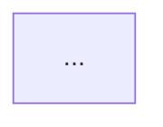

# OpenSearch Feature Explorer - Base Configuration

## OpenSearch Domain Knowledge

### Repository Structure
- **opensearch-build**: 統合リリースノート、ビルド設定
- **OpenSearch**: コアエンジン（Java）
- **OpenSearch-Dashboards**: UI/可視化（TypeScript/React）

### Release Notes Format
各項目は `- Description ([#PR_NUMBER](URL))` 形式でPRリンクを含む。
セクション: `### Added`, `### Changed`, `### Fixed`, `### Dependencies`

## GitHub MCP Tools Usage

GitHub MCP Server を使用してリポジトリ情報を取得する。

### Available Tools
- `get_file_contents`: ファイル内容取得（リリースノート取得に使用）
- `get_pull_request`: PR詳細取得
- `list_pull_request_files`: PR変更ファイル一覧
- `get_issue`: Issue詳細取得
- `search_code`: コード検索

### Investigation Flow
1. リリースノートからPR番号を抽出
2. `get_pull_request` でPR詳細を取得
3. `list_pull_request_files` で変更ファイルを確認
4. 必要に応じて `get_file_contents` で関連コードを取得
5. 関連Issueがあれば `get_issue` で詳細を取得

## Report Output Format

### Feature Report Template (features/{feature-name}.md)
```markdown
# {Feature Name}

## Overview
機能の概要説明

## Architecture


## Data Flow


## Components
影響を受けるコンポーネント一覧

## Configuration
設定項目と説明

## Related PRs
| Version | PR | Description |
|---------|-----|-------------|
| v3.4.0 | #1234 | ... |

## Breaking Changes
破壊的変更の有無と詳細

## Change History
- **v3.4.0**: 初期実装
- **v3.5.0**: 機能拡張
```

### Release Report Template (releases/v{version}/summary.md)
```markdown
# OpenSearch v{version} Release Summary

## Highlights
主要な変更点のサマリー

## Architecture Changes


## New Features
新機能一覧（features/ へのリンク含む）

## Improvements
改善点一覧

## Bug Fixes
バグ修正一覧

## Breaking Changes
破壊的変更一覧

## Dependencies
依存関係の更新
```

## Mermaid Diagram Guidelines

### Diagram Types by Use Case
| Use Case | Syntax | When to Use |
|----------|--------|-------------|
| Architecture | `graph TB` or `graph LR` | コンポーネント構成、システム全体像 |
| Data Flow | `flowchart LR` | データの流れ、処理フロー |
| Sequence | `sequenceDiagram` | API呼び出し、コンポーネント間通信 |
| State | `stateDiagram-v2` | 状態遷移、ライフサイクル |
| Class | `classDiagram` | クラス構造、継承関係 |

### Required Diagrams
- **Feature Report**: Architecture図（必須）、Data Flow図（推奨）
- **Release Summary**: Architecture Changes図（変更がある場合）

### Style Guidelines
- ノード名は簡潔に（英語）
- 日本語コメントは `%%` で追加可能
- サブグラフで論理グループを表現

## Feature Report Update Rules

### Merge Strategy
既存レポートがある場合:
1. 既存の構造を維持
2. 新情報を適切なセクションに統合
3. 図は必要に応じて更新（既存図の拡張または置換）
4. Change History に新バージョンの変更を追記

### Change History Format
```markdown
## Change History
- **v3.5.0** (2024-01-15): 機能Xを追加、パフォーマンス改善
- **v3.4.0** (2023-10-01): 初期実装
```
（新しい変更が上に来るように追記）
