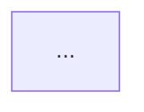

# OpenSearch Feature Explorer - Base Knowledge

## OpenSearch Domain Knowledge

### Repository Structure
- **opensearch-build**: Consolidated release notes, build configurations
- **OpenSearch**: Core engine (Java)
- **OpenSearch-Dashboards**: UI/visualization (TypeScript/React)

### Release Notes Format
Each item follows `- Description ([#PR_NUMBER](URL))` format with PR links.
Sections: `### Added`, `### Changed`, `### Fixed`, `### Dependencies`

## GitHub MCP Tools Usage

Use GitHub MCP Server to retrieve repository information.

### Available Tools
- `get_file_contents`: Get file contents (for fetching release notes)
- `get_pull_request`: Get PR details
- `list_pull_request_files`: List PR changed files
- `get_issue`: Get Issue details
- `search_code`: Search code

### Investigation Flow
1. Extract PR numbers from release notes
2. Get PR details with `get_pull_request`
3. Check changed files with `list_pull_request_files`
4. Get related code with `get_file_contents` if needed
5. Get Issue details with `get_issue` if linked

## Report Output Format

### Feature Report Template (docs/features/{feature-name}.md)
```markdown
# {Feature Name}

## Overview
Feature description

## Architecture


## Data Flow


## Components
List of affected components

## Configuration
Settings and descriptions

## Related PRs
| Version | PR | Description |
|---------|-----|-------------|

## Breaking Changes
Breaking changes if any

## Change History
- **v3.4.0**: Initial implementation
```

### Release Report Template (docs/releases/v{version}/summary.md)
```markdown
# OpenSearch v{version} Release Summary

## Highlights
Summary of major changes

## Architecture Changes


## New Features
List with links to docs/features/

## Improvements
List of improvements

## Bug Fixes
List of bug fixes

## Breaking Changes
List of breaking changes

## Dependencies
Dependency updates
```

## Mermaid Diagram Guidelines

### Diagram Types by Use Case
| Use Case | Syntax | When to Use |
|----------|--------|-------------|
| Architecture | `graph TB` or `graph LR` | Component structure |
| Data Flow | `flowchart LR` | Data flow, processing |
| Sequence | `sequenceDiagram` | API calls, communication |
| State | `stateDiagram-v2` | State transitions |
| Class | `classDiagram` | Class structure |

### Required Diagrams
- **Feature Report**: Architecture diagram (required), Data Flow (recommended)
- **Release Summary**: Architecture Changes diagram (if applicable)

## Feature Report Update Rules

### Merge Strategy
When existing report exists:
1. Preserve existing structure
2. Integrate new information into appropriate sections
3. Update diagrams as needed
4. Append to Change History

### Change History Format
```markdown
## Change History
- **v3.5.0** (2024-01-15): Added feature X, performance improvements
- **v3.4.0** (2023-10-01): Initial implementation
```
(Newer changes at top)
