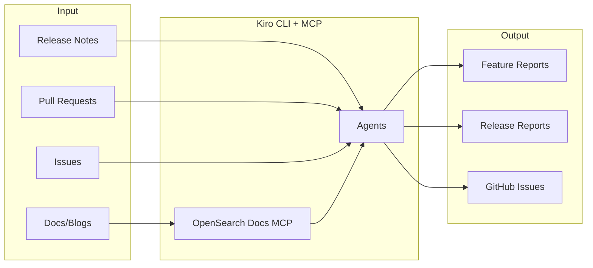
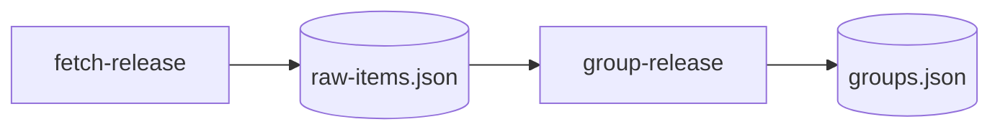
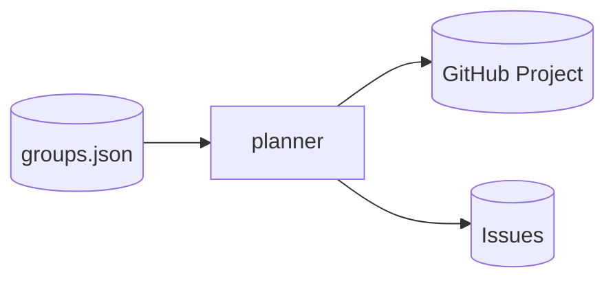
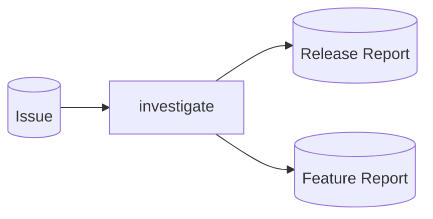
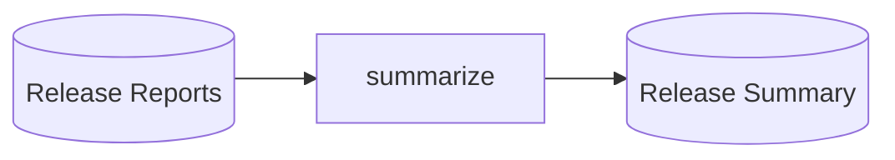
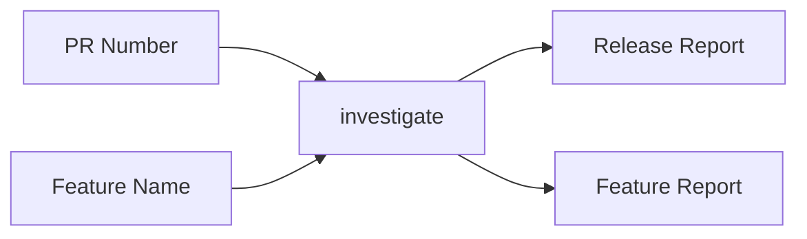

# OpenSearch Feature Explorer

A tool to analyze OpenSearch release notes and generate detailed feature/release reports.

## Overview



## Agents

| Agent | Description |
|-------|-------------|
| **fetch-release** | Fetch release notes → parse and save all items to JSON cache |
| **planner** | Read JSON cache → create tracking Issue with all items |
| **create-issues** | Create individual investigation Issues from tracking Issue |
| **investigate** | Deep investigation of release items → create release & feature reports |
| **explore** | Interactive Q&A + URL import |
| **summarize** | Aggregate release reports into release summary |
| **translate** | Translate reports to other languages |

## Requirements

- Python 3.8+
- [Kiro CLI](https://kiro.dev/)
- [GitHub CLI](https://cli.github.com/) (`gh`) - authenticated via `gh auth login`
- Node.js (for GitHub MCP Server)

### GitHub Token Scopes

When running `gh auth login`, select the following scopes:
- `repo` (Full control of private repositories)
- `read:org` (Read org membership)
- `project` (Full control of projects) - **required for GitHub Projects API**

After initial login, add additional scopes:

```bash
gh auth refresh -s copilot -s gist -s read:org -s repo -s workflow -s project
```

| Scope | Purpose |
|-------|---------|
| `repo` | Issue/PR operations |
| `project` | GitHub Projects (progress tracking) |
| `workflow` | GitHub Actions (MCP server) |
| `read:org` | Organization info |
| `copilot`, `gist` | MCP server requirements |

## Naming Conventions

| Resource | Pattern | Example |
|----------|---------|---------|
| GitHub Project | `v{version} Investigation` | `v3.0.0 Investigation` |
| Issue (group) | `[{category}] {group_name}` | `[feature] Star Tree Index` |
| Label (release) | `release/v{version}` | `release/v3.0.0` |
| Label (status) | `status/{status}` | `status/todo`, `status/done` |
| Data directory | `data/releases/v{version}/` | `data/releases/v3.0.0/` |
| Release report | `docs/releases/v{version}/{group-name}.md` | `docs/releases/v3.0.0/star-tree-index.md` |
| Feature report | `docs/features/{feature-name}.md` | `docs/features/star-tree-index.md` |

## Setup

```bash
git clone https://github.com/tkykenmt/opensearch-feature-explorer.git
cd opensearch-feature-explorer
pip install -r requirements.txt

# Authenticate GitHub CLI (required for GitHub MCP)
gh auth login
```

### GitHub Repository Settings

Enable the following in your repository settings (Settings → General):

- **Pull Requests**: Enable "Automatically delete head branches" to clean up feature branches after PR merge
- **Pages** (Settings → Pages): Set Source to "GitHub Actions" for automatic deployment

## Usage

### Use Case 1: Full Release Investigation

Complete workflow for investigating a new OpenSearch release.

#### Step 1: Parse Release Notes



```bash
python run.py fetch-release 3.0.0
python run.py group-release 3.0.0
```

#### Step 2: Create GitHub Project & Issues



```bash
python run.py planner 3.0.0
```

#### Step 3: Investigate Each Issue



```bash
python run.py investigate --issue 124
```

#### Step 4: Create Release Summary



```bash
python run.py summarize 3.0.0
```

### Use Case 2: Single Feature Investigation

Quick investigation of a specific feature without full release workflow.



```bash
python run.py investigate "Star Tree" --pr 16233
```

### Use Case 3: Interactive Exploration

Explore features interactively with Q&A.


```bash
python run.py explore "Segment Replication" --lang ja
```

### Planner Options

```bash
# Ignore existing tracking Issue and create new one
python run.py planner 3.0.0 -i
python run.py planner 3.0.0 --ignore-existing
```

## Output Structure

```
docs/
├── features/                          # Cumulative feature documentation
│   ├── index.md
│   ├── opensearch/
│   │   ├── star-tree-index.md
│   │   └── star-tree-index.ja.md
│   ├── neural-search/
│   │   └── semantic-highlighting.md
│   └── k-nn/
│       └── explain-api.md
└── releases/
    └── v3.0.0/
        ├── index.md                   # Release index
        ├── summary.md                 # Release summary (from summarize)
        └── features/
            ├── opensearch/
            │   ├── star-tree-enhancements.md
            │   └── grpc-transport.md
            ├── neural-search/
            │   └── semantic-highlighting.md
            └── k-nn/
                └── explain-api.md
```

## Local Preview

```bash
mkdocs serve
# Open http://localhost:8000
```

## Disclosure

This project uses generative AI to create documentation. Generated content may contain inaccuracies. Always verify information against official OpenSearch documentation and source code.
