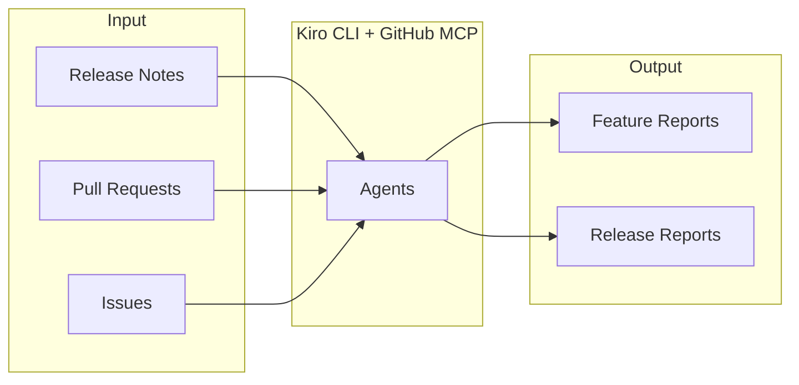

# OpenSearch Feature Explorer

A tool to analyze OpenSearch release notes and generate detailed feature/release reports.

## Overview



## Features

- **release-analyze**: Analyze release notes and generate version-specific reports
- **feature-report**: Create detailed feature reports
- **context-update**: Update reports with external context from URLs
- **explain**: Interactive explanation of features based on existing reports
- **translate**: Translate existing reports to other languages

## Requirements

- Python 3.8+
- [Kiro CLI](https://kiro.dev/)
- GitHub Copilot license (for GitHub MCP Server authentication)

## Setup

```bash
git clone https://github.com/tkykenmt/opensearch-feature-explorer.git
cd opensearch-feature-explorer
pip install -r requirements.txt
```

## Local Preview

```bash
mkdocs serve
# Open http://localhost:8000
```

## Deploy to GitHub Pages

```bash
mkdocs gh-deploy
```

## Usage

### Analyze Release Notes

```bash
# Generate report in English (default)
python run.py release-analyze 3.4.0

# Generate in Japanese
python run.py release-analyze 3.4.0 --lang ja

# Generate in both English and Japanese
python run.py release-analyze 3.4.0 --lang en,ja
```

### Create Feature Report

```bash
# Investigate by feature name
python run.py feature-report "Segment Replication"

# Start from a specific PR
python run.py feature-report "Star Tree" --pr 16233

# Output in multiple languages
python run.py feature-report "Remote Store" --lang en,ja
```

### Update with External Context

```bash
python run.py context-update --url https://opensearch.org/blog/... --feature "Segment Replication"
```

### Interactive Explanation

```bash
# Explain in English
python run.py explain "Segment Replication"

# Explain in Japanese
python run.py explain "Segment Replication" --lang ja
```

### Translate Reports

```bash
# Translate feature report
python run.py translate --feature "Segment Replication" --to ja

# Translate release report
python run.py translate --release 3.4.0 --to ja
```

## Output Structure

```
docs/
├── index.md                    # Top page
├── features/
│   ├── segment-replication.md
│   └── segment-replication.ja.md
└── releases/
    └── v3.4.0/
        ├── summary.md
        ├── summary.ja.md
        └── items/
            └── ...
```

Reports are output to `docs/` directory for GitHub Pages hosting.

## Report Format

Reports include Mermaid diagrams for better understanding:

- **Architecture diagrams**: Component structure
- **Data Flow diagrams**: Data flow visualization
- **Sequence diagrams**: API call flows

## License

MIT
