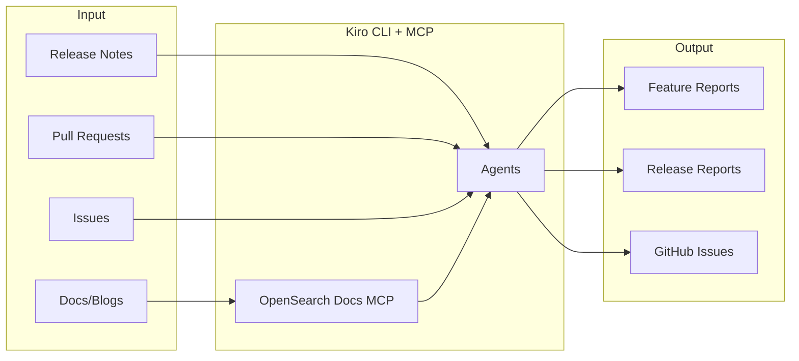

# OpenSearch Feature Explorer

A tool to analyze OpenSearch release notes and generate detailed feature/release reports.

## Overview



## Agents

| Agent | Description |
|-------|-------------|
| **planner** | Analyze release notes → create GitHub Issues for investigation |
| **investigate** | Deep investigation of release items → create release & feature reports |
| **explore** | Interactive Q&A + URL import |
| **summarize** | Aggregate release reports into release summary |
| **translate** | Translate reports to other languages |

## Requirements

- Python 3.8+
- [Kiro CLI](https://kiro.dev/)
- [GitHub CLI](https://cli.github.com/) (`gh`) - authenticated via `gh auth login`
- Node.js (for GitHub MCP Server)

## Setup

```bash
git clone https://github.com/tkykenmt/opensearch-feature-explorer.git
cd opensearch-feature-explorer
pip install -r requirements.txt

# Authenticate GitHub CLI (required for GitHub MCP)
gh auth login
```

## Usage

### Workflow

```bash
# 1. Plan release investigation (creates GitHub Issues)
python run.py planner 3.0.0

# 2. Investigate each feature (from GitHub Issue)
python run.py investigate --issue 123

# 3. Or investigate directly
python run.py investigate "Star Tree" --pr 16233

# 4. Batch investigate multiple issues
python run.py batch-investigate 5        # Process 5 issues
python run.py batch-investigate --all    # Process all open issues

# 5. Create release summary
python run.py summarize 3.0.0

# 6. Translate if needed
python run.py translate --feature "Star Tree" --to ja
```

### Interactive Exploration

```bash
python run.py explore "Segment Replication" --lang ja
```

## Output Structure

```
docs/
├── features/                          # Cumulative feature documentation
│   ├── index.md
│   ├── star-tree-index.md            # Full feature history
│   └── star-tree-index.ja.md
└── releases/
    └── v3.0.0/
        ├── index.md                   # Release index
        ├── summary.md                 # Release summary (from summarize)
        └── features/                  # Per-release change reports
            ├── star-tree-enhancements.md
            └── grpc-transport.md
```

## Local Preview

```bash
mkdocs serve
# Open http://localhost:8000
```

## GitHub Pages

This project is configured to deploy to GitHub Pages automatically. The site is built with MkDocs and deployed via GitHub Actions on push to `main`.

## Disclosure

This project uses generative AI to create documentation. Generated content may contain inaccuracies. Always verify information against official OpenSearch documentation and source code.

## License

MIT-0 (MIT No Attribution) - See [LICENSE](LICENSE)
