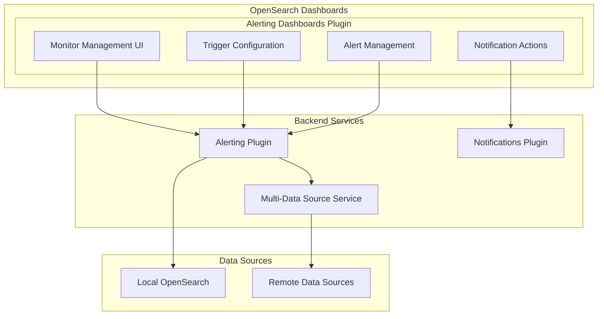

---
tags:
  - dashboards
  - observability
  - search
---

# Alerting Dashboards Plugin

## Summary

The Alerting Dashboards Plugin provides a user interface in OpenSearch Dashboards for managing alerting monitors, triggers, and notifications. It enables users to create and configure monitors that check for specific conditions in their data and trigger alerts with customizable actions and notifications.

## Details

### Architecture

### Components

| Component | Description |
|-----------|-------------|
| Monitor Management | UI for creating, editing, and managing monitors |
| Trigger Configuration | Interface for defining trigger conditions and thresholds |
| Alert Management | Dashboard for viewing and acknowledging alerts |
| Notification Actions | Configuration for alert notification channels |
| Multi-Data Source Support | Integration with MDS for remote cluster monitoring |

### Monitor Types

| Type | Description |
|------|-------------|
| Per Query Monitor | Runs a query and evaluates trigger conditions on results |
| Per Bucket Monitor | Evaluates trigger conditions on each bucket of aggregation results |
| Per Document Monitor | Evaluates conditions on individual documents |
| Cluster Metrics Monitor | Monitors cluster health and metrics |
| Composite Monitor | Combines multiple monitors with logical operators |

### Trigger Configuration

Bucket-level monitors support various filter operators:

| Operator | Description |
|----------|-------------|
| IS ABOVE | Triggers when value exceeds threshold |
| IS BELOW | Triggers when value falls below threshold |
| IS EXACTLY | Triggers when value matches exactly |
| INCLUDE | Filters for specific keyword values |
| EXCLUDE | Filters out specific keyword values |

### API Routes

| Route | Description |
|-------|-------------|
| `/api/alerting/_plugins` | Get installed alerting plugins |
| `/api/alerting/_settings` | Get alerting settings |
| `/api/alerting/_health` | Get cluster health for alerting |

### Configuration

| Setting | Description | Default |
|---------|-------------|---------|
| `data_source.enabled` | Enable Multi-Data Source support | `false` |

## Limitations

- Keyword filters (INCLUDE/EXCLUDE) are only supported for bucket-level monitors
- Multi-Data Source requires explicit configuration in OpenSearch Dashboards

## Change History

- **v3.4.0** (2026-01): Added keyword filter support for bucket-level monitor triggers; Fixed MDS client usage for OpenSearch API calls

## References

### Documentation
- [Alerting Documentation](https://docs.opensearch.org/3.0/observing-your-data/alerting/index/): Official alerting documentation
- [Triggers Documentation](https://docs.opensearch.org/3.0/observing-your-data/alerting/triggers/): Trigger configuration guide
- [Per Query and Per Bucket Monitors](https://docs.opensearch.org/3.0/observing-your-data/alerting/per-query-bucket-monitors/): Monitor types documentation
- [Alerting Dashboards Plugin Repository](https://github.com/opensearch-project/alerting-dashboards-plugin): Source code repository

### Pull Requests
| Version | PR | Description | Related Issue |
|---------|-----|-------------|---------------|
| v3.4.0 | [#1325](https://github.com/opensearch-project/alerting-dashboards-plugin/pull/1325) | Allow keyword filter to be attached to bucket level monitor trigger |   |
| v3.4.0 | [#1313](https://github.com/opensearch-project/alerting-dashboards-plugin/pull/1313) | Onboarded opensearch apis to use MDS client when MDS is enabled |   |
