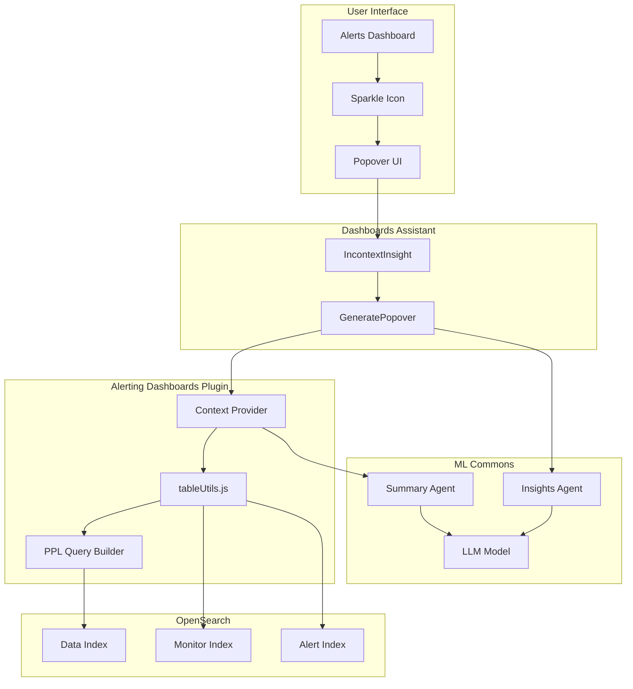
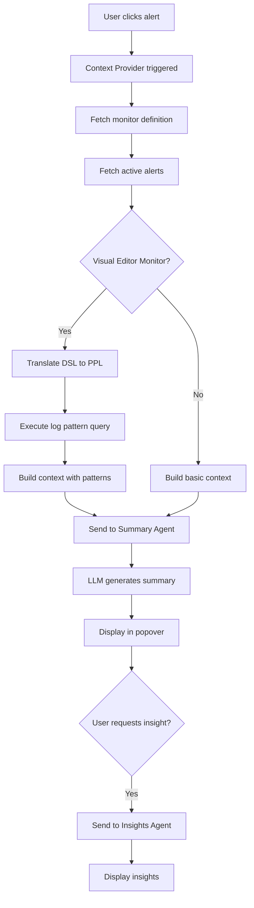

---
tags:
  - alerting-dashboards
---
# Alerting Summary & Insights

## Summary

Alerting Summary & Insights is an AI-powered feature in OpenSearch Dashboards that helps users understand and analyze alerts more effectively. By integrating with the OpenSearch Dashboards Assistant and large language models (LLMs), this feature provides context-aware alert summaries, log pattern analysis, and actionable insights directly from the alerts dashboard.

## Details

### Architecture



### Data Flow



### Components

| Component | File | Description |
|-----------|------|-------------|
| Context Provider | `tableUtils.js` | Builds rich context for LLM including monitor definition, alerts, and log patterns |
| PPL Query Map | `whereFilters.js` | Maps DSL filter operators to PPL equivalents |
| IncontextInsight Wrapper | `plugin.tsx` | Integrates with dashboards-assistant for in-context prompting |
| Assistant Service | `services.ts` | Provides access to assistant dashboards capabilities |

### Configuration

| Setting | Description | Default | Location |
|---------|-------------|---------|----------|
| `assistant.alertInsight.enabled` | Enable/disable alert insights | `false` | `opensearch_dashboards.yml` |
| `DEFAULT_LOG_PATTERN_TOP_N` | Number of top log patterns | `3` | `constants.js` |
| `DEFAULT_LOG_PATTERN_SAMPLE_SIZE` | Sample size for patterns | `20` | `constants.js` |
| `DEFAULT_ACTIVE_ALERTS_AI_TOP_N` | Max alerts in AI summary context | `1` | `constants.js` |
| `DEFAULT_DSL_QUERY_DATE_FORMAT` | DSL date format | `YYYY-MM-DDTHH:mm:ssZ` | `constants.js` |
| `DEFAULT_PPL_QUERY_DATE_FORMAT` | PPL date format | `YYYY-MM-DD HH:mm:ss` | `constants.js` |

### Usage Example

#### Enabling Alert Insights

```yaml
# opensearch_dashboards.yml
assistant.alertInsight.enabled: true
```

#### Creating Required Agents

Use Flow Framework to create the necessary agents:

```json
POST /_plugins/_flow_framework/workflow?provision=true
{
  "name": "Alert Summary Agent",
  "description": "Create Alert Summary Agent",
  "use_case": "REGISTER_AGENT",
  "workflows": {
    "provision": {
      "nodes": [
        {
          "id": "create_alert_summary_agent",
          "type": "register_agent",
          "user_inputs": {
            "type": "flow",
            "name": "Alert Summary Agent",
            "parameters": {
              "prompt": "You are an OpenSearch Alert Assistant..."
            }
          }
        }
      ]
    }
  }
}
```

#### Registering Root Agents

```json
POST /.plugins-ml-config/_doc/os_summary
{
  "type": "os_root_agent",
  "configuration": {
    "agent_id": "<SUMMARY_AGENT_ID>"
  }
}
```

### PPL Query Translation

The feature translates DSL filters to PPL for log pattern analysis:

| DSL Operator | PPL Equivalent |
|--------------|----------------|
| `is` | `match_phrase()` or `=` |
| `is_not` | `not match_phrase()` or `!=` |
| `is_null` | `isnull()` |
| `is_not_null` | `isnotnull()` |
| `is_greater` | `>` |
| `is_less` | `<` |
| `in_range` | `>= AND <=` |
| `starts_with` | `match_phrase_prefix()` |
| `contains` | `query_string()` |

## Limitations

- Log pattern analysis requires monitors created via visual editor
- Requires dashboards-assistant plugin installation
- LLM model must be deployed and configured
- Only the latest active alert is included in AI summary context (v3.0.0+)
- PPL patterns command required for log pattern extraction
- Only first index supported for multi-index monitors

## Change History

- **v3.0.0** (2025-01-07): Optimized alert context to use only latest active alert for AI summaries
- **v2.18.0** (2024-11-05): Initial implementation with context-aware alert analysis and log pattern support


## References

### Documentation
- [Alert Insights Documentation](https://docs.opensearch.org/3.0/dashboards/dashboards-assistant/alert-insight/): Official docs
- [OpenSearch Assistant Toolkit](https://docs.opensearch.org/3.0/ml-commons-plugin/opensearch-assistant/): Assistant overview
- [Flow Framework Templates](https://github.com/opensearch-project/flow-framework/tree/2.x/sample-templates): Agent templates

### Pull Requests
| Version | PR | Description | Related Issue |
|---------|-----|-------------|---------------|
| v3.0.0 | [#1220](https://github.com/opensearch-project/alerting-dashboards-plugin/pull/1220) | Only use latest active alert for alert summary context |   |
| v2.18.0 | [#996](https://github.com/opensearch-project/alerting-dashboards-plugin/pull/996) | Context aware alert analysis | [#995](https://github.com/opensearch-project/alerting-dashboards-plugin/issues/995) |
| v2.18.0 | [#1119](https://github.com/opensearch-project/alerting-dashboards-plugin/pull/1119) | Support top N log pattern data |   |

### Issues (Design / RFC)
- [Issue #995](https://github.com/opensearch-project/alerting-dashboards-plugin/issues/995): Original feature request
