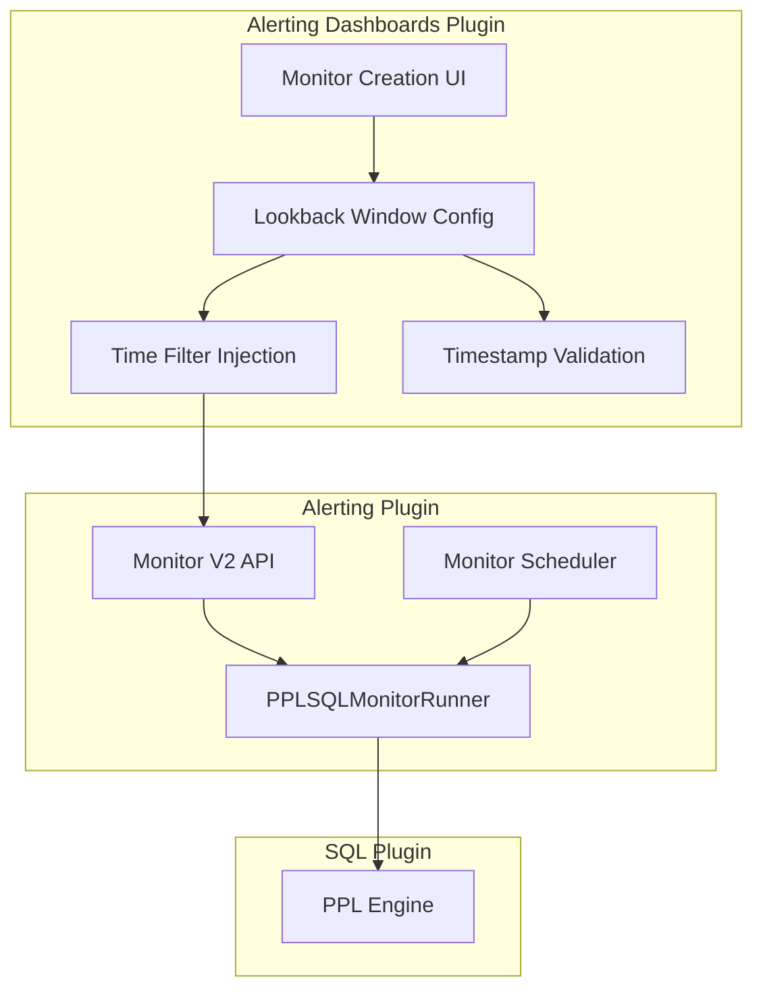

---
tags:
  - alerting-dashboards
---
# SQL/PPL Monitors

## Summary
SQL/PPL Monitors allow users to create alerting monitors that use PPL (Piped Processing Language) or SQL queries instead of traditional OpenSearch DSL queries. This feature includes a lookback window mechanism that automatically injects time-range filters into queries, ensuring monitors only evaluate data within a specified time window.

## Details

### Architecture



### Components

| Component | Description |
|-----------|-------------|
| `PplAlertingCreateMonitor` | Main monitor creation/edit form for PPL monitors |
| `addTimeFilterToQuery()` | Injects time-range WHERE clause into PPL queries based on lookback window |
| `computeLookBackMinutes()` | Converts lookback amount + unit to total minutes |
| `pplAlertingMonitorToFormik` | Converts backend monitor object to Formik form values |
| `pplFormikToMonitor` | Converts Formik form values to backend monitor API payload |
| `ConfigureTriggersPpl` | Trigger configuration with lookback-aware query preview |

### Configuration

| Setting | Description | Default |
|---------|-------------|---------|
| Lookback window enabled | Toggle to enable/disable time-range filtering | true |
| Lookback amount | Numeric value for the lookback duration | 1 |
| Lookback unit | Unit of time (minutes, hours, days) | hours |
| Timestamp field | The date/timestamp field used for time filtering | @timestamp |

### Constraints

| Constraint | Value |
|------------|-------|
| Minimum lookback | 1 minute |
| Maximum lookback | 7 days (10,080 minutes) |

### Usage Example

A PPL monitor query:
```
source=web_logs | stats count() by status
```

With a 1-hour lookback window and `@timestamp` field, the executed query becomes:
```
source=web_logs | where @timestamp > TIMESTAMP('2026-04-13 10:00:00') and @timestamp < TIMESTAMP('2026-04-13 11:00:00') | stats count() by status
```

## Limitations
- Maximum lookback window is 7 days
- Time filter injection uses first-pipe string replacement, which may not handle all complex PPL query patterns
- Lookback window metadata is stored in `ui_metadata.lookback` for frontend persistence; the backend also stores `look_back_window_minutes` at the monitor level

## Change History
- **v3.6.0**: Moved lookback window logic from backend to frontend; added max 7-day validation; persisted lookback metadata in `ui_metadata.lookback`
- **v3.3.0**: Initial PPL/SQL monitor support with backend-only lookback window (PPL Alerting Models, Create/Update Monitor V2, Execute Monitor)

## References

### Documentation
- PPL/SQL Monitors are part of the OpenSearch Alerting plugin ecosystem

### Pull Requests
| Version | PR | Description |
|---------|-----|-------------|
| v3.6.0 | `https://github.com/opensearch-project/alerting-dashboards-plugin/pull/1379` | Lookback window frontend for PPL/SQL monitors |
| v3.3.0 | `https://github.com/opensearch-project/alerting/pull/1955` | PPL Alerting: Models |
| v3.3.0 | `https://github.com/opensearch-project/alerting/pull/1961` | PPL Alerting: Create and Update Monitor V2 |
| v3.3.0 | `https://github.com/opensearch-project/alerting/pull/1960` | PPL Alerting: Execute Monitor and Monitor Stats |
