---
tags:
  - alerting
---
# Alerting Access Control

## Summary

The Alerting plugin provides role-based access control mechanisms to restrict which users can access monitor results in notification templates. This security feature prevents potential exposure of sensitive data through alert notifications by allowing administrators to specify which user roles are permitted to include query results in notification message templates.

## Details

### Architecture

```mermaid
flowchart TB
    subgraph "Monitor Execution"
        A[Monitor Trigger] --> B[TriggerExecutionContext]
        B --> C{Check Access Control}
    end
    
    subgraph "Access Control Check"
        C --> D{Setting Configured?}
        D -->|No| E[Return full results]
        D -->|Yes| F{Monitor roles ∩<br/>Allowed roles?}
        F -->|Yes| E
        F -->|No| G[Return empty results]
    end
    
    subgraph "Notification"
        E --> H[Template with results]
        G --> I[Template without results]
        H --> J[Send Notification]
        I --> J
    end
```



### Configuration

| Setting | Description | Default | Scope |
|---------|-------------|---------|-------|
| `plugins.alerting.notification_context_results_allowed_roles` | List of user roles allowed to include results in notification templates | `[]` (empty - all roles allowed) | Cluster |

### Behavior Matrix

| Setting State | Monitor User Roles | Result Access |
|---------------|-------------------|---------------|
| Not configured | Any | Full results |
| Configured with `["admin"]` | `["admin", "user"]` | Full results |
| Configured with `["admin"]` | `["user"]` | Empty results |
| Configured with `["admin", "analyst"]` | `["analyst"]` | Full results |

### Usage Example

Configure allowed roles:

```json
PUT _cluster/settings
{
  "persistent": {
    "plugins.alerting.notification_context_results_allowed_roles": ["admin", "security_analyst"]
  }
}
```

In notification templates, `{{ctx.results}}` will:
- Return query results for monitors owned by users with `admin` or `security_analyst` roles
- Return an empty list for monitors owned by users without these roles

## Limitations

- Cluster-wide setting only; cannot be configured per-monitor
- Affects all existing monitors immediately when changed
- Only controls `results` field in templates; other context fields remain accessible
- Document-level monitors always return empty results in templates by design

## Change History

- **v3.5.0** (2026-01-26): Initial implementation - Added `NOTIFICATION_CONTEXT_RESULTS_ALLOWED_ROLES` setting for role-based access control of trigger execution context results

## References

### Documentation

- [Alerting Security](https://opensearch.org/docs/latest/observing-your-data/alerting/security/) - Official documentation on alerting security and access control

### Pull Requests

| Version | PR | Description |
|---------|-----|-------------|
| v3.5.0 | [#1991](https://github.com/opensearch-project/alerting/pull/1991) | Access control for results in trigger execution context |

### Related Issues

- [#1986](https://github.com/opensearch-project/alerting/issues/1986) - Feature request: Access control for using monitor results in email template
