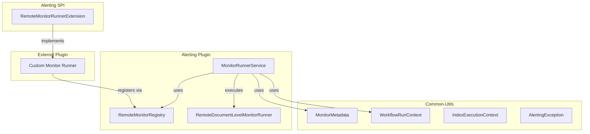

---
tags:
  - alerting
---
# Cross-Cluster & Remote Monitors

## Summary

Cross-cluster monitoring and remote monitors extend OpenSearch Alerting capabilities to support multi-cluster environments and custom monitor types from external plugins. This feature enables centralized alerting across distributed OpenSearch deployments and provides an extensibility framework for specialized monitoring use cases.

## Details

### Architecture



### Components

| Component | Description |
|-----------|-------------|
| `RemoteMonitorRunnerExtension` | SPI interface for external plugins to register custom monitor types |
| `RemoteMonitorRegistry` | Registry mapping monitor types to their runner implementations |
| `RemoteDocumentLevelMonitorRunner` | Built-in runner for remote document-level monitors |
| `MonitorMetadata` | Metadata tracking for monitor execution state |
| `WorkflowRunContext` | Context passed during workflow/monitor execution |

### Configuration

| Setting | Description | Default |
|---------|-------------|---------|
| `plugins.alerting.cross_cluster_monitoring_enabled` | Enable cross-cluster monitoring | `true` (v2.16.0+) |

### Cross-Cluster Monitor Creation

To create a cross-cluster monitor:

1. Configure remote cluster connections
2. Create a monitor specifying remote cluster indices using `cluster_name:index_pattern` syntax
3. The monitor will query across all specified clusters

### Remote Monitor Extension

External plugins can register custom monitor types:

```kotlin
class MyPlugin : RemoteMonitorRunnerExtension {
    override fun getMonitorTypesToMonitorRunners(): Map<String, RemoteMonitorRunner> {
        return mapOf(
            "my_custom_query_level_monitor" to MyCustomMonitorRunner()
        )
    }
}
```

### Required Permissions

For cross-cluster monitors via Dashboards UI:
- `cluster:admin/opensearch/alerting/remote/indexes/get`
- `indices:admin/resolve/index`
- `cluster:monitor/health`
- `indices:admin/mappings/get`

### Usage Example

Cross-cluster monitor configuration:

```json
{
  "name": "Cross-Cluster Health Monitor",
  "type": "monitor",
  "monitor_type": "query_level_monitor",
  "inputs": [
    {
      "uri": {
        "api_type": "CLUSTER_HEALTH",
        "path": "_cluster/health/",
        "clusters": ["cluster-1", "cluster-2"]
      }
    }
  ],
  "triggers": [
    {
      "query_level_trigger": {
        "name": "Unhealthy cluster trigger",
        "condition": {
          "script": {
            "source": "for (cluster in ctx.results[0].keySet()) if (ctx.results[0][cluster].status != 'green') return true",
            "lang": "painless"
          }
        }
      }
    }
  ]
}
```

## Limitations

- Cross-cluster monitoring requires remote cluster connections to be pre-configured
- Remote monitors require the implementing plugin to be installed
- Custom monitor types must follow naming conventions (ending with standard monitor type suffix)
- Maximum of 10 triggers per cluster metrics monitor

## Change History

- **v2.16.0** (2024-08-06): Cross-cluster monitoring enabled by default; Remote monitors SPI introduced

## References

### Documentation
- [Per cluster metrics monitors](https://docs.opensearch.org/latest/observing-your-data/alerting/per-cluster-metrics-monitors/)
- [Alerting security](https://docs.opensearch.org/latest/observing-your-data/alerting/security/)

### Pull Requests
| Version | PR | Description |
|---------|-----|-------------|
| v2.16.0 | [#1612](https://github.com/opensearch-project/alerting/pull/1612) | Enable cross-cluster monitor cluster setting |
| v2.16.0 | [#1589](https://github.com/opensearch-project/alerting/pull/1589) | Support remote monitors in alerting |
| v2.16.0 | [#694](https://github.com/opensearch-project/common-utils/pull/694) | Add support for remote monitors in common-utils |

### Related Issues
- [#1546](https://github.com/opensearch-project/alerting/issues/1546) - [FEATURE] Remote Monitors in OpenSearch Alerting
