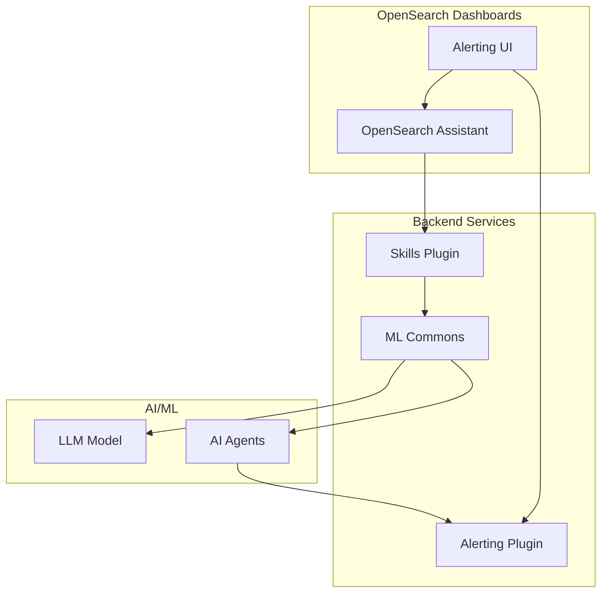

---
tags:
  - alerting
---
# Alerting Integration

## Summary

Alerting Integration enables AI-powered alert creation and insights within OpenSearch. Users can create alerts using natural language through the OpenSearch Assistant, receive AI-generated alert summaries, and get insights about triggered alerts including log pattern analysis.

## Details

### Architecture



### Components

| Component | Description |
|-----------|-------------|
| CreateAlertTool | Skills plugin tool for natural language alert creation |
| Alert Summary Agent | Generates summaries of triggered alerts |
| Alert Insights Agent | Provides deeper analysis and recommendations |
| In-Context Summarization UI | Dashboards UI for viewing AI-generated insights |

### CreateAlertTool

Enables alert creation through natural language queries by leveraging LLM capabilities.

**Input Parameters:**
| Parameter | Required | Description |
|-----------|----------|-------------|
| `question` | Yes | Natural language question about creating an alert |
| `indices` | Yes | Target indices for the monitor |
| `chat_history` | No | Conversation history for context |

**Output Format:**
```json
{
  "name": "Alert Name",
  "search": {
    "indices": ["index_name"],
    "timeField": "timestamp",
    "bucketValue": 60,
    "bucketUnitOfTime": "m",
    "filters": [
      {
        "fieldName": [{"label": "field", "type": "text"}],
        "fieldValue": "value",
        "operator": "is"
      }
    ],
    "aggregations": [
      {"aggregationType": "count", "fieldName": "field"}
    ]
  },
  "triggers": [
    {
      "name": "Trigger Name",
      "severity": 1,
      "thresholdValue": 1,
      "thresholdEnum": "ABOVE"
    }
  ]
}
```

### Alert Insights Configuration

Alert insights require three AI agents:
1. **Alert Summary Agent** - Basic alert summarization
2. **Alert Summary with Log Patterns Agent** - Summary including log pattern analysis
3. **Alert Insights Agent** - Deep analysis and recommendations

**Root Agent Configuration:**
```
os_summary - Alert summary agent
os_summary_with_log_pattern - Summary with log patterns agent
os_insight - Alert insights agent
```

### Usage Example

**Creating an Alert via Natural Language:**
```
User: "Create an alert that triggers when error logs exceed 100 in the last hour"

CreateAlertTool generates:
- Monitor on specified index
- Filter for error level logs
- Time range of 1 hour
- Trigger condition: count > 100
```

**Viewing Alert Insights in Dashboards:**
1. Navigate to OpenSearch Plugins > Alerting
2. Hover over alerts with sparkle icon
3. Select to view AI-generated summary
4. Click info icon for detailed insights

## Limitations

- CreateAlertTool requires ChatAgentRunner integration for chat history
- Visual editor alerts only support Discover navigation
- Alert insights is an experimental feature
- Log pattern analysis requires query monitors created via OpenSearch Dashboards

## Change History

- **v2.19.0** (2025-02): Initial implementation of CreateAlertTool, in-context summarization UI, and alert insights

## References

### Documentation

- [Alert Insights](https://docs.opensearch.org/2.19/dashboards/dashboards-assistant/alert-insight/)
- [OpenSearch Assistant](https://docs.opensearch.org/2.19/dashboards/dashboards-assistant/index/)
- [Alerting](https://docs.opensearch.org/2.19/observing-your-data/alerting/index/)
- [Agents and Tools](https://docs.opensearch.org/2.19/ml-commons-plugin/agents-tools/index/)

### Pull Requests

| Version | PR | Repository | Description |
|---------|-----|------------|-------------|
| v2.19.0 | [#456](https://github.com/opensearch-project/skills/pull/456) | skills | Backport CreateAlertTool to 2.x |
| v2.19.0 | [#452](https://github.com/opensearch-project/skills/pull/452) | skills | Support pass prompt to CreateAlertTool |
| v2.19.0 | [#349](https://github.com/opensearch-project/skills/pull/349) | skills | Add CreateAlertTool (original) |
| v2.19.0 | [#392](https://github.com/opensearch-project/dashboards-assistant/pull/392) | dashboards-assistant | Update UI for In-context summarization |
| v2.19.0 | [#368](https://github.com/opensearch-project/dashboards-assistant/pull/368) | dashboards-assistant | Visual editor alerts Discover navigation |
| v2.19.0 | [#1778](https://github.com/opensearch-project/alerting/pull/1778) | alerting | Workflow metadata fix |
| v2.19.0 | [#1729](https://github.com/opensearch-project/alerting/pull/1729) | alerting | Workflow execution optimization |
