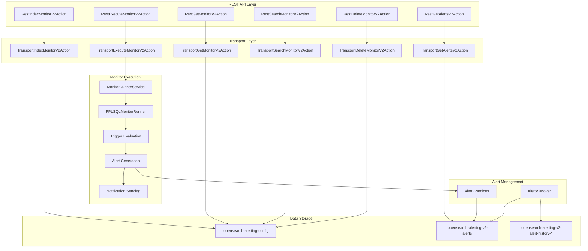
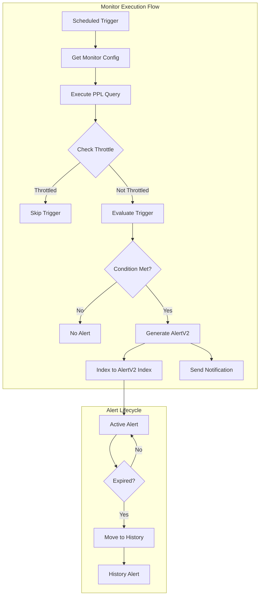

---
tags:
  - domain/observability
  - component/server
  - observability
  - sql
---
# PPL Alerting

## Summary

PPL Alerting is a V2 alerting system that enables users to create monitors using Piped Processing Language (PPL) queries. It provides a complete API layer separate from the existing V1 alerting, featuring stateless alerts with automatic expiration, flexible trigger modes (per-result and result-set), and custom PPL conditions for complex alerting logic.

## Details

### Architecture



### Data Flow



### Components

| Component | Description |
|-----------|-------------|
| PPLSQLMonitor | V2 monitor model supporting PPL query language |
| PPLSQLTrigger | Trigger with modes (result_set, per_result) and conditions (number_of_results, custom) |
| AlertV2 | Stateless alert model with automatic expiration |
| PPLSQLMonitorRunner | Core execution logic: throttle checking, PPL execution, trigger evaluation, alert generation, notification sending |
| AlertV2Indices | Manages V2 alert indices with rollover and retention |
| AlertV2Mover | Background job that moves expired alerts to history indices |
| MonitorV2Runner | Interface for V2 monitor execution |

### Trigger Modes

| Mode | Description |
|------|-------------|
| `result_set` | Evaluates trigger condition against the entire query result set |
| `per_result` | Evaluates trigger condition for each row in the result set |

### Trigger Condition Types

| Type | Description |
|------|-------------|
| `number_of_results` | Triggers based on result count (GREATER_THAN, LESS_THAN, EQUAL_TO, etc.) |
| `custom` | Uses PPL eval statement for complex conditions |

### Configuration

| Setting | Description | Default |
|---------|-------------|---------|
| `plugins.alerting.v2.enabled` | Enable/disable Alerting V2 | true |
| `plugins.alerting.v2.alert_history_enabled` | Enable alert history | true |
| `plugins.alerting.v2.alert_history_rollover_period` | History rollover period | 12h |
| `plugins.alerting.v2.alert_history_max_age` | Max age for rollover | 30d |
| `plugins.alerting.v2.alert_history_max_docs` | Max docs for rollover | 1000 |
| `plugins.alerting.v2.alert_history_retention_period` | History retention | 60d |
| `plugins.alerting.v2.monitor.max_monitors` | Max V2 monitors | 1000 |
| `plugins.alerting.v2.monitor.max_throttle_duration` | Max throttle (minutes) | 7200 |
| `plugins.alerting.v2.monitor.max_expire_duration` | Max expire (minutes) | 43200 |
| `plugins.alerting.v2.monitor.max_look_back_window` | Max look back (minutes) | 10080 |
| `plugins.alerting.v2.monitor.max_query_length` | Max query length | 2000 |
| `plugins.alerting.v2.query_results_max_datarows` | Max data rows | 1000 |
| `plugins.alerting.v2.query_results_max_size` | Max results size | 3000 |
| `plugins.alerting.v2.per_result_trigger_max_alerts` | Max alerts per result | 10 |
| `plugins.alerting.v2.notification_subject_source_max_length` | Max subject length | 1000 |
| `plugins.alerting.v2.notification_message_source_max_length` | Max message length | 3000 |

### API Endpoints

| Endpoint | Method | Description |
|----------|--------|-------------|
| `/_plugins/_alerting/v2/monitors` | POST | Create V2 monitor |
| `/_plugins/_alerting/v2/monitors/{id}` | GET | Get V2 monitor |
| `/_plugins/_alerting/v2/monitors/{id}` | PUT | Update V2 monitor |
| `/_plugins/_alerting/v2/monitors/{id}` | DELETE | Delete V2 monitor |
| `/_plugins/_alerting/v2/monitors/_search` | POST | Search V2 monitors |
| `/_plugins/_alerting/v2/monitors/{id}/_execute` | POST | Execute V2 monitor |
| `/_plugins/_alerting/v2/alerts` | GET | Get V2 alerts |

### Usage Example

Creating a PPL monitor with result-set trigger:

```json
POST /_plugins/_alerting/v2/monitors
{
  "monitor_v2": {
    "ppl_monitor": {
      "name": "high-error-rate-monitor",
      "description": "Monitors for high error rates in application logs",
      "enabled": true,
      "schedule": {
        "period": {
          "interval": 5,
          "unit": "MINUTES"
        }
      },
      "query_language": "PPL",
      "query": "source = logs-* | where level = 'ERROR' | stats count() as error_count by service",
      "look_back_window_minutes": 15,
      "timestamp_field": "@timestamp",
      "triggers": [
        {
          "name": "high-error-count",
          "severity": "high",
          "mode": "result_set",
          "type": "number_of_results",
          "num_results_condition": "GREATER_THAN",
          "num_results_value": 100,
          "throttle_minutes": 60,
          "expires_minutes": 120,
          "actions": [
            {
              "name": "notify-ops-team",
              "destination_id": "slack-channel-id",
              "subject_template": {
                "source": "High Error Rate Alert - {{ctx.monitor.name}}"
              },
              "message_template": {
                "source": "Monitor {{ctx.monitor.name}} detected high error rate.\n\nQuery Results:\n{{ctx.results}}"
              }
            }
          ]
        }
      ]
    }
  }
}
```

Creating a PPL monitor with per-result trigger and custom condition:

```json
POST /_plugins/_alerting/v2/monitors
{
  "monitor_v2": {
    "ppl_monitor": {
      "name": "service-latency-monitor",
      "enabled": true,
      "schedule": {
        "period": {
          "interval": 1,
          "unit": "MINUTES"
        }
      },
      "query_language": "PPL",
      "query": "source = metrics-* | stats avg(latency_ms) as avg_latency by service | where avg_latency > 500",
      "look_back_window_minutes": 5,
      "timestamp_field": "@timestamp",
      "triggers": [
        {
          "name": "high-latency-service",
          "severity": "medium",
          "mode": "per_result",
          "type": "custom",
          "custom_condition": "avg_latency > 1000",
          "throttle_minutes": 30,
          "expires_minutes": 60,
          "actions": [
            {
              "name": "page-oncall",
              "destination_id": "pagerduty-id",
              "subject_template": {
                "source": "High Latency: {{ctx.trigger.triggered_row.service}}"
              },
              "message_template": {
                "source": "Service {{ctx.trigger.triggered_row.service}} has avg latency of {{ctx.trigger.triggered_row.avg_latency}}ms"
              }
            }
          ]
        }
      ]
    }
  }
}
```

## Limitations

- V2 APIs are completely separate from V1 - no migration path from existing monitors
- AlertV2 is stateless - no ACTIVE/COMPLETED state transitions like V1 alerts
- Maximum 1000 V2 monitors by default (configurable)
- Security roles for V2 APIs may require manual configuration
- Per-result triggers limited to 10 alerts per execution by default

## Change History

- **v3.4.0** (2025): Initial implementation of PPL Alerting with V2 API layer, PPLSQLMonitor, AlertV2 model, and complete CRUD operations

## Related Features
- [Notifications](../notifications/notifications-plugin.md)
- [Anomaly Detection](../anomaly-detection/anomaly-detection.md)
- [Common Utils](../common-utils/common-utils.md)

## References

### Documentation
- [Alerting Documentation](https://docs.opensearch.org/3.0/observing-your-data/alerting/index/): Official alerting documentation
- [PPL Documentation](https://docs.opensearch.org/3.0/search-plugins/sql/ppl/index/): PPL query language reference
- [Alerting Security](https://docs.opensearch.org/3.0/observing-your-data/alerting/security/): Security configuration for alerting

### Pull Requests
| Version | PR | Description | Related Issue |
|---------|-----|-------------|---------------|
| v3.4.0 | [alerting#1960](https://github.com/opensearch-project/alerting/pull/1960) | PPL Alerting: Execute Monitor and Monitor Stats | [#1880](https://github.com/opensearch-project/alerting/issues/1880) |
| v3.4.0 | [alerting#1966](https://github.com/opensearch-project/alerting/pull/1966) | PPL Alerting: Get and Search Monitors | [#1880](https://github.com/opensearch-project/alerting/issues/1880) |
| v3.4.0 | [alerting#1968](https://github.com/opensearch-project/alerting/pull/1968) | PPL Alerting: Delete Monitor, More V1/V2 Separation | [#1880](https://github.com/opensearch-project/alerting/issues/1880) |
| v3.4.0 | [alerting#1972](https://github.com/opensearch-project/alerting/pull/1972) | PPL Alerting: Get Alerts and Alert Lifecycle | [#1880](https://github.com/opensearch-project/alerting/issues/1880) |

### Issues (Design / RFC)
- [Issue alerting#1880](https://github.com/opensearch-project/alerting/issues/1880): RFC for Alerting V2
