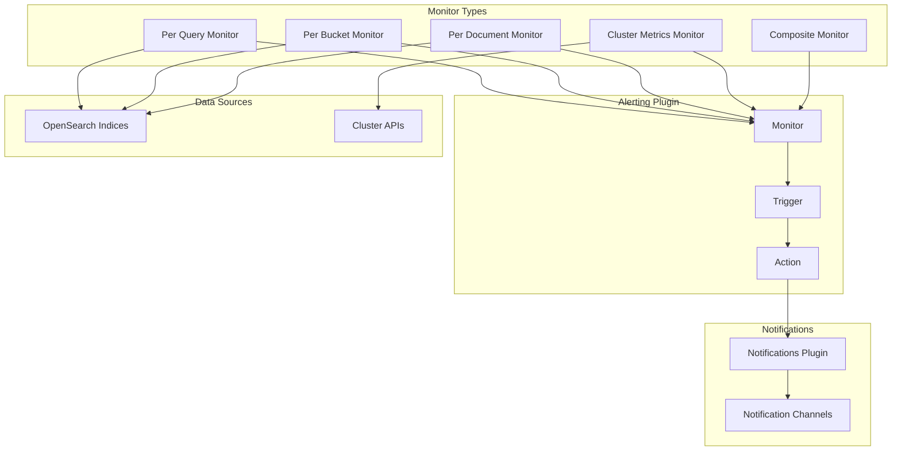

# Alerting

## Summary

OpenSearch Alerting is a plugin that enables proactive monitoring of data by creating monitors that check for specific conditions and trigger alerts with notifications. It supports multiple monitor types including per-query, per-bucket, per-document, per-cluster-metrics, and composite monitors, allowing users to be notified when data meets certain criteria.

## Details

### Architecture



### Monitor Types

| Monitor Type | Description | Use Case |
|--------------|-------------|----------|
| Per Query | Runs a query and generates alerts based on matching criteria | Simple threshold-based alerting |
| Per Bucket | Evaluates trigger criteria based on aggregated values | Alerting on grouped/bucketed data |
| Per Document | Returns individual documents matching trigger conditions | Document-level alerting |
| Per Cluster Metrics | Runs API requests to monitor cluster health | Infrastructure monitoring |
| Composite | Combines multiple monitors into a single workflow | Complex multi-condition alerting |

### Components

| Component | Description |
|-----------|-------------|
| Monitor | Defines what data to check and how often |
| Trigger | Specifies conditions that generate alerts |
| Action | Defines what happens when a trigger fires |
| Destination | Where notifications are sent (via Notifications plugin) |

### Configuration

| Setting | Description | Default |
|---------|-------------|---------|
| `plugins.alerting.monitor.max_monitors` | Maximum number of monitors | 1000 |
| `plugins.alerting.request_timeout` | Timeout for alerting requests | 10s |
| `plugins.alerting.alert_history_enabled` | Enable alert history | true |
| `plugins.alerting.alert_history_max_age` | Max age of alert history | 30d |

### Monitor Configuration

| Setting | Description | Default |
|---------|-------------|---------|
| `delete_query_index_in_every_run` | For doc-level monitors: when true, deletes and recreates the query index on each monitor run. Designed for externally defined monitors (e.g., Security Analytics) that manage their own query indices. | `false` |

### Usage Example

Creating a per-query monitor:

```json
POST _plugins/_alerting/monitors
{
  "type": "monitor",
  "name": "high-error-rate-monitor",
  "monitor_type": "query_level_monitor",
  "enabled": true,
  "schedule": {
    "period": {
      "interval": 1,
      "unit": "MINUTES"
    }
  },
  "inputs": [{
    "search": {
      "indices": ["logs-*"],
      "query": {
        "size": 0,
        "query": {
          "bool": {
            "filter": [{
              "range": {
                "@timestamp": {
                  "gte": "now-5m"
                }
              }
            }, {
              "term": {
                "level": "ERROR"
              }
            }]
          }
        }
      }
    }
  }],
  "triggers": [{
    "name": "high-error-count",
    "severity": "1",
    "condition": {
      "script": {
        "source": "ctx.results[0].hits.total.value > 100",
        "lang": "painless"
      }
    },
    "actions": [{
      "name": "notify-ops",
      "destination_id": "notification-channel-id",
      "message_template": {
        "source": "High error rate detected: {{ctx.results[0].hits.total.value}} errors in the last 5 minutes"
      }
    }]
  }]
}
```

## Limitations

- Maximum of 1000 monitors by default (configurable)
- Composite monitors require delegate monitors to be created first
- Per-document monitors may have performance impact on large datasets

## Change History

- **v3.4.0** (2025): Build script fix to only publish alerting plugin zip, excluding sample remote monitor plugin from release artifacts
- **v3.3.0** (2025): User custom attributes support for DLS/FLS parameter substitution - monitors now save and pass user custom attributes during execution, enabling DLS queries with `${attr.internal.*}` substitution to work correctly
- **v3.2.0** (2025): MGet bug fix with proper finding-to-document mapping, randomized fan-out node distribution for better load balancing, consistent API responses when alerting config index doesn't exist, Maven snapshot publishing migration to Sonatype Central
- **v3.1.0** (2025): Doc-level monitor timeboxing (3-4 min execution limit), batch findings publishing for improved performance, index pattern validation for doc-level monitors, threat intel monitor check fix, alert insight on dashboard overview page, log pattern extraction error handling
- **v3.0.0** (2025): Bug fixes for bucket selector aggregation, Java Agent migration, and dashboard subfield selection
- **v2.18.0** (2024-11-05): Doc-level monitor improvements including dynamic query index deletion (`delete_query_index_in_every_run` flag), query index lifecycle optimization, bucket-level monitor performance optimization for time-series indices, dashboard UX fit-and-finish updates, MDS compatibility fixes
- **v2.17.0** (2024-09-17): Monitor lock renewal fix, distribution build fixes, workspace navigation fix, trigger name validation fix, alerts card rendering fix, cypress and unit test fixes

## References

### Documentation
- [Alerting Documentation](https://docs.opensearch.org/3.0/observing-your-data/alerting/index/): Official alerting documentation
- [Monitors Documentation](https://docs.opensearch.org/3.0/observing-your-data/alerting/monitors/): Monitor types and configuration
- [Per Document Monitors](https://docs.opensearch.org/3.0/observing-your-data/alerting/per-document-monitors/): Per-document monitor documentation
- [Composite Monitors](https://docs.opensearch.org/3.0/observing-your-data/alerting/composite-monitors/): Composite monitor documentation
- [Alerting Security](https://docs.opensearch.org/3.0/observing-your-data/alerting/security/): Security configuration for alerting
- [Document-Level Security](https://docs.opensearch.org/3.0/security/access-control/document-level-security/): Parameter substitution in DLS queries
- [Notifications Plugin](https://docs.opensearch.org/3.0/observing-your-data/notifications/index/): Notifications integration

### Pull Requests
| Version | PR | Description | Related Issue |
|---------|-----|-------------|---------------|
| v3.4.0 | [#1608](https://github.com/opensearch-project/alerting/pull/1608) | Fix build script to only publish alerting zip |   |
| v3.3.0 | [#1917](https://github.com/opensearch-project/alerting/pull/1917) | Adds support for leveraging user custom attributes in Alerting monitors |   |
| v3.2.0 | [#1885](https://github.com/opensearch-project/alerting/pull/1885) | Fix MGet bug, randomize fan out distribution |   |
| v3.2.0 | [#1818](https://github.com/opensearch-project/alerting/pull/1818) | Refactored consistent responses and fixed unrelated exceptions | [#1057](https://github.com/opensearch-project/alerting/issues/1057) |
| v3.2.0 | [#1869](https://github.com/opensearch-project/alerting/pull/1869) | Update the maven snapshot publish endpoint and credential |   |
| v3.1.0 | [#1850](https://github.com/opensearch-project/alerting/pull/1850) | Timebox doc level monitor execution |   |
| v3.1.0 | [#1854](https://github.com/opensearch-project/alerting/pull/1854) | Prevent dry run execution of doc level monitor with index pattern |   |
| v3.1.0 | [#1856](https://github.com/opensearch-project/alerting/pull/1856) | Use transport service timeout instead of custom impl |   |
| v3.1.0 | [#1860](https://github.com/opensearch-project/alerting/pull/1860) | Publish list of findings instead of individual ones |   |
| v3.1.0 | [#829](https://github.com/opensearch-project/common-utils/pull/829) | Validate index patterns not allowed in doc level monitor |   |
| v3.1.0 | [#832](https://github.com/opensearch-project/common-utils/pull/832) | Update PublishFindingsRequest to use list of findings |   |
| v3.1.0 | [#835](https://github.com/opensearch-project/common-utils/pull/835) | Fix isDocLevelMonitor check for threat intel monitor |   |
| v3.1.0 | [#1248](https://github.com/opensearch-project/alerting-dashboards-plugin/pull/1248) | Add alert insight to alerts card on overview page |   |
| v3.1.0 | [#1256](https://github.com/opensearch-project/alerting-dashboards-plugin/pull/1256) | Add error handling for extract log pattern |   |
| v3.0.0 | [#1780](https://github.com/opensearch-project/alerting/pull/1780) | Fix bucket selector aggregation writeable name |   |
| v3.0.0 | [#1823](https://github.com/opensearch-project/alerting/pull/1823) | Fix build due to phasing off SecurityManager |   |
| v3.0.0 | [#1824](https://github.com/opensearch-project/alerting/pull/1824) | Use java-agent Gradle plugin |   |
| v3.0.0 | [#1831](https://github.com/opensearch-project/alerting/pull/1831) | Correct release notes filename |   |
| v3.0.0 | [#1234](https://github.com/opensearch-project/alerting-dashboards-plugin/pull/1234) | Fix .keyword subfield selection in bucket monitor | [#517](https://github.com/opensearch-project/alerting-dashboards-plugin/issues/517) |
| v2.18.0 | [#1685](https://github.com/opensearch-project/alerting/pull/1685) | Delete query index only if put mappings throws an exception |   |
| v2.18.0 | [#1701](https://github.com/opensearch-project/alerting/pull/1701) | Optimize bucket level monitor alias resolution for time-series indices |   |
| v2.18.0 | [#1702](https://github.com/opensearch-project/alerting/pull/1702) | Fix query index shards to 0 and auto expand replicas to 0-1 |   |
| v2.18.0 | [#1092](https://github.com/opensearch-project/alerting-dashboards-plugin/pull/1092) | Fit and Finish UX Fixes |   |
| v2.18.0 | [#1099](https://github.com/opensearch-project/alerting-dashboards-plugin/pull/1099) | Fit and Finish UX changes Pt 2 |   |
| v2.18.0 | [#1102](https://github.com/opensearch-project/alerting-dashboards-plugin/pull/1102) | Fix assistant plugin override issue and return dataSourceId in context |   |
| v2.18.0 | [#1117](https://github.com/opensearch-project/alerting-dashboards-plugin/pull/1117) | Add width for recent alerts card |   |
| v2.18.0 | [#1124](https://github.com/opensearch-project/alerting-dashboards-plugin/pull/1124) | Fix ui_metadata not fetched when MDS client is used |   |
| v2.18.0 | [#1659](https://github.com/opensearch-project/alerting/pull/1659) | Adding Alerting Comments system indices and Security ITs |   |
| v2.18.0 | [#1663](https://github.com/opensearch-project/alerting/pull/1663) | Add logging for remote monitor execution flows |   |
| v2.18.0 | [#1664](https://github.com/opensearch-project/alerting/pull/1664) | Separate doc-level monitor query indices for externally defined monitors |   |
| v2.18.0 | [#1668](https://github.com/opensearch-project/alerting/pull/1668) | Move deletion of query index before its creation |   |
| v2.18.0 | [#1674](https://github.com/opensearch-project/alerting/pull/1674) | Create query index at the time of monitor creation |   |
| v2.17.0 | [#1623](https://github.com/opensearch-project/alerting/pull/1623) | Fix monitor renew lock issue |   |
| v2.17.0 | [#1637](https://github.com/opensearch-project/alerting/pull/1637) | Fix distribution builds |   |
| v2.17.0 | [#1640](https://github.com/opensearch-project/alerting/pull/1640) | Fix distribution builds |   |
| v2.17.0 | [#1027](https://github.com/opensearch-project/alerting-dashboards-plugin/pull/1027) | Fixed cypress tests |   |
| v2.17.0 | [#1028](https://github.com/opensearch-project/alerting-dashboards-plugin/pull/1028) | Fix workspace navigation visibility |   |
| v2.17.0 | [#1040](https://github.com/opensearch-project/alerting-dashboards-plugin/pull/1040) | Fix failed UT of AddAlertingMonitor.test.js |   |
| v2.17.0 | [#794](https://github.com/opensearch-project/alerting-dashboards-plugin/pull/794) | Fix trigger name validation |   |
| v2.17.0 | [#1073](https://github.com/opensearch-project/alerting-dashboards-plugin/pull/1073) | Fix alerts card in all-use case overview page |   |

### Issues (Design / RFC)
- [Issue #1829](https://github.com/opensearch-project/alerting/issues/1829): Alerting does not work with DLS parameter substitution
- [Issue #1057](https://github.com/opensearch-project/alerting/issues/1057): Return empty responses if there is no alerting config index created
- [Issue #1853](https://github.com/opensearch-project/alerting/issues/1853): Timebox doc level monitor to avoid duplicate executions
- [Issue #1859](https://github.com/opensearch-project/alerting/issues/1859): Change publish findings to accept a list of findings
- [Issue #1617](https://github.com/opensearch-project/alerting/issues/1617): Distribution build issue
- [Issue #671](https://github.com/opensearch-project/alerting-dashboards-plugin/issues/671): Trigger name validation issue
