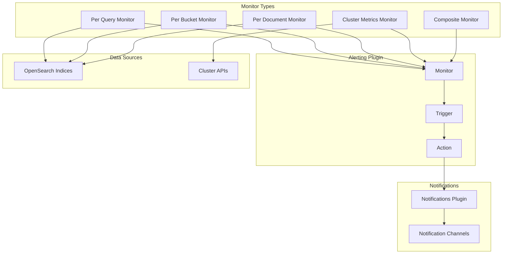

# Alerting

## Summary

OpenSearch Alerting is a plugin that enables proactive monitoring of data by creating monitors that check for specific conditions and trigger alerts with notifications. It supports multiple monitor types including per-query, per-bucket, per-document, per-cluster-metrics, and composite monitors, allowing users to be notified when data meets certain criteria.

## Details

### Architecture



### Monitor Types

| Monitor Type | Description | Use Case |
|--------------|-------------|----------|
| Per Query | Runs a query and generates alerts based on matching criteria | Simple threshold-based alerting |
| Per Bucket | Evaluates trigger criteria based on aggregated values | Alerting on grouped/bucketed data |
| Per Document | Returns individual documents matching trigger conditions | Document-level alerting |
| Per Cluster Metrics | Runs API requests to monitor cluster health | Infrastructure monitoring |
| Composite | Combines multiple monitors into a single workflow | Complex multi-condition alerting |

### Components

| Component | Description |
|-----------|-------------|
| Monitor | Defines what data to check and how often |
| Trigger | Specifies conditions that generate alerts |
| Action | Defines what happens when a trigger fires |
| Destination | Where notifications are sent (via Notifications plugin) |

### Configuration

| Setting | Description | Default |
|---------|-------------|---------|
| `plugins.alerting.monitor.max_monitors` | Maximum number of monitors | 1000 |
| `plugins.alerting.request_timeout` | Timeout for alerting requests | 10s |
| `plugins.alerting.alert_history_enabled` | Enable alert history | true |
| `plugins.alerting.alert_history_max_age` | Max age of alert history | 30d |

### Usage Example

Creating a per-query monitor:

```json
POST _plugins/_alerting/monitors
{
  "type": "monitor",
  "name": "high-error-rate-monitor",
  "monitor_type": "query_level_monitor",
  "enabled": true,
  "schedule": {
    "period": {
      "interval": 1,
      "unit": "MINUTES"
    }
  },
  "inputs": [{
    "search": {
      "indices": ["logs-*"],
      "query": {
        "size": 0,
        "query": {
          "bool": {
            "filter": [{
              "range": {
                "@timestamp": {
                  "gte": "now-5m"
                }
              }
            }, {
              "term": {
                "level": "ERROR"
              }
            }]
          }
        }
      }
    }
  }],
  "triggers": [{
    "name": "high-error-count",
    "severity": "1",
    "condition": {
      "script": {
        "source": "ctx.results[0].hits.total.value > 100",
        "lang": "painless"
      }
    },
    "actions": [{
      "name": "notify-ops",
      "destination_id": "notification-channel-id",
      "message_template": {
        "source": "High error rate detected: {{ctx.results[0].hits.total.value}} errors in the last 5 minutes"
      }
    }]
  }]
}
```

## Limitations

- Maximum of 1000 monitors by default (configurable)
- Composite monitors require delegate monitors to be created first
- Per-document monitors may have performance impact on large datasets

## Related PRs

| Version | PR | Description |
|---------|-----|-------------|
| v3.0.0 | [#1780](https://github.com/opensearch-project/alerting/pull/1780) | Fix bucket selector aggregation writeable name |
| v3.0.0 | [#1823](https://github.com/opensearch-project/alerting/pull/1823) | Fix build due to phasing off SecurityManager |
| v3.0.0 | [#1824](https://github.com/opensearch-project/alerting/pull/1824) | Use java-agent Gradle plugin |
| v3.0.0 | [#1831](https://github.com/opensearch-project/alerting/pull/1831) | Correct release notes filename |
| v3.0.0 | [#1234](https://github.com/opensearch-project/alerting-dashboards-plugin/pull/1234) | Fix .keyword subfield selection in bucket monitor |
| v2.17.0 | [#1623](https://github.com/opensearch-project/alerting/pull/1623) | Fix monitor renew lock issue |
| v2.17.0 | [#1637](https://github.com/opensearch-project/alerting/pull/1637) | Fix distribution builds |
| v2.17.0 | [#1640](https://github.com/opensearch-project/alerting/pull/1640) | Fix distribution builds |
| v2.17.0 | [#1027](https://github.com/opensearch-project/alerting-dashboards-plugin/pull/1027) | Fixed cypress tests |
| v2.17.0 | [#1028](https://github.com/opensearch-project/alerting-dashboards-plugin/pull/1028) | Fix workspace navigation visibility |
| v2.17.0 | [#1040](https://github.com/opensearch-project/alerting-dashboards-plugin/pull/1040) | Fix failed UT of AddAlertingMonitor.test.js |
| v2.17.0 | [#794](https://github.com/opensearch-project/alerting-dashboards-plugin/pull/794) | Fix trigger name validation |
| v2.17.0 | [#1073](https://github.com/opensearch-project/alerting-dashboards-plugin/pull/1073) | Fix alerts card in all-use case overview page |

## References

- [Alerting Documentation](https://docs.opensearch.org/3.0/observing-your-data/alerting/index/): Official alerting documentation
- [Monitors Documentation](https://docs.opensearch.org/3.0/observing-your-data/alerting/monitors/): Monitor types and configuration
- [Composite Monitors](https://docs.opensearch.org/3.0/observing-your-data/alerting/composite-monitors/): Composite monitor documentation
- [Alerting Security](https://docs.opensearch.org/3.0/observing-your-data/alerting/security/): Security configuration for alerting
- [Notifications Plugin](https://docs.opensearch.org/3.0/observing-your-data/notifications/index/): Notifications integration
- [Issue #1617](https://github.com/opensearch-project/alerting/issues/1617): Distribution build issue
- [Issue #671](https://github.com/opensearch-project/alerting-dashboards-plugin/issues/671): Trigger name validation issue

## Change History

- **v3.0.0** (2025): Bug fixes for bucket selector aggregation, Java Agent migration, and dashboard subfield selection
- **v2.17.0** (2024-09-17): Monitor lock renewal fix, distribution build fixes, workspace navigation fix, trigger name validation fix, alerts card rendering fix, cypress and unit test fixes
