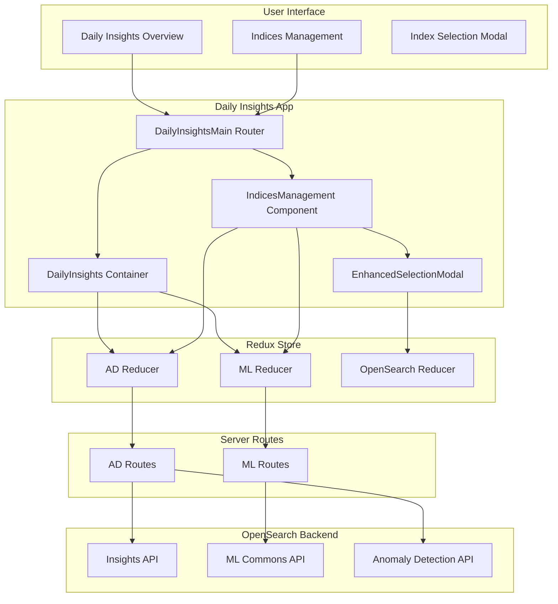
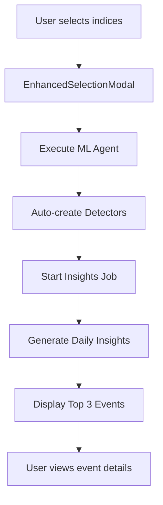

---
tags:
  - anomaly-detection-dashboards
---
# Anomaly Detection Daily Insights

## Summary

Daily Insights is a feature in the Anomaly Detection Dashboards plugin that provides automated anomaly detection management and AI-powered insights across multiple indices. It enables users to automatically create anomaly detectors for selected indices using ML agents and generates daily summaries of correlated anomaly events, helping users identify patterns and relationships across their data.

## Details

### Architecture



### Data Flow



### Components

| Component | Description |
|-----------|-------------|
| `DailyInsightsMain` | Main router component handling navigation between Overview and Indices Management pages |
| `DailyInsights` | Container component displaying insights overview, job status, and correlated anomaly events |
| `IndicesManagement` | Table view showing configured indices with auto-created detectors and their status |
| `EnhancedSelectionModal` | Paginated modal with search, multi-cluster support, and ML agent configuration |

### Configuration

| Setting | Description | Default |
|---------|-------------|---------|
| `anomalyDetection:dailyInsightsEnabled` | UI setting to enable/disable Daily Insights feature | `false` |
| `plugins.anomaly_detection.insights_enabled` | Backend cluster setting to enable insights API | `false` |

### API Endpoints

| Endpoint | Method | Description |
|----------|--------|-------------|
| `/_plugins/_anomaly_detection/insights/_start` | POST | Start the insights generation job with configurable frequency |
| `/_plugins/_anomaly_detection/insights/_stop` | POST | Stop the running insights generation job |
| `/_plugins/_anomaly_detection/insights/_status` | GET | Get current insights job status and schedule |
| `/_plugins/_anomaly_detection/insights/_results` | GET | Retrieve generated insights results |
| `/_plugins/_ml/agents/{agentId}/_execute` | POST | Execute ML agent for auto-creating detectors |

### Usage Example

#### Enabling the Feature

```yaml
# In opensearch_dashboards.yml or via Advanced Settings UI
anomalyDetection:
  dailyInsightsEnabled: true
```

#### Starting Daily Insights

1. Navigate to **Anomaly Detection → Daily Insights**
2. Click "Select Indices to Monitor"
3. Select indices from the modal (supports pagination and search)
4. Configure the ML Agent ID (default: `auto-create-detector-agent`)
5. Click "Start Auto Insights"

#### Viewing Insights

The Daily Insights page displays:
- Job status (running/stopped)
- Analysis window timeframe
- Top 3 correlated anomaly events with:
  - Event summary text
  - Affected entities
  - Detector and index information
  - Time range of anomalies

## Limitations

- Feature is behind a feature flag and disabled by default
- Requires ML Commons agent to be pre-configured for auto-creating detectors
- Insights are filtered to show only results from the most recent job execution window (default: 24 hours)
- Maximum of 3 correlated events displayed on the overview page

## Change History

- **v3.4.0** (2026-01): Initial implementation with Daily Insights page, Indices Management, and Index Selection Modal


## References

### Documentation
- [Anomaly Detection Documentation](https://docs.opensearch.org/3.0/observing-your-data/ad/index/)
- [Anomaly Detection API](https://docs.opensearch.org/3.0/observing-your-data/ad/api/)
- [Anomaly Detection Dashboards Plugin](https://github.com/opensearch-project/anomaly-detection-dashboards-plugin)

### Pull Requests
| Version | PR | Description | Related Issue |
|---------|-----|-------------|---------------|
| v3.4.0 | [#1118](https://github.com/opensearch-project/anomaly-detection-dashboards-plugin/pull/1118) | Introduce Daily Insights Page |   |
| v3.4.0 | [#1119](https://github.com/opensearch-project/anomaly-detection-dashboards-plugin/pull/1119) | Adding Indices management and selection for daily insights |   |
| v3.4.0 | [#1120](https://github.com/opensearch-project/anomaly-detection-dashboards-plugin/pull/1120) | Adding data selector for index management |   |
