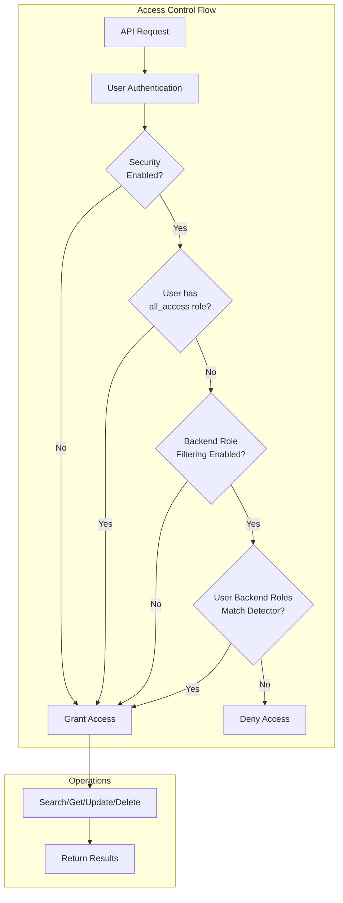

---
tags:
  - domain/observability
  - component/server
  - ml
  - search
  - security
---
# Anomaly Detection Admin Backend Role Bypass

## Summary

The Admin Backend Role Bypass feature allows users with the `all_access` role to access all anomaly detectors regardless of backend role filtering settings. This ensures administrators can properly manage and oversee all detectors in the cluster while maintaining fine-grained access control for regular users.

## Details

### Architecture



### Components

| Component | Description |
|-----------|-------------|
| `ParseUtils.isAdmin()` | Utility method checking if user has `all_access` role |
| `ADSearchHandler` | Handles search requests with admin bypass logic |
| Backend Role Filter | Filters detector access based on user backend roles |

### Configuration

| Setting | Description | Default |
|---------|-------------|--------|
| `plugins.anomaly_detection.filter_by_backend_roles` | Enable backend role filtering | `false` |

### How It Works

1. **Admin Detection**: The system checks if the user's roles contain `all_access`
2. **Bypass Logic**: If user is admin, backend role filtering is skipped
3. **Role Preservation**: When admin updates a detector, original backend roles are preserved

### Usage Example

#### Enable Backend Role Filtering

```json
PUT _cluster/settings
{
  "transient": {
    "plugins.anomaly_detection.filter_by_backend_roles": "true"
  }
}
```

#### Admin Access Behavior

With filtering enabled:
- Regular users only see detectors matching their backend roles
- Admin users (`all_access` role) see all detectors
- Admin updates preserve detector's original backend roles

```bash
# As admin - can access any detector
GET _plugins/_anomaly_detection/detectors/<any_detector_id>

# As regular user - only detectors with matching backend roles
GET _plugins/_anomaly_detection/detectors/<matching_detector_id>
```

## Limitations

- Only the `all_access` role is recognized as admin
- Custom admin roles require manual configuration
- Feature requires Security plugin to be enabled

## Change History

- **v2.17.0** (2024-09-17): Backported admin bypass feature to 2.x branch
- **v2.7.0** (2023-04-11): Initial implementation of admin priority over backend role filtering

## Related Features
- [Alerting](../alerting/alerting.md)
- [ML Commons](../ml-commons/ml-commons-agentic-memory.md)
- [Job Scheduler](../job-scheduler/job-scheduler.md)

## References

### Documentation
- [Anomaly Detection Security](https://docs.opensearch.org/latest/observing-your-data/ad/security/): Security documentation
- [Backend Role Filtering](https://docs.opensearch.org/latest/observing-your-data/ad/security/#advanced-limit-access-by-backend-role): Backend role configuration

### Pull Requests
| Version | PR | Description | Related Issue |
|---------|-----|-------------|---------------|
| v2.17.0 | [#859](https://github.com/opensearch-project/anomaly-detection/pull/859) | Backport: Admin priority over backend role filtering |   |
| v2.7.0 | [#850](https://github.com/opensearch-project/anomaly-detection/pull/850) | Initial implementation | [#842](https://github.com/opensearch-project/anomaly-detection/issues/842) |

### Issues (Design / RFC)
- [Issue #842](https://github.com/opensearch-project/anomaly-detection/issues/842): Original feature request
