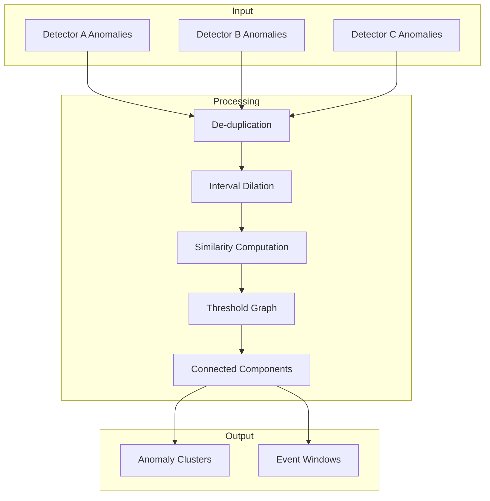

---
tags:
  - anomaly-detection
---
# Anomaly Detection Correlation

## Summary

Anomaly correlation is a feature that clusters anomalies from multiple detectors based on temporal overlap similarity. When multiple detectors fire on the same incident, their anomaly intervals substantially overlap in time. This feature identifies such correlations and groups related anomalies into clusters, each with an event window representing the incident timeframe.

## Details

### Architecture



### Algorithm

The correlation algorithm works as follows:

1. **De-duplication**: Remove duplicate anomalies by ID (stable insertion order)
2. **Interval Dilation**: Expand time intervals by ±delta to tolerate bucket alignment drift
3. **Pairwise Similarity**: For each pair of anomalies, compute:
   - Temporal overlap (IoU or overlap coefficient)
   - Duration penalty
   - Combined similarity score
4. **Threshold Graph**: Add edge between anomalies if similarity ≥ alpha
5. **Connected Components**: Run DFS to find clusters
6. **Event Windows**: Compute `[min(start), max(end)]` for each cluster

### Temporal Modes

| Mode | Description | Use Case |
|------|-------------|----------|
| IOU | Jaccard over time on dilated intervals | General cases |
| OVL | Overlap coefficient (overlap / min length) | Containment cases |
| HYBRID | Blends IoU and OVL for strong containment | Default mode |

### Configuration Parameters

| Parameter | Default | Description |
|-----------|---------|-------------|
| `delta` | 5 min | Time tolerance for interval dilation |
| `alpha` | 0.30 | Minimum similarity threshold for edge creation |
| `kappa` | 30 min | Duration penalty scale (Laplacian kernel) |
| `minOverlap` | 3 min | Minimum overlap required after dilation |
| `temporalMode` | HYBRID | Temporal similarity mode |
| `lam` | 0.6 | Hybrid containment blend factor |
| `tauContain` | 0.8 | Containment threshold |
| `rhoMax` | 0.25 | Maximum duration ratio for containment |
| `containmentRelax` | 0.45 | Duration penalty relaxation under containment |

### Backward Dilation

For coarse detectors (≥30 min intervals) using community aggregations (sum, avg, count), the algorithm extends the start time by the detector interval to account for detection lag. This is because:

- Community aggregations need most/all data in a bucket
- If an incident starts near the end of a bucket, detection may be delayed
- Bucket boundaries are scheduling artifacts, not incident timing

### Usage Example

```java
List<Anomaly> anomalies = collectAnomalies();
List<AnomalyDetector> detectors = getDetectorConfigs();

// Get clusters with event windows
List<AnomalyCorrelation.Cluster> clusters = 
    AnomalyCorrelation.clusterWithEventWindows(anomalies, detectors);

// Optionally exclude single-element clusters
List<AnomalyCorrelation.Cluster> multiClusters = 
    AnomalyCorrelation.clusterWithEventWindows(anomalies, detectors, false);
```

### Key Classes

| Class | Description |
|-------|-------------|
| `Anomaly` | Represents an anomaly with modelId, configId, start/end times |
| `AnomalyCorrelation` | Main utility class with clustering algorithms |
| `AnomalyCorrelation.Cluster` | Contains event window and list of anomalies |
| `AnomalyCorrelation.EventWindow` | Time range spanning a cluster |

## Limitations

- Correlation is computed in-memory; large anomaly sets may impact performance
- Requires detector configurations to be available for interval-aware dilation
- Algorithm assumes anomalies represent time intervals, not point events

## Change History

- **v3.5.0** (2026-01): Initial implementation with temporal overlap similarity clustering

## References

### Documentation

- OpenSearch Anomaly Detection documentation

### Pull Requests

| Version | PR | Description |
|---------|-----|-------------|
| v3.5.0 | [#1641](https://github.com/opensearch-project/anomaly-detection/pull/1641) | Correlating Anomalies via Temporal Overlap Similarity |
| v3.5.0 | [#1654](https://github.com/opensearch-project/anomaly-detection/pull/1654) | Serialize integTestRemote on remote clusters |
| v3.5.0 | [#1135](https://github.com/opensearch-project/anomaly-detection-dashboards-plugin/pull/1135) | Bump lodash from 4.17.21 to 4.17.23 |
| v3.5.0 | [#1134](https://github.com/opensearch-project/anomaly-detection-dashboards-plugin/pull/1134) | Bump lodash-es from 4.17.21 to 4.17.23 |
