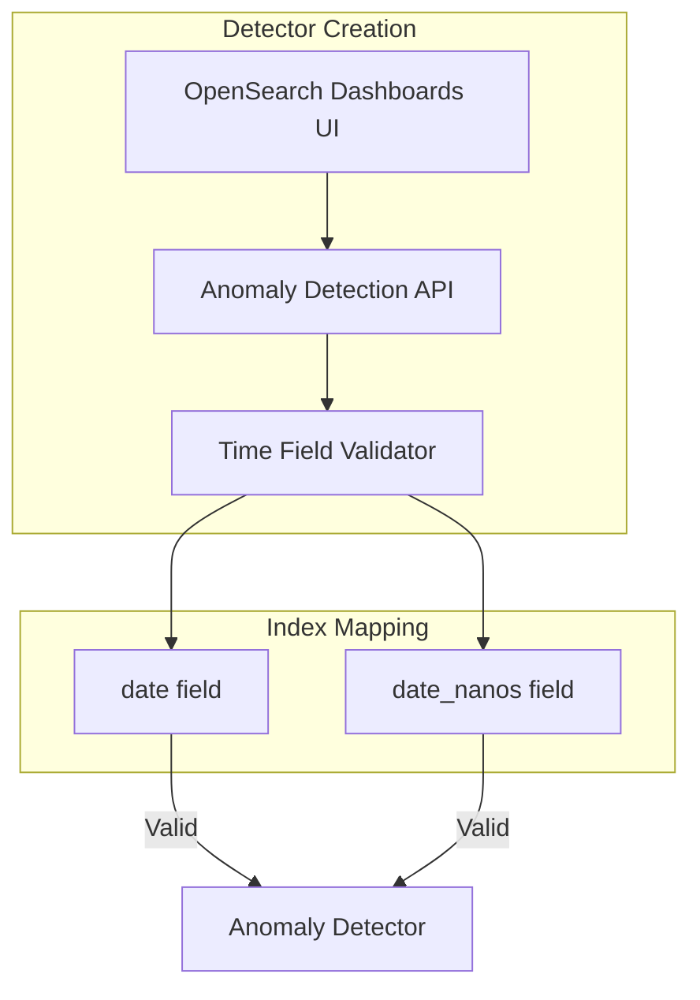

---
tags:
  - anomaly-detection
---
# Anomaly Detection date_nanos Support

## Summary

The Anomaly Detection plugin supports the `date_nanos` field type as a valid timestamp field for creating anomaly detectors. This allows users with nanosecond-precision timestamps to use Anomaly Detection without needing to create a separate `date` type field.

## Details

### Overview

OpenSearch provides two date field types:
- `date`: Millisecond precision (default)
- `date_nanos`: Nanosecond precision

The Anomaly Detection plugin validates the timestamp field type when creating detectors. With `date_nanos` support, both field types are accepted as valid timestamp fields.

### Architecture



### Components

| Component | Description |
|-----------|-------------|
| `AbstractTimeSeriesActionHandler` | Validates timestamp field type during detector creation |
| `CommonName.DATE_NANOS_TYPE` | Constant for `date_nanos` type string |
| `Timestamp.tsx` | UI component for timestamp field selection |
| `DataTypes` interface | Redux state interface including `date_nanos` fields |

### Configuration

No additional configuration is required. The `date_nanos` field type is automatically recognized when:
1. Creating a detector via the REST API
2. Selecting a timestamp field in OpenSearch Dashboards

### Usage Example

#### Index Mapping with date_nanos

```json
PUT /high-frequency-data
{
  "mappings": {
    "properties": {
      "timestamp": {
        "type": "date_nanos",
        "format": "strict_date_optional_time_nanos||epoch_millis"
      },
      "cpu_usage": {
        "type": "double"
      },
      "host": {
        "type": "keyword"
      }
    }
  }
}
```

#### Creating a Detector

```json
POST /_plugins/_anomaly_detection/detectors
{
  "name": "cpu-anomaly-detector",
  "description": "Detect CPU usage anomalies",
  "time_field": "timestamp",
  "indices": ["high-frequency-data"],
  "feature_attributes": [
    {
      "feature_name": "cpu_avg",
      "feature_enabled": true,
      "aggregation_query": {
        "cpu_avg": {
          "avg": {
            "field": "cpu_usage"
          }
        }
      }
    }
  ],
  "detection_interval": {
    "period": {
      "interval": 1,
      "unit": "Minutes"
    }
  }
}
```

## Limitations

- Internal anomaly detection processing uses millisecond precision for detection intervals
- The nanosecond precision is preserved in the source data but aggregated to the detection interval

## Change History

- **v2.16.0** (2024-08-06): Added support for `date_nanos` field type as a valid timestamp field

## References

### Documentation

- [Date nanoseconds field type](https://docs.opensearch.org/latest/field-types/supported-field-types/date-nanos/)
- [Anomaly Detection](https://docs.opensearch.org/latest/observing-your-data/ad/index/)

### Pull Requests

| Version | PR | Description |
|---------|-----|-------------|
| v2.16.0 | [anomaly-detection#1238](https://github.com/opensearch-project/anomaly-detection/pull/1238) | Adding support for date_nanos to Anomaly Detection |
| v2.16.0 | [anomaly-detection-dashboards-plugin#795](https://github.com/opensearch-project/anomaly-detection-dashboards-plugin/pull/795) | Allow date_nanos dates in timestamp selection |

### Related Issues

| Issue | Description |
|-------|-------------|
| [anomaly-detection#1226](https://github.com/opensearch-project/anomaly-detection/issues/1226) | Feature request: Support date_nanos as a date field |
