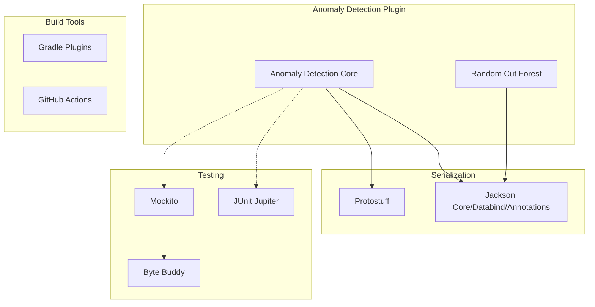

---
tags:
  - domain/observability
  - component/server
  - ml
  - security
---
# Anomaly Detection Dependencies

## Summary

The Anomaly Detection plugin maintains various dependencies for core functionality, serialization, and testing. Regular dependency updates ensure security, compatibility with the OpenSearch core, and access to the latest features and bug fixes.

## Details

### Architecture



### Key Dependencies

| Category | Dependency | Purpose |
|----------|------------|---------|
| Serialization | Jackson | JSON serialization/deserialization |
| Serialization | Protostuff | RCF model serialization |
| ML | Random Cut Forest | Anomaly detection algorithm |
| Math | Apache Commons Math3 | Statistical computations |
| Utilities | Guava | Collections and utilities |
| Testing | JUnit Jupiter | Unit testing framework |
| Testing | Mockito | Mocking framework |
| Testing | Byte Buddy | Runtime code generation for mocks |

### Configuration

Dependencies are managed in `build.gradle` with version variables for consistency:

```groovy
ext {
    jacksonVersion = "2.18.0"
}

dependencies {
    implementation("com.fasterxml.jackson.core:jackson-databind:${jacksonVersion}")
    implementation("com.fasterxml.jackson.core:jackson-annotations:${jacksonVersion}")
}
```

## Limitations

- Jackson version must be compatible with OpenSearch core's jackson-core
- Test dependencies should align with OpenSearch test framework versions

## Change History

- **v2.18.0** (2024-10-29): Updated Jackson to 2.18.0, JUnit Jupiter to 5.11.2, Mockito to 5.14.1; removed unused javassist dependency


## References

### Documentation
- [Anomaly Detection Documentation](https://docs.opensearch.org/latest/observing-your-data/ad/index/)
- [Anomaly Detection Repository](https://github.com/opensearch-project/anomaly-detection)

### Pull Requests
| Version | PR | Description | Related Issue |
|---------|-----|-------------|---------------|
| v2.18.0 | [#1337](https://github.com/opensearch-project/anomaly-detection/pull/1337) | Updating several dependencies |   |
