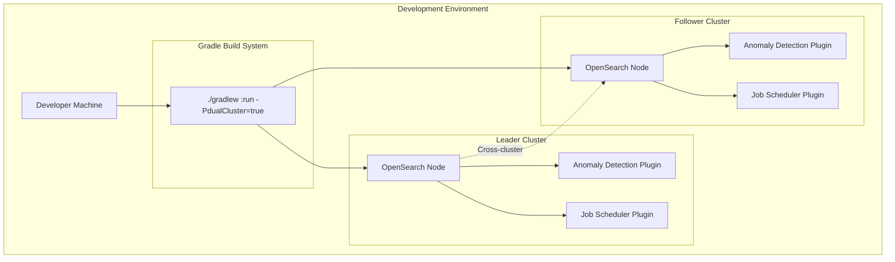
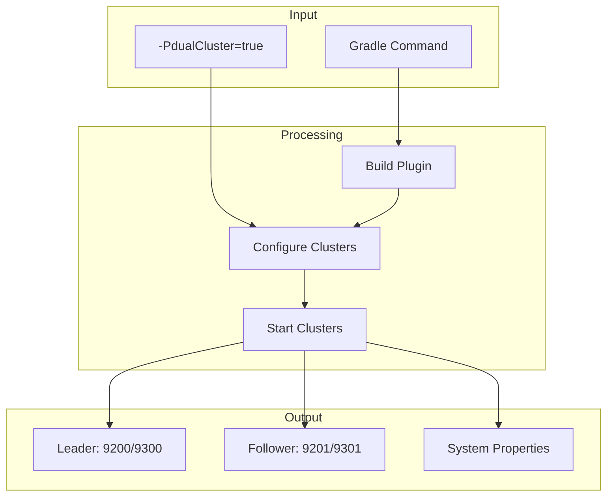

---
tags:
  - anomaly-detection
---
# Dual Cluster Development Environment

## Summary

The Anomaly Detection plugin provides a dual cluster development environment that allows developers to run two independent OpenSearch clusters locally with a single Gradle command. This feature simplifies testing of cross-cluster functionality such as cross-cluster replication, remote cluster queries, and multi-cluster anomaly detection scenarios.

## Details

### Architecture



### Data Flow



### Components

| Component | Description |
|-----------|-------------|
| `leaderCluster` | Primary test cluster with `cluster_role=leader` attribute |
| `followCluster` | Secondary test cluster with `cluster_role=follower` attribute |
| `configureClusterPlugins()` | Shared function for plugin installation and security configuration |
| `integTest` | Default single cluster for standard testing |

### Configuration

| Setting | Description | Default |
|---------|-------------|---------|
| `-PdualCluster` | Enable dual cluster mode | `false` |
| `discovery.type` | Cluster discovery mode | `single-node` |
| `path.repo` | Snapshot repository path | `${buildDir}/{clusterName}/repo` |
| `node.attr.cluster_role` | Custom attribute for cluster identification | `leader` or `follower` |

### Network Configuration

| Cluster | HTTP Port | Transport Port |
|---------|-----------|----------------|
| Leader | 9200 | 9300 |
| Follower | 9201 | 9301 |

### Usage Example

```bash
# Standard single cluster mode
./gradlew :run

# Dual cluster mode for cross-cluster testing
./gradlew :run -PdualCluster=true
```

When running in dual cluster mode, the console output displays:

```
Leader cluster running at HTTP: localhost:9200, Transport: localhost:9300
Follower cluster running at HTTP: localhost:9201, Transport: localhost:9301
```

### System Properties for Tests

When dual cluster mode is enabled, the following system properties are set for integration tests:

```groovy
systemProperty "tests.leader.cluster.name", "leader"
systemProperty "tests.follow.cluster.name", "follower"
systemProperty "tests.cluster.leader.http_hosts", "localhost:9200"
systemProperty "tests.cluster.follow.http_hosts", "localhost:9201"
systemProperty "tests.cluster.leader.transport_hosts", "localhost:9300"
systemProperty "tests.cluster.follow.transport_hosts", "localhost:9301"
```

### Security Configuration

When security is enabled (`-Dsecurity=true`), both clusters are configured with:
- SSL/TLS certificates (kirk.pem, esnode.pem, root-ca.pem)
- Demo certificates for development
- Security plugin settings for HTTPS and transport layer encryption

## Limitations

- Both clusters run on localhost only (not suitable for distributed testing)
- Clusters share the same security configuration when enabled
- Single node per cluster (no multi-node cluster simulation)
- Requires sufficient system resources to run two JVM instances

## Change History

- **v3.0.0** (2025-05-06): Initial implementation - Added `-PdualCluster` property to launch leader and follower clusters for cross-cluster testing


## References

### Documentation
- [DEVELOPER_GUIDE.md](https://github.com/opensearch-project/anomaly-detection/blob/main/DEVELOPER_GUIDE.md): Official developer documentation
- [build.gradle](https://github.com/opensearch-project/anomaly-detection/blob/main/build.gradle): Gradle build configuration

### Pull Requests
| Version | PR | Description | Related Issue |
|---------|-----|-------------|---------------|
| v3.0.0 | [#1441](https://github.com/opensearch-project/anomaly-detection/pull/1441) | Initial implementation of dual cluster gradle run |   |
