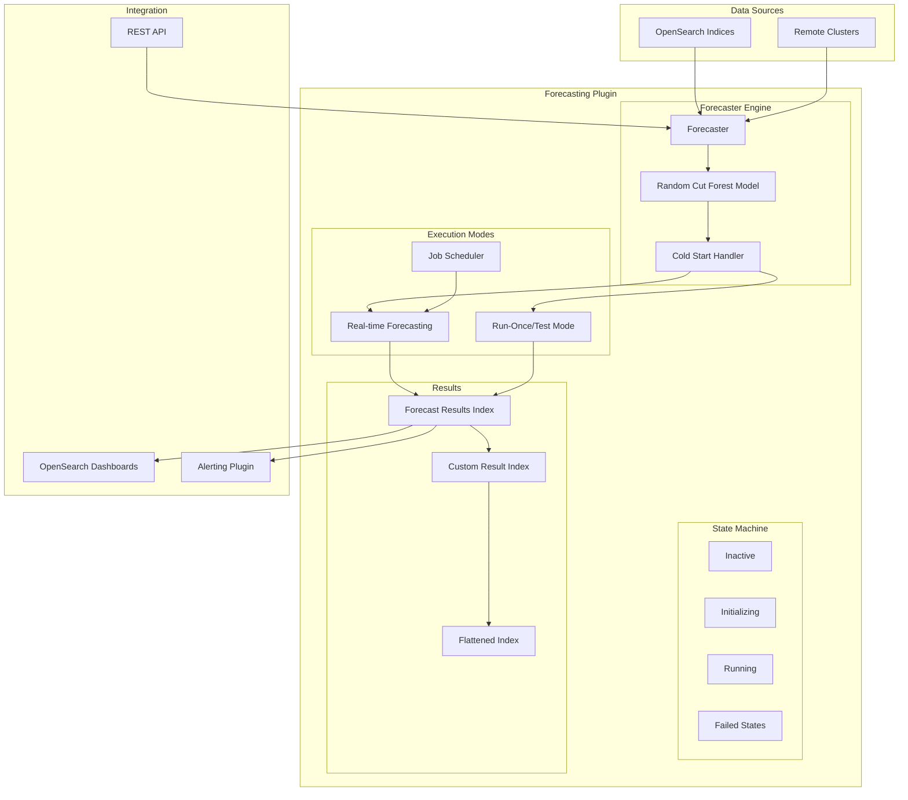
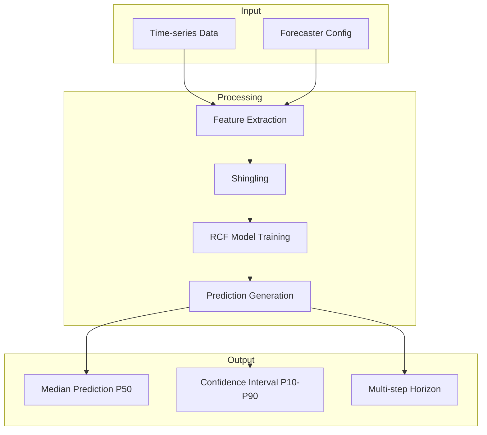

# Anomaly Detection Forecasting

## Summary

OpenSearch Forecasting transforms time-series data into predictive signals using the Random Cut Forest (RCF) model. Built on the same foundation as Anomaly Detection, Forecasting predicts future metric values to help with capacity planning, predictive maintenance, and proactive alerting. The feature supports both single-entity and high-cardinality (multi-entity) forecasters, with a comprehensive Dashboards UI for configuration, testing, and visualization.

## Details

### Architecture



### Data Flow



### Components

| Component | Description |
|-----------|-------------|
| Forecaster | Configuration defining data source, features, and prediction parameters |
| Random Cut Forest (RCF) | Online learning ML algorithm for time-series prediction |
| Cold Start Handler | Initializes model with historical data before real-time forecasting |
| State Machine | Manages forecaster lifecycle states (Inactive, Initializing, Running, Failed) |
| Result Index | Stores forecast predictions with confidence intervals |
| Category Field | Enables high-cardinality forecasting by entity grouping |

### Forecaster States

| State | Description |
|-------|-------------|
| `INACTIVE` | Forecaster created but not started |
| `INACTIVE_STOPPED` | Forecaster stopped by user after running |
| `AWAITING_DATA_INIT` | Attempting to start but insufficient data for initialization |
| `AWAITING_DATA_RESTART` | Attempting to restart but insufficient data |
| `INIT_TEST` | Building model for test/run-once execution |
| `INIT_FORECAST` | Building model for continuous forecasting |
| `TEST_COMPLETE` | Test run completed successfully |
| `RUNNING` | Forecaster running continuously |
| `INIT_TEST_FAILED` | Test initialization failed |
| `INIT_FORECAST_FAILED` | Forecast initialization failed |
| `FORECAST_FAILED` | Forecaster failed during operation |

### Configuration

| Setting | Description | Default |
|---------|-------------|---------|
| `forecast_interval` | Time between forecast runs | Required |
| `window_delay` | Extra time for data collection | Auto-suggested |
| `horizon` | Number of future buckets to predict | Required |
| `history` | Historical data points for cold-start training | Auto-suggested (max 10,000) |
| `shingle_size` | Number of intervals for pattern detection | 8 (auto-calculated) |
| `category_field` | Field(s) for entity grouping | None (single-entity) |
| `result_index` | Custom index for results | `opensearch-forecast-results` |

### API Endpoints

| Endpoint | Method | Description |
|----------|--------|-------------|
| `/_plugins/_forecast/forecasters` | POST | Create forecaster |
| `/_plugins/_forecast/forecasters/<id>` | GET | Get forecaster |
| `/_plugins/_forecast/forecasters/<id>` | PUT | Update forecaster |
| `/_plugins/_forecast/forecasters/<id>` | DELETE | Delete forecaster |
| `/_plugins/_forecast/forecasters/<id>/_start` | POST | Start forecasting |
| `/_plugins/_forecast/forecasters/<id>/_stop` | POST | Stop forecasting |
| `/_plugins/_forecast/forecasters/<id>/_run_once` | POST | Run test/backtest |
| `/_plugins/_forecast/forecasters/<id>/_profile` | GET | Get forecaster profile |

### Usage Example

#### Create a Single-Entity Forecaster

```json
POST _plugins/_forecast/forecasters
{
  "name": "cpu-forecast",
  "description": "Forecast CPU usage every 10 minutes",
  "time_field": "timestamp",
  "indices": ["server-metrics-*"],
  "feature_attributes": [
    {
      "feature_name": "avg_cpu",
      "feature_enabled": true,
      "aggregation_query": {
        "avg_cpu": {
          "avg": {
            "field": "cpu_usage"
          }
        }
      }
    }
  ],
  "forecast_interval": {
    "period": {
      "interval": 10,
      "unit": "Minutes"
    }
  },
  "horizon": 24,
  "history": 500
}
```

#### Create a High-Cardinality Forecaster

```json
POST _plugins/_forecast/forecasters
{
  "name": "per-host-cpu-forecast",
  "description": "Forecast CPU usage per host",
  "time_field": "timestamp",
  "indices": ["server-metrics-*"],
  "feature_attributes": [
    {
      "feature_name": "avg_cpu",
      "feature_enabled": true,
      "aggregation_query": {
        "avg_cpu": {
          "avg": {
            "field": "cpu_usage"
          }
        }
      }
    }
  ],
  "category_field": ["host.name"],
  "forecast_interval": {
    "period": {
      "interval": 10,
      "unit": "Minutes"
    }
  },
  "horizon": 24
}
```

### Security Roles

Forecasting uses the same security framework as anomaly detection:

| Role | Description |
|------|-------------|
| `anomaly_full_access` | Full access to all forecasting operations |
| `anomaly_read_access` | Read-only access to forecasters and results |

### Use Cases

| Domain | What to Forecast | Operational Benefit |
|--------|------------------|---------------------|
| Predictive Maintenance | Temperature, vibration, error counts | Replace parts before failure |
| Network Forecasting | Throughput, latency, connections | Allocate bandwidth for SLA targets |
| Capacity Planning | CPU, RAM, disk usage | Rightsize hardware, autoscale efficiently |
| Financial Planning | Order volume, revenue | Align staffing and budgets |

## Limitations

- Maximum 2 category fields per high-cardinality forecaster
- Model training requires minimum 40 historical data points
- Entity caching limited by available memory (formula: `(nodes × heap × 10%) / model_size`)
- Forecast accuracy declines with longer horizons
- Custom result indexes require separate lifecycle management

## Change History

- **v3.1.0** (2025-07-08): Bug fixes for task state handling, date format compatibility, cold-start/window delay refinements, UI validation and error display improvements, missing data error surfacing, Create Forecaster UI enhancements

## References

### Documentation
- [Forecasting Documentation](https://docs.opensearch.org/3.1/observing-your-data/forecast/index/): Official documentation
- [Getting Started with Forecasting](https://docs.opensearch.org/3.1/observing-your-data/forecast/getting-started/): Setup guide
- [Managing Forecasters](https://docs.opensearch.org/3.1/observing-your-data/forecast/managing-forecasters/): Lifecycle management
- [Forecasting Security](https://docs.opensearch.org/3.1/observing-your-data/forecast/security/): Security configuration
- [Forecasting API](https://docs.opensearch.org/3.1/observing-your-data/forecast/api/): API reference

### Blog Posts
- [One Million Entities Blog](https://opensearch.org/blog/one-million-enitities-in-one-minute/): High-cardinality performance

### Pull Requests
| Version | PR | Description |
|---------|-----|-------------|
| v3.1.0 | [#1489](https://github.com/opensearch-project/anomaly-detection/pull/1489) | Fix incorrect task state handling |
| v3.1.0 | [#1493](https://github.com/opensearch-project/anomaly-detection/pull/1493) | Fix range query on non-epoch date mappings |
| v3.1.0 | [#1496](https://github.com/opensearch-project/anomaly-detection/pull/1496) | Refine cold-start, window delay, task updates |
| v3.1.0 | [#1479](https://github.com/opensearch-project/anomaly-detection/pull/1479) | State machine, config index, suggest/validate APIs |
| v3.1.0 | [#1038](https://github.com/opensearch-project/anomaly-detection-dashboards-plugin/pull/1038) | Forecasting frontend |
| v3.1.0 | [#1047](https://github.com/opensearch-project/anomaly-detection-dashboards-plugin/pull/1047) | Validation and error display improvements |
| v3.1.0 | [#1050](https://github.com/opensearch-project/anomaly-detection-dashboards-plugin/pull/1050) | Missing data error surfacing |
| v3.1.0 | [#1052](https://github.com/opensearch-project/anomaly-detection-dashboards-plugin/pull/1052) | Create Forecaster UI improvements |
