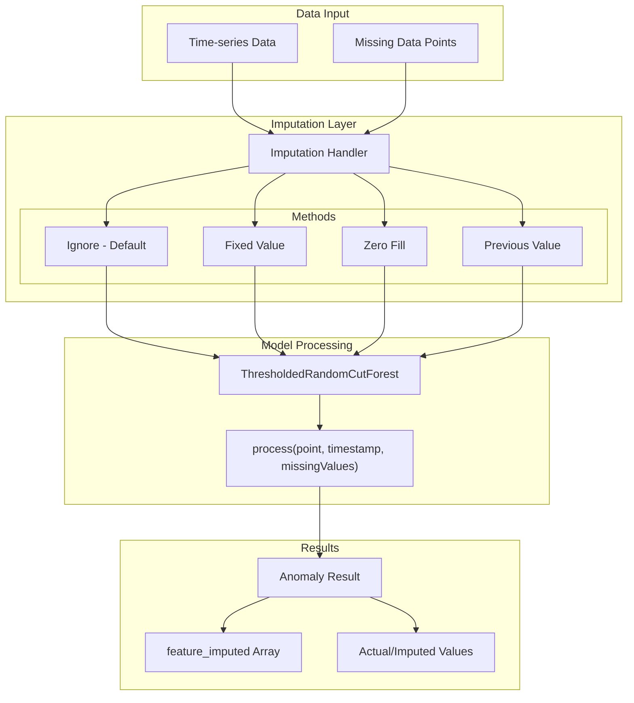
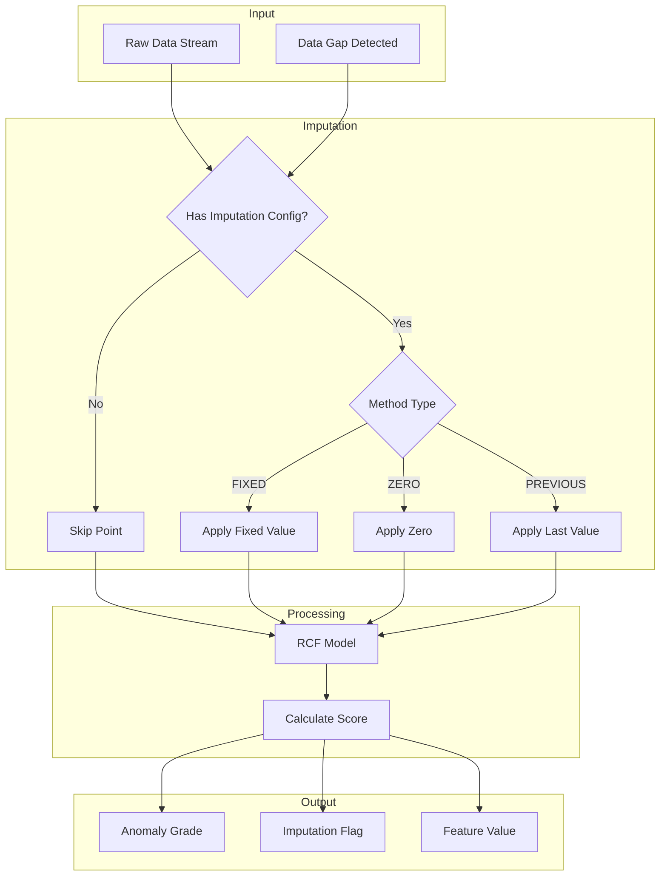

# Anomaly Detection Missing Data Handling

## Summary

OpenSearch Anomaly Detection provides flexible missing data handling capabilities, allowing users to choose how to address gaps in time-series data. This feature improves anomaly detection recall by treating missing data as meaningful signals rather than simply ignoring them. Users can configure imputation methods including ignoring missing data, filling with fixed values, zeros, or previous values.

## Details

### Architecture



### Data Flow



### Components

| Component | Description |
|-----------|-------------|
| `ImputationOption` | Configuration model for imputation method and default values |
| `ADRealTimeInferencer` | Real-time inference handler with imputation support |
| `ADHCImputeTransportAction` | Broadcast action for high-cardinality detector imputation |
| `FeatureImputed` | Model class tracking imputation status per feature |
| `ImputedFeatureResult` | Result class containing imputed values and boolean flags |
| `Inferencer` | Refactored base class for imputation processing and statistics |

### Imputation Methods

| Method | Description | Use Case |
|--------|-------------|----------|
| `IGNORE` | Skip missing data points (default) | When gaps are expected and not meaningful |
| `FIXED` | Replace with user-specified values | When a baseline value is known |
| `ZERO` | Replace with zeros | When absence indicates zero activity (e.g., event counts) |
| `PREVIOUS` | Carry forward last observed value | When continuity is expected |

### Configuration

| Setting | Description | Default |
|---------|-------------|---------|
| `imputation_option.method` | Imputation method to use | `IGNORE` |
| `imputation_option.default_fill` | Array of feature-value pairs for FIXED method | None |

### API Configuration

```json
{
  "imputation_option": {
    "method": "FIXED",
    "default_fill": [
      {
        "feature_name": "feature1",
        "data": 100.0
      },
      {
        "feature_name": "feature2", 
        "data": 50.0
      }
    ]
  }
}
```

### Usage Examples

#### Zero Fill for Event Counting

```json
POST _plugins/_anomaly_detection/detectors
{
  "name": "login-event-detector",
  "description": "Detect unusual login patterns including complete drops",
  "time_field": "@timestamp",
  "indices": ["login-events-*"],
  "feature_attributes": [
    {
      "feature_name": "login_count",
      "feature_enabled": true,
      "aggregation_query": {
        "login_count": {
          "value_count": {
            "field": "user_id"
          }
        }
      }
    }
  ],
  "detection_interval": {
    "period": {
      "interval": 5,
      "unit": "Minutes"
    }
  },
  "imputation_option": {
    "method": "ZERO"
  }
}
```

#### Previous Value for Metric Continuity

```json
POST _plugins/_anomaly_detection/detectors
{
  "name": "temperature-detector",
  "description": "Monitor temperature with gap handling",
  "time_field": "timestamp",
  "indices": ["sensor-data-*"],
  "feature_attributes": [
    {
      "feature_name": "avg_temp",
      "feature_enabled": true,
      "aggregation_query": {
        "avg_temp": {
          "avg": {
            "field": "temperature"
          }
        }
      }
    }
  ],
  "detection_interval": {
    "period": {
      "interval": 1,
      "unit": "Minutes"
    }
  },
  "imputation_option": {
    "method": "PREVIOUS"
  }
}
```

#### Fixed Value for Known Baselines

```json
POST _plugins/_anomaly_detection/detectors
{
  "name": "throughput-detector",
  "description": "Monitor throughput with baseline imputation",
  "time_field": "timestamp",
  "indices": ["network-metrics-*"],
  "feature_attributes": [
    {
      "feature_name": "bytes_per_sec",
      "feature_enabled": true,
      "aggregation_query": {
        "bytes_per_sec": {
          "avg": {
            "field": "throughput"
          }
        }
      }
    }
  ],
  "detection_interval": {
    "period": {
      "interval": 1,
      "unit": "Minutes"
    }
  },
  "imputation_option": {
    "method": "FIXED",
    "default_fill": [
      {
        "feature_name": "bytes_per_sec",
        "data": 1000000
      }
    ]
  }
}
```

### Result Format with Imputation

```json
{
  "detector_id": "kzcZ43wBgEQAbjDnhzGF",
  "schema_version": 5,
  "data_start_time": 1635898161367,
  "data_end_time": 1635898221367,
  "feature_data": [
    {
      "feature_id": "processing_bytes_max",
      "feature_name": "processing bytes max",
      "data": 2322
    },
    {
      "feature_id": "processing_bytes_avg",
      "feature_name": "processing bytes avg",
      "data": 1718.67
    }
  ],
  "anomaly_score": 1.81,
  "anomaly_grade": 0,
  "confidence": 0.98,
  "feature_imputed": [
    {
      "feature_id": "processing_bytes_max",
      "imputed": true
    },
    {
      "feature_id": "processing_bytes_avg",
      "imputed": false
    }
  ]
}
```

## Limitations

- Imputation with shingle size 1 is not meaningful; requires shingle size > 1
- Extensive imputation can compromise model accuracy - quality input is critical
- Confidence score decreases when imputations occur
- Preview mode uses linear interpolation instead of configured imputation for efficiency
- First imputation in a continuous missing area may generate NaN values that are not saved

## Change History

- **v2.17.0** (2024-09-17): Initial implementation with four imputation methods, feature_imputed tracking, HC detector broadcast support, historical analysis integration

## References

### Documentation
- [Anomaly Detection Documentation](https://docs.opensearch.org/2.17/observing-your-data/ad/index/): Setting imputation options
- [Anomaly Result Mapping](https://docs.opensearch.org/2.17/observing-your-data/ad/result-mapping/): feature_imputed field documentation
- [Forum Discussion](https://forum.opensearch.org/t/do-missing-buckets-ruin-anomaly-detection/16535): Original feature request
- [Random Cut Forest Library](https://github.com/aws/random-cut-forest-by-aws): RCF 4.1.0 with missing data support

### Pull Requests
| Version | PR | Description | Related Issue |
|---------|-----|-------------|---------------|
| v2.17.0 | [#1274](https://github.com/opensearch-project/anomaly-detection/pull/1274) | Add Support for Handling Missing Data in Anomaly Detection |   |
