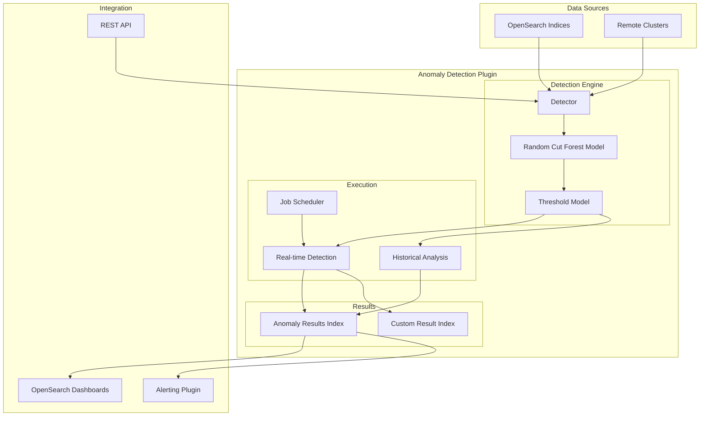
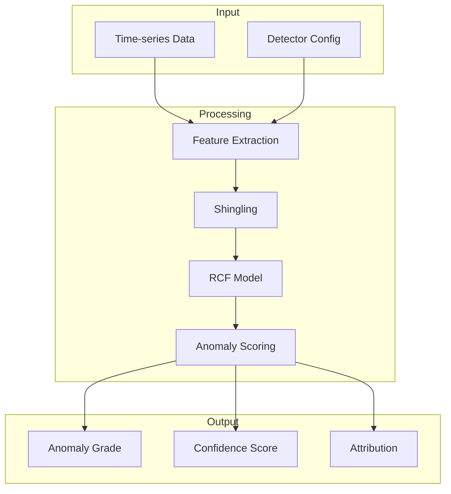

---
tags:
  - anomaly-detection
---
# Anomaly Detection

## Summary

OpenSearch Anomaly Detection uses machine learning algorithms, specifically Random Cut Forest (RCF), to automatically identify unusual patterns in time-series data. It supports both real-time and historical analysis, single-entity and high-cardinality (multi-entity) detectors, and can monitor data across local and remote clusters. The plugin integrates with OpenSearch Dashboards for visualization and with the Alerting plugin for notifications.

## Details

### Architecture



### Data Flow



### Components

| Component | Description |
|-----------|-------------|
| Detector | Configuration defining data source, features, and detection parameters |
| Random Cut Forest (RCF) | Unsupervised ML algorithm for anomaly scoring |
| Threshold Model | Determines anomaly grade based on RCF scores |
| Job Scheduler | Executes real-time detection at configured intervals |
| Result Index | Stores anomaly detection results |
| Category Field | Enables high-cardinality detection by grouping entities |

### Detector Types

| Type | Description | Use Case |
|------|-------------|----------|
| Single-entity | One model for entire data stream | Simple metrics monitoring |
| High-cardinality (HC) | Separate model per entity | Per-host, per-user monitoring |
| Real-time | Continuous detection | Live monitoring and alerting |
| Historical | Batch analysis over time range | Root cause analysis, backtesting |

### Configuration

| Setting | Description | Default |
|---------|-------------|---------|
| `detection_interval` | Time between detection runs | Required |
| `frequency` | Detection execution frequency (v3.3.0+, must be multiple of interval) | Same as `detection_interval` |
| `window_delay` | Extra time for data collection | 1 minute |
| `shingle_size` | Number of intervals for pattern detection | 8 |
| `category_field` | Field(s) for entity grouping | None (single-entity) |
| `result_index` | Custom index for results | `.opensearch-anomaly-results*` |
| `filter_query` | Query to filter input data | Match all |
| `auto_create` | Indicates if detector was created automatically (v3.4.0+) | `false` |

### API Endpoints

| Endpoint | Method | Description |
|----------|--------|-------------|
| `/_plugins/_anomaly_detection/detectors` | POST | Create detector |
| `/_plugins/_anomaly_detection/detectors/<id>` | GET | Get detector |
| `/_plugins/_anomaly_detection/detectors/<id>` | PUT | Update detector |
| `/_plugins/_anomaly_detection/detectors/<id>` | DELETE | Delete detector |
| `/_plugins/_anomaly_detection/detectors/<id>/_start` | POST | Start detection |
| `/_plugins/_anomaly_detection/detectors/<id>/_stop` | POST | Stop detection |
| `/_plugins/_anomaly_detection/detectors/<id>/_profile` | GET | Get detector profile |
| `/_plugins/_anomaly_detection/detectors/results/_search` | POST | Search results |
| `/_plugins/_anomaly_detection/detectors/_suggest/{suggestType}` | POST | Get configuration suggestions (v3.3.0+) |

### Usage Example

#### Create a Single-Entity Detector

```json
POST _plugins/_anomaly_detection/detectors
{
  "name": "cpu-anomaly-detector",
  "description": "Detect CPU usage anomalies",
  "time_field": "timestamp",
  "indices": ["server-metrics-*"],
  "feature_attributes": [
    {
      "feature_name": "avg_cpu",
      "feature_enabled": true,
      "aggregation_query": {
        "avg_cpu": {
          "avg": {
            "field": "cpu_usage"
          }
        }
      }
    }
  ],
  "detection_interval": {
    "period": {
      "interval": 5,
      "unit": "Minutes"
    }
  },
  "window_delay": {
    "period": {
      "interval": 1,
      "unit": "Minutes"
    }
  }
}
```

#### Create a High-Cardinality Detector

```json
POST _plugins/_anomaly_detection/detectors
{
  "name": "per-host-cpu-detector",
  "description": "Detect CPU anomalies per host",
  "time_field": "timestamp",
  "indices": ["server-metrics-*"],
  "feature_attributes": [
    {
      "feature_name": "avg_cpu",
      "feature_enabled": true,
      "aggregation_query": {
        "avg_cpu": {
          "avg": {
            "field": "cpu_usage"
          }
        }
      }
    }
  ],
  "category_field": ["host.name"],
  "detection_interval": {
    "period": {
      "interval": 5,
      "unit": "Minutes"
    }
  }
}
```

#### Start Historical Analysis

```json
POST _plugins/_anomaly_detection/detectors/<detector_id>/_start
{
  "start_time": 1633048868000,
  "end_time": 1633394468000
}
```

### Security Roles

| Role | Description |
|------|-------------|
| `anomaly_full_access` | Full access to all anomaly detection operations |
| `anomaly_read_access` | Read-only access to detectors, results, and suggest API (v3.4.0+) |

## Limitations

- Maximum 2 category fields per high-cardinality detector
- Real-time detection requires Job Scheduler plugin
- Model training requires sufficient historical data (shingle_size × detection_interval)
- Custom result indices must be managed separately for deletion
- Cross-cluster detection requires proper cluster connectivity

## Change History

- **v3.4.0** (2026-02-18): **Enhancements** - Conditional resource sharing with automatic fallback to legacy access control when model-group is excluded from protected resources, new `AnomalyDetectionClient` methods (`validateAnomalyDetector()`, `suggestAnomalyDetector()`) for cross-plugin integration, new `auto_create` field for programmatic detector creation, `anomaly_read_access` role now includes suggest API permission
- **v3.4.0** (2026-02-18): **Bugfixes** - Fixed forecast results index creation on 3-AZ domains by using `auto_expand_replicas: "0-2"` instead of fixed replica count, improved missing feature data detection to honor detector frequency (prevents false warnings when frequency differs from detection interval), suppressed spurious error toasts when data sources are unavailable in multi-data-source environments
- **v3.3.0** (2026-01-14): **Frequency scheduling and Suggest API** - Added `frequency` parameter for flexible detection intervals separate from data aggregation, new Suggest API (`/_plugins/_anomaly_detection/detectors/_suggest`) for automated configuration recommendations, Dashboards UI enhancements with Suggest Parameters button and Operation Settings panel reorganization, bug fixes for STOPPED state race condition, flaky integration tests, and protected resource types compatibility
- **v3.3.0** (2026-01-14): **Resource authorization integration** - Search handler updated to consume `PluginClient` for DLS-style filtering of protected resources, enabling fine-grained resource sharing with the Security plugin's new access control framework
- **v3.2.0** (2025-08-05): **Long interval support** (>1 hour detection intervals for daily/weekly monitoring), **centralized resource access control** integration with security plugin auto-evaluation, concurrency bug fixes for HCAD multi-node clusters, forecasting interval calculation fixes, Dashboards UI improvements, build infrastructure updates (Gradle 8.14, Nebula 12.2.1)
- **v3.0.0** (2025-05-06): AWS SAM template for WAF logs, cross-cluster improvements, OpenSearch 3.0.0 compatibility updates, Java Agent migration
- **v2.18.0** (2024-11-05): Added suppression rule validation in AnomalyDetector constructor for immediate feedback on configuration errors, fixed default rules bug when empty ruleset provided, upgraded RCF to v4.2.0, Dashboards bugfixes for custom result index rendering, historical analysis route path, custom result index field reset, and preview support for suppression rules and imputation options
- **v2.17.0** (2024-09-17): Fixed inference logic with new `lastSeenExecutionEndTime` tracking, standardized config index mapping (`defaultFill` → `default_fill`), improved null checks for imputation options, bugfixes for real-time/historical task flag management, null aggregation handling, Dashboards data source integration
- **v2.x**: High-cardinality detection, historical analysis, custom result indices


## References

### Documentation
- [Anomaly Detection Documentation](https://docs.opensearch.org/3.0/observing-your-data/ad/index/): Official documentation
- [Anomaly Detection API](https://docs.opensearch.org/3.0/observing-your-data/ad/api/): API reference
- [Anomaly Detection Security](https://docs.opensearch.org/3.0/observing-your-data/ad/security/): Security configuration
- [GitHub Repository](https://github.com/opensearch-project/anomaly-detection): Source code

### Blog Posts
- [Real-time Anomaly Detection Blog](https://opensearch.org/blog/real-time-anomaly-detection-in-open-distro-for-elasticsearch/): Introduction to anomaly detection
- [One Million Entities Blog](https://opensearch.org/blog/one-million-enitities-in-one-minute/): High-cardinality performance improvements
- [Introducing Resource Sharing](https://opensearch.org/blog/introducing-resource-sharing-a-new-access-control-model-for-opensearch/): Resource sharing access control model

### Pull Requests
| Version | PR | Description | Related Issue |
|---------|-----|-------------|---------------|
| v3.4.0 | [#1569](https://github.com/opensearch-project/anomaly-detection/pull/1569) | Conditional resource sharing - auto-switch to legacy access control |   |
| v3.4.0 | [#1605](https://github.com/opensearch-project/anomaly-detection/pull/1605) | Add validate and suggest transport actions to node client |   |
| v3.4.0 | [#1602](https://github.com/opensearch-project/anomaly-detection/pull/1602) | Add auto_create field for programmatic detector creation |   |
| v3.4.0 | [security#5754](https://github.com/opensearch-project/security/pull/5754) | Add suggest API to anomaly_read_access role |   |
| v3.4.0 | [#1615](https://github.com/opensearch-project/anomaly-detection/pull/1615) | Fix auto-expand replicas for default results index on 3AZ domains |   |
| v3.4.0 | [#1116](https://github.com/opensearch-project/anomaly-detection-dashboards-plugin/pull/1116) | Honor detector frequency when flagging missing feature data |   |
| v3.4.0 | [#1126](https://github.com/opensearch-project/anomaly-detection-dashboards-plugin/pull/1126) | Address error toast on page open with data source enabled |   |
| v3.3.0 | [#1562](https://github.com/opensearch-project/anomaly-detection/pull/1562) | Add frequency scheduling in real time |   |
| v3.3.0 | [#1563](https://github.com/opensearch-project/anomaly-detection/pull/1563) | Adding AD suggest API |   |
| v3.3.0 | [#1098](https://github.com/opensearch-project/anomaly-detection-dashboards-plugin/pull/1098) | Add Suggest parameters button + move operational settings to Configure Model |   |
| v3.3.0 | [#1565](https://github.com/opensearch-project/anomaly-detection/pull/1565) | Make frequency optional; fix STOPPED state; add ecommerce tests |   |
| v3.3.0 | [#1571](https://github.com/opensearch-project/anomaly-detection/pull/1571) | Fix flaky ITs | [#5693](https://github.com/opensearch-project/opensearch-build/issues/5693) |
| v3.3.0 | [#1572](https://github.com/opensearch-project/anomaly-detection/pull/1572) | Fix tests by adding the new node setting for protected types |   |
| v3.3.0 | [#1579](https://github.com/opensearch-project/anomaly-detection/pull/1579) | Exclude long-running tests from integTestRemote |   |
| v3.3.0 | [#1546](https://github.com/opensearch-project/anomaly-detection/pull/1546) | Updates search handler to consume resource authz and updates resource authz related tests |   |
| v3.2.0 | [#1513](https://github.com/opensearch-project/anomaly-detection/pull/1513) | Support >1 hr intervals |   |
| v3.2.0 | [#1533](https://github.com/opensearch-project/anomaly-detection/pull/1533) | Centralized resource access control for detectors and forecasters |   |
| v3.2.0 | [#1508](https://github.com/opensearch-project/anomaly-detection/pull/1508) | Fixing concurrency bug on writer |   |
| v3.2.0 | [#1528](https://github.com/opensearch-project/anomaly-detection/pull/1528) | Fix: advance past current interval & anchor on now |   |
| v3.2.0 | [#1535](https://github.com/opensearch-project/anomaly-detection/pull/1535) | Changing search calls on interval calculation |   |
| v3.2.0 | [#1537](https://github.com/opensearch-project/anomaly-detection/pull/1537) | Bumping gradle and nebula versions |   |
| v3.2.0 | [#1054](https://github.com/opensearch-project/anomaly-detection-dashboards-plugin/pull/1054) | Allow stopping forecaster from FORECAST_FAILURE state |   |
| v3.2.0 | [#1058](https://github.com/opensearch-project/anomaly-detection-dashboards-plugin/pull/1058) | Improve indicator helper, fix zero-value plotting |   |
| v3.2.0 | [#1060](https://github.com/opensearch-project/anomaly-detection-dashboards-plugin/pull/1060) | Wrap data filter in detector creation | [#715](https://github.com/opensearch-project/anomaly-detection-dashboards-plugin/issues/715) |
| v3.2.0 | [#1064](https://github.com/opensearch-project/anomaly-detection-dashboards-plugin/pull/1064) | Fix ribbon encoding issue in contextual launch |   |
| v3.2.0 | [#1068](https://github.com/opensearch-project/anomaly-detection-dashboards-plugin/pull/1068) | Fix: fetch full forecaster list, and fix delete bug |   |
| v3.0.0 | [#1460](https://github.com/opensearch-project/anomaly-detection/pull/1460) | AWS SAM template for WAF log analysis |   |
| v3.0.0 | [#1446](https://github.com/opensearch-project/anomaly-detection/pull/1446) | Distinguish local cluster when name matches remote |   |
| v3.0.0 | [#1424](https://github.com/opensearch-project/anomaly-detection/pull/1424) | Fix breaking changes for 3.0.0 release | [#3351](https://github.com/opensearch-project/OpenSearch/issues/3351) |
| v3.0.0 | [#1450](https://github.com/opensearch-project/anomaly-detection/pull/1450) | Java Agent migration (SecurityManager removal) |   |
| v3.0.0 | [#1441](https://github.com/opensearch-project/anomaly-detection/pull/1441) | Dual cluster gradle run for development |   |
| v2.18.0 | [#1341](https://github.com/opensearch-project/anomaly-detection/pull/1341) | Add rule validation in AnomalyDetector constructor |   |
| v2.18.0 | [#1334](https://github.com/opensearch-project/anomaly-detection/pull/1334) | Bump RCF version and fix default rules bug |   |
| v2.18.0 | [#887](https://github.com/opensearch-project/anomaly-detection-dashboards-plugin/pull/887) | Fix custom result index session not rendering issue |   |
| v2.18.0 | [#889](https://github.com/opensearch-project/anomaly-detection-dashboards-plugin/pull/889) | Fix historical analysis route and custom result index reset |   |
| v2.18.0 | [#898](https://github.com/opensearch-project/anomaly-detection-dashboards-plugin/pull/898) | Fix preview not considering rules and imputation options |   |
| v2.17.0 | [#1284](https://github.com/opensearch-project/anomaly-detection/pull/1284) | Fix inference logic and standardize config index mapping |   |
| v2.17.0 | [#1287](https://github.com/opensearch-project/anomaly-detection/pull/1287) | Prevent resetting latest flag of real-time when starting historical |   |
| v2.17.0 | [#1292](https://github.com/opensearch-project/anomaly-detection/pull/1292) | Correct handling of null max aggregation values |   |
| v2.17.0 | [#828](https://github.com/opensearch-project/anomaly-detection-dashboards-plugin/pull/828) | Fix dataSourceId not showing in URL |   |
| v2.17.0 | [#837](https://github.com/opensearch-project/anomaly-detection-dashboards-plugin/pull/837) | Remove dataSourceFilter that breaks DataSourceView |   |
