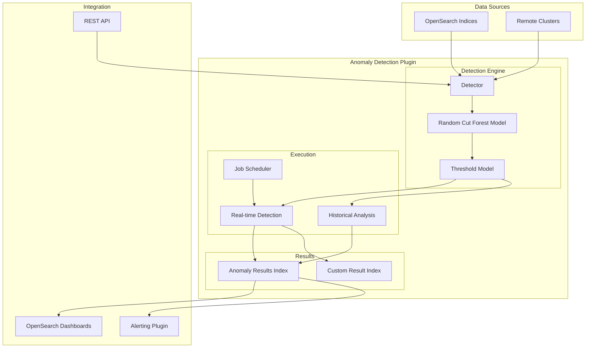
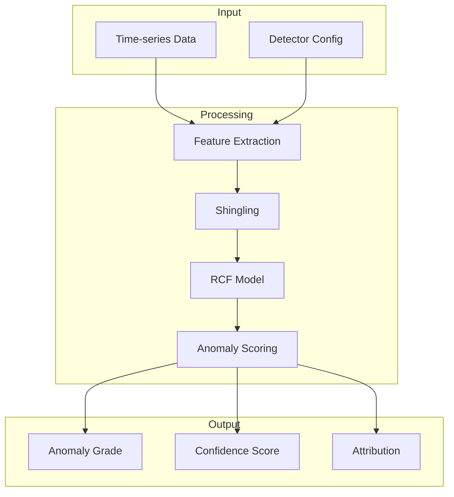

# Anomaly Detection

## Summary

OpenSearch Anomaly Detection uses machine learning algorithms, specifically Random Cut Forest (RCF), to automatically identify unusual patterns in time-series data. It supports both real-time and historical analysis, single-entity and high-cardinality (multi-entity) detectors, and can monitor data across local and remote clusters. The plugin integrates with OpenSearch Dashboards for visualization and with the Alerting plugin for notifications.

## Details

### Architecture



### Data Flow



### Components

| Component | Description |
|-----------|-------------|
| Detector | Configuration defining data source, features, and detection parameters |
| Random Cut Forest (RCF) | Unsupervised ML algorithm for anomaly scoring |
| Threshold Model | Determines anomaly grade based on RCF scores |
| Job Scheduler | Executes real-time detection at configured intervals |
| Result Index | Stores anomaly detection results |
| Category Field | Enables high-cardinality detection by grouping entities |

### Detector Types

| Type | Description | Use Case |
|------|-------------|----------|
| Single-entity | One model for entire data stream | Simple metrics monitoring |
| High-cardinality (HC) | Separate model per entity | Per-host, per-user monitoring |
| Real-time | Continuous detection | Live monitoring and alerting |
| Historical | Batch analysis over time range | Root cause analysis, backtesting |

### Configuration

| Setting | Description | Default |
|---------|-------------|---------|
| `detection_interval` | Time between detection runs | Required |
| `window_delay` | Extra time for data collection | 1 minute |
| `shingle_size` | Number of intervals for pattern detection | 8 |
| `category_field` | Field(s) for entity grouping | None (single-entity) |
| `result_index` | Custom index for results | `.opensearch-anomaly-results*` |
| `filter_query` | Query to filter input data | Match all |

### API Endpoints

| Endpoint | Method | Description |
|----------|--------|-------------|
| `/_plugins/_anomaly_detection/detectors` | POST | Create detector |
| `/_plugins/_anomaly_detection/detectors/<id>` | GET | Get detector |
| `/_plugins/_anomaly_detection/detectors/<id>` | PUT | Update detector |
| `/_plugins/_anomaly_detection/detectors/<id>` | DELETE | Delete detector |
| `/_plugins/_anomaly_detection/detectors/<id>/_start` | POST | Start detection |
| `/_plugins/_anomaly_detection/detectors/<id>/_stop` | POST | Stop detection |
| `/_plugins/_anomaly_detection/detectors/<id>/_profile` | GET | Get detector profile |
| `/_plugins/_anomaly_detection/detectors/results/_search` | POST | Search results |

### Usage Example

#### Create a Single-Entity Detector

```json
POST _plugins/_anomaly_detection/detectors
{
  "name": "cpu-anomaly-detector",
  "description": "Detect CPU usage anomalies",
  "time_field": "timestamp",
  "indices": ["server-metrics-*"],
  "feature_attributes": [
    {
      "feature_name": "avg_cpu",
      "feature_enabled": true,
      "aggregation_query": {
        "avg_cpu": {
          "avg": {
            "field": "cpu_usage"
          }
        }
      }
    }
  ],
  "detection_interval": {
    "period": {
      "interval": 5,
      "unit": "Minutes"
    }
  },
  "window_delay": {
    "period": {
      "interval": 1,
      "unit": "Minutes"
    }
  }
}
```

#### Create a High-Cardinality Detector

```json
POST _plugins/_anomaly_detection/detectors
{
  "name": "per-host-cpu-detector",
  "description": "Detect CPU anomalies per host",
  "time_field": "timestamp",
  "indices": ["server-metrics-*"],
  "feature_attributes": [
    {
      "feature_name": "avg_cpu",
      "feature_enabled": true,
      "aggregation_query": {
        "avg_cpu": {
          "avg": {
            "field": "cpu_usage"
          }
        }
      }
    }
  ],
  "category_field": ["host.name"],
  "detection_interval": {
    "period": {
      "interval": 5,
      "unit": "Minutes"
    }
  }
}
```

#### Start Historical Analysis

```json
POST _plugins/_anomaly_detection/detectors/<detector_id>/_start
{
  "start_time": 1633048868000,
  "end_time": 1633394468000
}
```

### Security Roles

| Role | Description |
|------|-------------|
| `anomaly_full_access` | Full access to all anomaly detection operations |
| `anomaly_read_access` | Read-only access to detectors and results |

## Limitations

- Maximum 2 category fields per high-cardinality detector
- Real-time detection requires Job Scheduler plugin
- Model training requires sufficient historical data (shingle_size × detection_interval)
- Custom result indices must be managed separately for deletion
- Cross-cluster detection requires proper cluster connectivity

## Related PRs

| Version | PR | Description |
|---------|-----|-------------|
| v3.0.0 | [#1460](https://github.com/opensearch-project/anomaly-detection/pull/1460) | AWS SAM template for WAF log analysis |
| v3.0.0 | [#1446](https://github.com/opensearch-project/anomaly-detection/pull/1446) | Distinguish local cluster when name matches remote |
| v3.0.0 | [#1424](https://github.com/opensearch-project/anomaly-detection/pull/1424) | Fix breaking changes for 3.0.0 release |
| v3.0.0 | [#1450](https://github.com/opensearch-project/anomaly-detection/pull/1450) | Java Agent migration (SecurityManager removal) |
| v3.0.0 | [#1441](https://github.com/opensearch-project/anomaly-detection/pull/1441) | Dual cluster gradle run for development |
| v2.17.0 | [#1284](https://github.com/opensearch-project/anomaly-detection/pull/1284) | Fix inference logic and standardize config index mapping |
| v2.17.0 | [#1287](https://github.com/opensearch-project/anomaly-detection/pull/1287) | Prevent resetting latest flag of real-time when starting historical |
| v2.17.0 | [#1292](https://github.com/opensearch-project/anomaly-detection/pull/1292) | Correct handling of null max aggregation values |
| v2.17.0 | [#828](https://github.com/opensearch-project/anomaly-detection-dashboards-plugin/pull/828) | Fix dataSourceId not showing in URL |
| v2.17.0 | [#837](https://github.com/opensearch-project/anomaly-detection-dashboards-plugin/pull/837) | Remove dataSourceFilter that breaks DataSourceView |

## References

- [Anomaly Detection Documentation](https://docs.opensearch.org/3.0/observing-your-data/ad/index/): Official documentation
- [Anomaly Detection API](https://docs.opensearch.org/3.0/observing-your-data/ad/api/): API reference
- [Anomaly Detection Security](https://docs.opensearch.org/3.0/observing-your-data/ad/security/): Security configuration
- [GitHub Repository](https://github.com/opensearch-project/anomaly-detection): Source code
- [Real-time Anomaly Detection Blog](https://opensearch.org/blog/real-time-anomaly-detection-in-open-distro-for-elasticsearch/): Introduction to anomaly detection
- [One Million Entities Blog](https://opensearch.org/blog/one-million-enitities-in-one-minute/): High-cardinality performance improvements

## Change History

- **v3.0.0** (2025-05-06): AWS SAM template for WAF logs, cross-cluster improvements, OpenSearch 3.0.0 compatibility updates, Java Agent migration
- **v2.17.0** (2024-09-17): Fixed inference logic with new `lastSeenExecutionEndTime` tracking, standardized config index mapping (`defaultFill` → `default_fill`), improved null checks for imputation options, bugfixes for real-time/historical task flag management, null aggregation handling, Dashboards data source integration
- **v2.x**: High-cardinality detection, historical analysis, custom result indices
