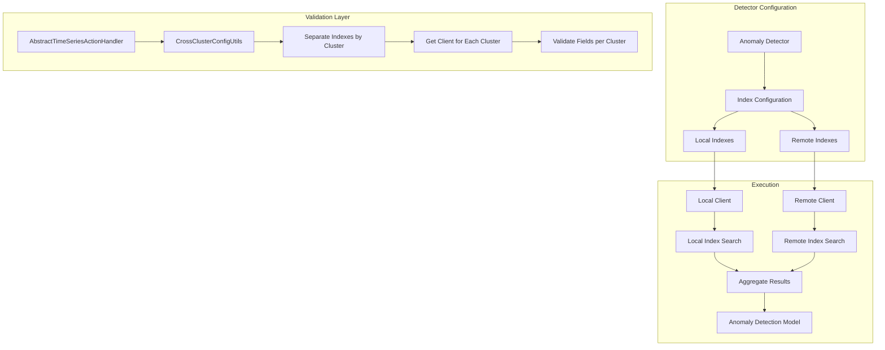
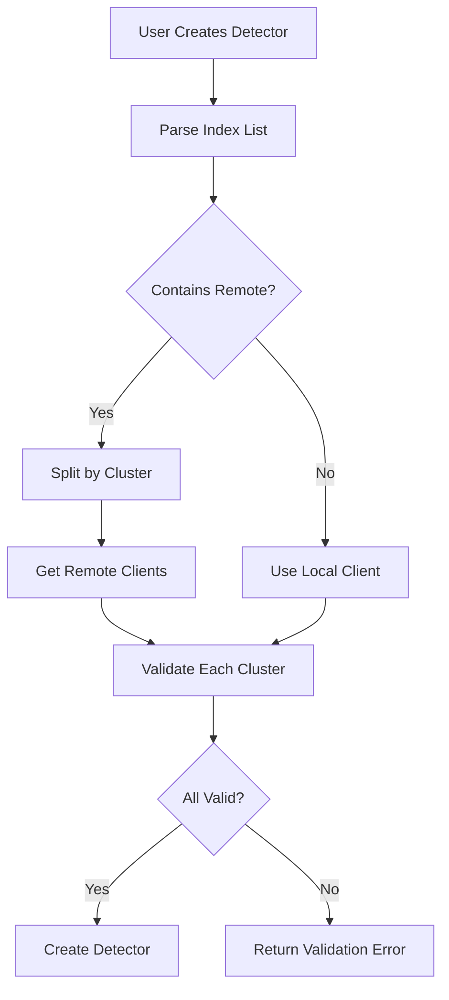

---
tags:
  - indexing
  - ml
  - search
---

# Anomaly Detection Remote/Multi-Index Support

## Summary

Anomaly Detection Remote/Multi-Index Support enables anomaly detectors to monitor data from multiple indexes and remote clusters simultaneously. This feature extends the anomaly detection plugin's data source capabilities, allowing users to create detectors that span across distributed data sources using cross-cluster search functionality.

## Details

### Architecture



### Data Flow



### Components

| Component | Description |
|-----------|-------------|
| `CrossClusterConfigUtils` | Utility class for managing cross-cluster index configurations |
| `separateClusterIndexes()` | Parses index list into cluster-to-indexes map |
| `getClientForCluster()` | Returns appropriate client (local or remote) for a given cluster |
| `parseClusterAndIndexName()` | Extracts cluster name and index name from combined string |
| `MultiResponsesDelegateActionListener` | Handles parallel validation responses from multiple clusters |

### Configuration

| Setting | Description | Default |
|---------|-------------|---------|
| Index pattern | Supports `cluster:index` format for remote indexes | N/A |
| Multiple indexes | Comma-separated list of local and remote indexes | N/A |

### Usage Example

#### Creating a Multi-Index Detector

```json
PUT _plugins/_anomaly_detection/detectors
{
  "name": "multi-cluster-cpu-detector",
  "description": "Monitor CPU across multiple clusters",
  "time_field": "timestamp",
  "indices": [
    "metrics-local",
    "cluster-east:metrics-east",
    "cluster-west:metrics-west"
  ],
  "feature_attributes": [
    {
      "feature_name": "avg-cpu",
      "feature_enabled": true,
      "aggregation_query": {
        "avg_cpu": {
          "avg": {
            "field": "cpu_usage"
          }
        }
      }
    }
  ],
  "detection_interval": {
    "period": {
      "interval": 5,
      "unit": "Minutes"
    }
  }
}
```

#### Using OpenSearch Dashboards

In OpenSearch Dashboards 2.17+, you can select remote clusters and indexes directly from the UI when creating a detector:

1. Navigate to **Anomaly Detection** > **Create Detector**
2. In the **Data source** section, select indexes from local or remote clusters
3. Use the `cluster-name:index-name` pattern or select from the dropdown

### Security Configuration

When using remote indexes with fine-grained access control:

1. Create matching users on both clusters
2. Map users to `anomaly_full_access` role on both clusters
3. Ensure required permissions are granted:
   - `indices:data/read/field_caps`
   - `indices:admin/resolve/index`
   - `cluster:monitor/remote/info`

## Limitations

- All indexes must share the same timestamp field name and type
- Categorical fields must exist in all specified indexes for high-cardinality detectors
- Cross-cluster search must be configured before using remote indexes
- Network latency to remote clusters may affect detection performance
- Remote cluster authentication must be properly configured

## Change History

- **v2.17.0** (2024-09-17): Initial implementation of remote index and multi-index validation support

## References

### Documentation
- [Anomaly Detection Documentation](https://docs.opensearch.org/2.17/observing-your-data/ad/index/)
- [Anomaly Detection Security](https://docs.opensearch.org/2.17/observing-your-data/ad/security/)
- [Cross-Cluster Search](https://docs.opensearch.org/2.17/search-plugins/cross-cluster-search/)
- [Anomaly Detection API](https://docs.opensearch.org/2.17/observing-your-data/ad/api/)

### Pull Requests
| Version | PR | Description | Related Issue |
|---------|-----|-------------|---------------|
| v2.17.0 | [#1290](https://github.com/opensearch-project/anomaly-detection/pull/1290) | Adding remote index and multi-index checks in validation |   |
| v2.17.0 | [#1295](https://github.com/opensearch-project/anomaly-detection/pull/1295) | Backport to 2.17 branch |   |
