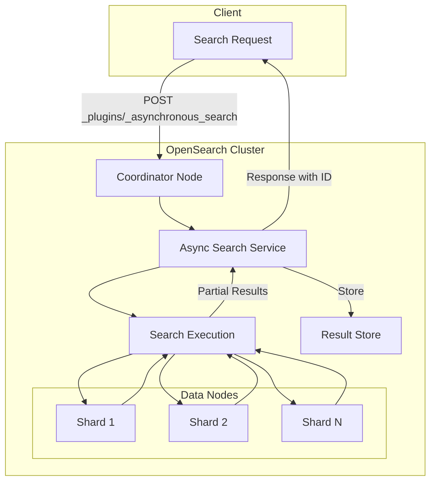
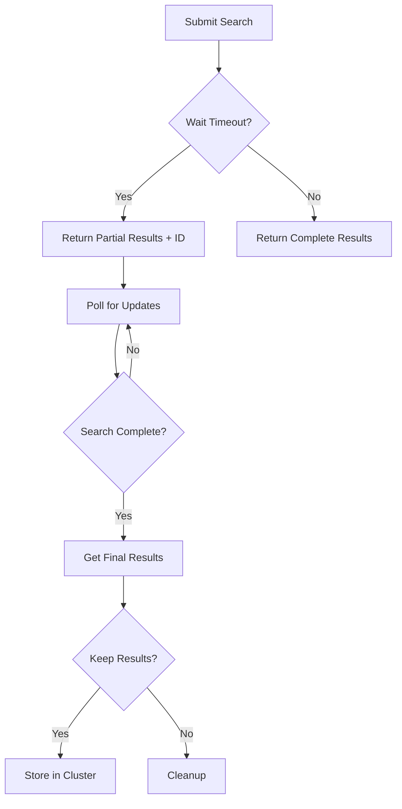

---
tags:
  - domain/search
  - component/server
  - indexing
  - observability
  - search
  - security
---
# Asynchronous Search

## Summary

Asynchronous search is an OpenSearch plugin that enables running search requests in the background for large volumes of data. It allows users to submit long-running queries, monitor their progress, retrieve partial results as they become available, and save completed results for later examination. This is particularly useful when searching across warm nodes or multiple remote clusters where queries may take significant time to complete.

## Details

### Architecture



### Data Flow



### Components

| Component | Description |
|-----------|-------------|
| Async Search Service | Manages asynchronous search lifecycle and state |
| Result Store | Persists search results in the cluster for later retrieval |
| Stats Collector | Tracks metrics for submitted, running, and completed searches |
| Security Integration | Provides role-based access control for async searches |

### Configuration

| Setting | Description | Default |
|---------|-------------|---------|
| `wait_for_completion_timeout` | Time to wait for initial results (max 300s) | 1 second |
| `keep_on_completion` | Whether to save results after search completes | `false` |
| `keep_alive` | Duration to retain saved results | 12 hours |

### API Endpoints

| Endpoint | Method | Description |
|----------|--------|-------------|
| `_plugins/_asynchronous_search` | POST | Submit an asynchronous search |
| `_plugins/_asynchronous_search/<ID>` | GET | Get partial/complete results |
| `_plugins/_asynchronous_search/<ID>` | DELETE | Cancel search or delete results |
| `_plugins/_asynchronous_search/stats` | GET | Get async search statistics |

### Search States

| State | Description |
|-------|-------------|
| `RUNNING` | Search is still executing |
| `SUCCEEDED` | Search completed successfully |
| `FAILED` | Search completed with failure |
| `PERSISTING` | Results are being persisted |
| `PERSIST_SUCCEEDED` | Results successfully persisted |
| `PERSIST_FAILED` | Result persistence failed |
| `CLOSED` | Search was closed/cancelled |
| `STORE_RESIDENT` | Results are stored and available |

### Usage Example

```json
// Submit an asynchronous search
POST _plugins/_asynchronous_search/?wait_for_completion_timeout=1ms&keep_on_completion=true
{
  "query": {
    "match_all": {}
  },
  "aggs": {
    "city": {
      "terms": {
        "field": "city",
        "size": 10
      }
    }
  }
}

// Response includes an ID for polling
{
  "id": "FklfVlU4eFdIUTh1Q1hyM3ZnT19fUVEUd29KLWZYUUI3TzRpdU5wMjRYOHgAAAAAAAAABg==",
  "state": "RUNNING",
  "start_time_in_millis": 1599833301297,
  "expiration_time_in_millis": 1600265301297,
  "response": {
    "took": 15,
    "_shards": {
      "total": 21,
      "successful": 4
    }
  }
}

// Poll for results
GET _plugins/_asynchronous_search/FklfVlU4eFdIUTh1Q1hyM3ZnT19fUVEUd29KLWZYUUI3TzRpdU5wMjRYOHgAAAAAAAAABg==
```

### Security Roles

| Role | Description |
|------|-------------|
| `asynchronous_search_full_access` | Full access to all async search operations |
| `asynchronous_search_read_access` | Read-only access to async search results |

## Limitations

- Maximum `wait_for_completion_timeout` is 300 seconds
- Results are automatically deleted after `keep_alive` period expires
- Query execution time counts against `keep_alive` duration
- Users can only access their own async searches (with security enabled)

## Change History

- **v3.2.0** (2025-09-02): Infrastructure maintenance - Gradle 8.14.3, JDK 24 CI support, Maven snapshot endpoint migration
- **v3.0.0** (2025-05-06): GA release preparation - JDK21 baseline, Gradle 8.10.2, JDK23 support
- **v1.0.0** (2021-07-12): Initial release with OpenSearch

## Related Features
- [Search Relevance](../search-relevance/dashboards-observability-search-relevance-ci-tests.md)

## References

### Documentation
- [Asynchronous Search Documentation](https://docs.opensearch.org/3.0/search-plugins/async/index/)
- [Asynchronous Search Security](https://docs.opensearch.org/3.0/search-plugins/async/security/)
- [Asynchronous Search Settings](https://docs.opensearch.org/3.0/search-plugins/async/settings/)
- [GitHub Repository](https://github.com/opensearch-project/asynchronous-search)

### Pull Requests
| Version | PR | Description | Related Issue |
|---------|-----|-------------|---------------|
| v3.2.0 | [#754](https://github.com/opensearch-project/asynchronous-search/pull/754) | Gradle 8.14.3 upgrade and JDK 24 CI support |   |
| v3.2.0 | [#748](https://github.com/opensearch-project/asynchronous-search/pull/748) | Maven snapshot publishing endpoint migration | [#5551](https://github.com/opensearch-project/opensearch-build/issues/5551) |
| v3.0.0 | [#724](https://github.com/opensearch-project/asynchronous-search/pull/724) | Version increment for 3.0.0 GA |   |
| v3.0.0 | [#698](https://github.com/opensearch-project/asynchronous-search/pull/698) | JDK23 support and Gradle 8.10.2 | [#318](https://github.com/opensearch-project/asynchronous-search/issues/318) |
| v3.0.0 | [#582](https://github.com/opensearch-project/asynchronous-search/pull/582) | JDK21 baseline for 3.0 | [#581](https://github.com/opensearch-project/asynchronous-search/issues/581) |
