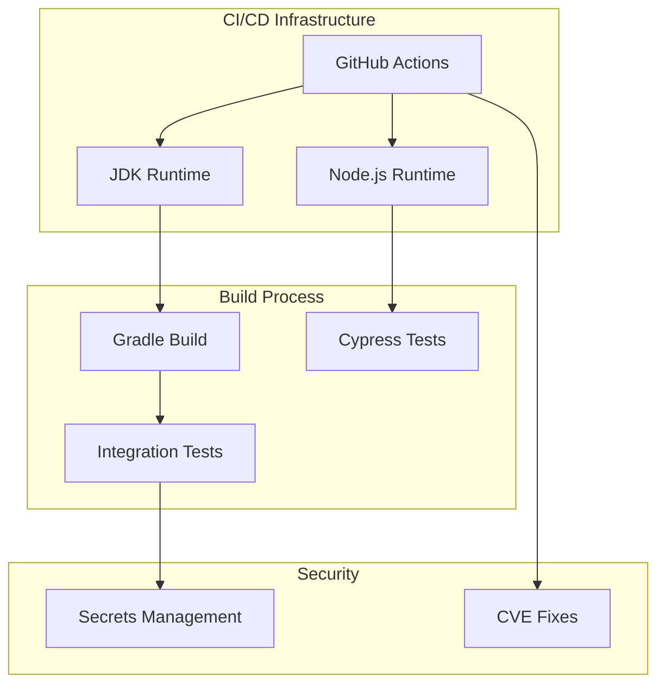

# CI/CD & Build Improvements

## Summary

CI/CD & Build Improvements encompass infrastructure changes across OpenSearch plugins that enhance build reliability, security, and developer workflow. These improvements include JDK version updates, CI workflow fixes, test security enhancements, and streamlined contribution processes.

## Details

### Architecture

### Components

| Component | Description |
|-----------|-------------|
| JDK Baseline | Minimum JDK version required for building plugins |
| GitHub Actions Workflows | CI/CD automation for testing and releases |
| Integration Tests | End-to-end tests with security considerations |
| Backport Automation | Automated PR backporting to release branches |
| Dependency Management | Security updates for build dependencies |

### Key Improvements

#### JDK Version Management

OpenSearch plugins progressively update their baseline JDK requirements to align with core OpenSearch. This ensures compatibility and access to newer Java features.

#### CI Workflow Reliability

Workflow fixes address compatibility issues with runtime environments (Node.js, JDK) and ensure proper build ordering (compile before test).

#### Test Security

Sensitive information like API keys must be masked in CI logs to prevent credential exposure. This is achieved by sanitizing test output.

#### Backport Process

Streamlined backport workflows allow automated PRs to merge without manual approval, accelerating the release process while maintaining quality through automated checks.

### Configuration

CI/CD improvements typically involve changes to:

| File | Purpose |
|------|---------|
| `.github/workflows/*.yml` | GitHub Actions workflow definitions |
| `build.gradle` | Gradle build configuration |
| `MAINTAINERS.md` | Maintainer list management |
| `package.json` | Node.js dependency versions |

## Limitations

- Infrastructure changes require coordination across multiple repositories
- JDK baseline updates may require contributors to update their development environments
- Backport automation relies on proper labeling of PRs

## Related PRs

| Version | PR | Repository | Description |
|---------|-----|------------|-------------|
| v3.4.0 | [#1603](https://github.com/opensearch-project/anomaly-detection/pull/1603) | anomaly-detection | Prevent oversized bulk requests in synthetic data test |
| v3.4.0 | [#1485](https://github.com/opensearch-project/index-management/pull/1485) | index-management | Bump actions/github-script from 7 to 8 |
| v3.4.0 | [#863](https://github.com/opensearch-project/job-scheduler/pull/863) | job-scheduler | Bump actions/checkout from 5 to 6 |
| v3.4.0 | [#4405](https://github.com/opensearch-project/ml-commons/pull/4405) | ml-commons | Fix dependency conflict and jar hell |
| v3.4.0 | [#4413](https://github.com/opensearch-project/ml-commons/pull/4413) | ml-commons | Decrease Disk Circuit Breaker Free Space Threshold |
| v3.4.0 | [#4487](https://github.com/opensearch-project/ml-commons/pull/4487) | ml-commons | Remove unnecessary files on CI workflow to save space |
| v3.4.0 | [#1618](https://github.com/opensearch-project/neural-search/pull/1618) | neural-search | Onboard to S3 snapshots |
| v3.4.0 | [#1657](https://github.com/opensearch-project/neural-search/pull/1657) | neural-search | Add BWC tests for Sparse ANN Seismic feature |
| v3.4.0 | [#1663](https://github.com/opensearch-project/neural-search/pull/1663) | neural-search | Add role assignment multi-node integ testing in CI |
| v3.4.0 | [#1676](https://github.com/opensearch-project/neural-search/pull/1676) | neural-search | Upgrade codecov-action to v5 to fix rate limit issue |
| v3.4.0 | [#258](https://github.com/opensearch-project/opensearch-learning-to-rank-base/pull/258) | learning-to-rank | Reduce required coverage until improvement |
| v3.3.0 | [#5548](https://github.com/opensearch-project/security/pull/5548) | security | Update delete_backport_branch workflow to include release-chores branches |
| v3.3.0 | [#4090](https://github.com/opensearch-project/ml-commons/pull/4090) | ml-commons | Update delete_backport_branch workflow to include release-chores branches |
| v2.18.0 | [#1276](https://github.com/opensearch-project/index-management/pull/1276) | index-management | Update baseline JDK to JDK-21 |
| v2.18.0 | [#1263](https://github.com/opensearch-project/index-management/pull/1263) | index-management | Move non-active maintainer to emeritus |
| v2.18.0 | [#1251](https://github.com/opensearch-project/index-management/pull/1251) | index-management | Remove wildcard imports |
| v2.18.0 | [#3112](https://github.com/opensearch-project/ml-commons/pull/3112) | ml-commons | Remove API keys from integration test logs |
| v2.18.0 | [#3132](https://github.com/opensearch-project/ml-commons/pull/3132) | ml-commons | Allow backport PRs to skip approval |
| v2.18.0 | [#3148](https://github.com/opensearch-project/ml-commons/pull/3148) | ml-commons | Update approval requirements |
| v2.18.0 | [#3159](https://github.com/opensearch-project/ml-commons/pull/3159) | ml-commons | Unblock integration test pipeline |
| v2.18.0 | [#965](https://github.com/opensearch-project/notifications/pull/965) | notifications | Fix CI workflows for Node 20 |
| v2.18.0 | [#2138](https://github.com/opensearch-project/observability/pull/2138) | observability | CVE fix for lint-staged |
| v2.18.0 | [#2187](https://github.com/opensearch-project/observability/pull/2187) | observability | Add compile step before Cypress |
| v2.18.0 | [#117](https://github.com/opensearch-project/query-insights/pull/117) | query-insights | Upgrade deprecated actions/upload-artifact to v3 |

## References

- [ml-commons Issue #2915](https://github.com/opensearch-project/ml-commons/issues/2915): API keys in integration test logs
- [opensearch-build Issue #5360](https://github.com/opensearch-project/opensearch-build/issues/5360): S3 snapshots onboarding
- [neural-search Issue #1672](https://github.com/opensearch-project/neural-search/issues/1672): Codecov rate limit issue

## Change History

- **v3.4.0** (2026-01-11): GitHub Actions version upgrades (checkout v6, github-script v8, codecov-action v5), test reliability improvements for anomaly-detection and neural-search, CI disk space management for ml-commons, S3 snapshots integration for neural-search, multi-node testing in neural-search, code coverage threshold adjustment in learning-to-rank
- **v3.3.0** (2025-08-25): Update delete_backport_branch workflow to include release-chores branches in security and ml-commons, modernize workflow to use actions/github-script
- **v2.18.0** (2024-11-05): JDK-21 baseline for index-management, CI workflow fixes for notifications, observability, and query-insights, test security improvements for ml-commons, backport process improvements
