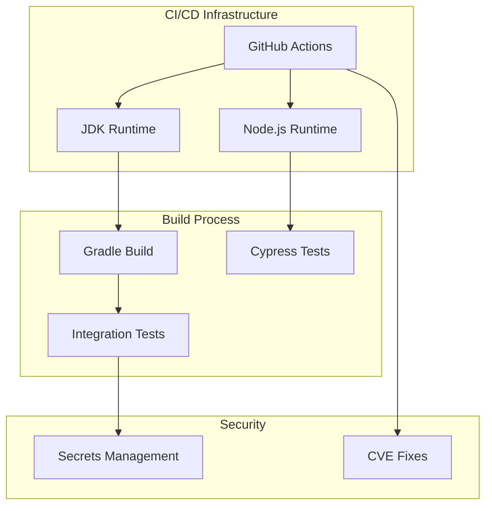

# CI/CD & Build Improvements

## Summary

CI/CD & Build Improvements encompass infrastructure changes across OpenSearch plugins that enhance build reliability, security, and developer workflow. These improvements include JDK version updates, CI workflow fixes, test security enhancements, and streamlined contribution processes.

## Details

### Architecture

### Components

| Component | Description |
|-----------|-------------|
| JDK Baseline | Minimum JDK version required for building plugins |
| GitHub Actions Workflows | CI/CD automation for testing and releases |
| Integration Tests | End-to-end tests with security considerations |
| Backport Automation | Automated PR backporting to release branches |
| Dependency Management | Security updates for build dependencies |

### Key Improvements

#### JDK Version Management

OpenSearch plugins progressively update their baseline JDK requirements to align with core OpenSearch. This ensures compatibility and access to newer Java features.

#### CI Workflow Reliability

Workflow fixes address compatibility issues with runtime environments (Node.js, JDK) and ensure proper build ordering (compile before test).

#### Test Security

Sensitive information like API keys must be masked in CI logs to prevent credential exposure. This is achieved by sanitizing test output.

#### Backport Process

Streamlined backport workflows allow automated PRs to merge without manual approval, accelerating the release process while maintaining quality through automated checks.

### Configuration

CI/CD improvements typically involve changes to:

| File | Purpose |
|------|---------|
| `.github/workflows/*.yml` | GitHub Actions workflow definitions |
| `build.gradle` | Gradle build configuration |
| `MAINTAINERS.md` | Maintainer list management |
| `package.json` | Node.js dependency versions |

## Limitations

- Infrastructure changes require coordination across multiple repositories
- JDK baseline updates may require contributors to update their development environments
- Backport automation relies on proper labeling of PRs

## Related PRs

| Version | PR | Repository | Description |
|---------|-----|------------|-------------|
| v2.18.0 | [#1276](https://github.com/opensearch-project/index-management/pull/1276) | index-management | Update baseline JDK to JDK-21 |
| v2.18.0 | [#1263](https://github.com/opensearch-project/index-management/pull/1263) | index-management | Move non-active maintainer to emeritus |
| v2.18.0 | [#1251](https://github.com/opensearch-project/index-management/pull/1251) | index-management | Remove wildcard imports |
| v2.18.0 | [#3112](https://github.com/opensearch-project/ml-commons/pull/3112) | ml-commons | Remove API keys from integration test logs |
| v2.18.0 | [#3132](https://github.com/opensearch-project/ml-commons/pull/3132) | ml-commons | Allow backport PRs to skip approval |
| v2.18.0 | [#3148](https://github.com/opensearch-project/ml-commons/pull/3148) | ml-commons | Update approval requirements |
| v2.18.0 | [#3159](https://github.com/opensearch-project/ml-commons/pull/3159) | ml-commons | Unblock integration test pipeline |
| v2.18.0 | [#965](https://github.com/opensearch-project/notifications/pull/965) | notifications | Fix CI workflows for Node 20 |
| v2.18.0 | [#2138](https://github.com/opensearch-project/observability/pull/2138) | observability | CVE fix for lint-staged |
| v2.18.0 | [#2187](https://github.com/opensearch-project/observability/pull/2187) | observability | Add compile step before Cypress |

## References

- [ml-commons Issue #2915](https://github.com/opensearch-project/ml-commons/issues/2915): API keys in integration test logs

## Change History

- **v2.18.0** (2024-11-05): JDK-21 baseline for index-management, CI workflow fixes for notifications and observability, test security improvements for ml-commons, backport process improvements
