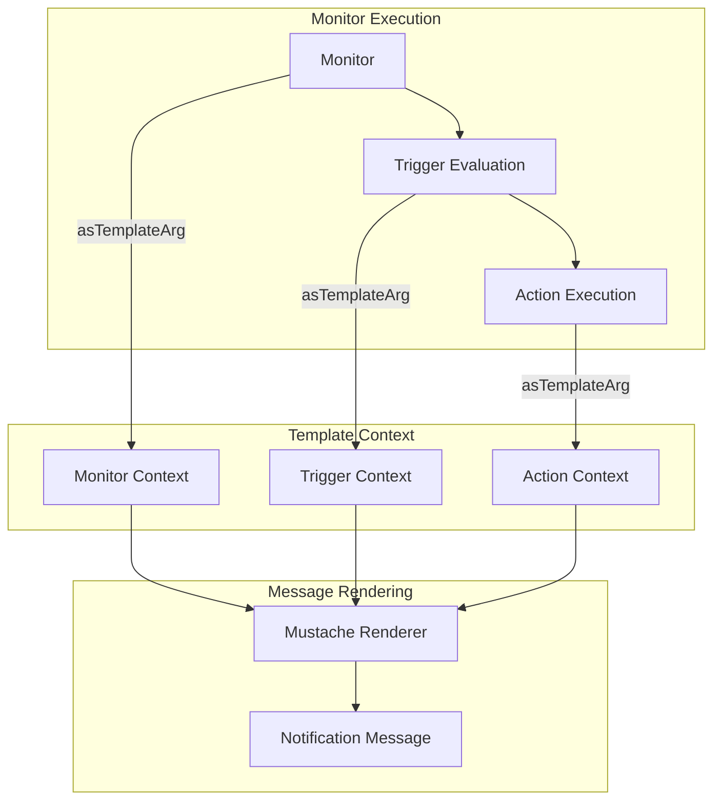
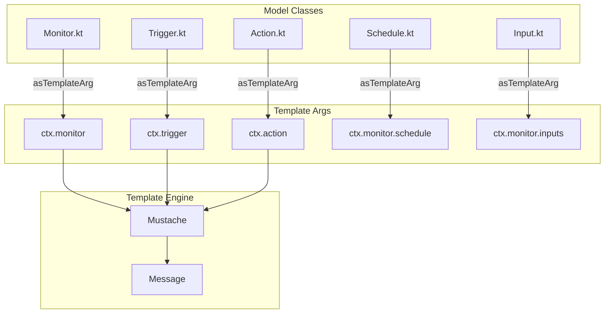

---
tags:
  - ml
---

# Alerting Context Variables

## Summary

The Alerting plugin provides context (`ctx`) variables that can be used in monitor action message templates. These variables allow users to include dynamic information about monitors, triggers, alerts, and actions in their notification messages. This feature enables rich, informative alert notifications that include relevant context about what triggered the alert.

## Details

### Architecture



### Data Flow



### Components

| Component | Description |
|-----------|-------------|
| `Monitor` | Contains monitor metadata including name, type, schedule, and inputs |
| `Trigger` | Contains trigger configuration including name, severity, condition, and actions |
| `Action` | Contains action configuration including name, destination, and throttle settings |
| `Schedule` | Contains schedule configuration (cron or interval) |
| `Input` | Contains monitor input configuration (search query or document-level queries) |

### Available Context Variables

#### Monitor Context (`ctx.monitor`)

| Variable | Type | Description |
|----------|------|-------------|
| `_id` | String | Monitor ID |
| `_version` | Long | Monitor version |
| `name` | String | Monitor name |
| `enabled` | Boolean | Whether monitor is enabled |
| `monitor_type` | String | Type of monitor (query_level_monitor, bucket_level_monitor, doc_level_monitor) |
| `enabled_time` | Long | Epoch milliseconds when monitor was enabled |
| `last_update_time` | Long | Epoch milliseconds of last update |
| `schedule` | Object | Schedule configuration |
| `inputs` | Array | Monitor inputs |

#### Trigger Context (`ctx.trigger`)

| Variable | Type | Description |
|----------|------|-------------|
| `id` | String | Trigger ID |
| `name` | String | Trigger name |
| `severity` | String | Trigger severity level |
| `actions` | Array | List of actions |
| `condition` | Object | Trigger condition with script source and language |

#### Action Context (`ctx.action`)

| Variable | Type | Description |
|----------|------|-------------|
| `id` | String | Action ID |
| `name` | String | Action name |
| `destination_id` | String | Destination ID for notifications |
| `throttle_enabled` | Boolean | Whether throttling is enabled |

#### Schedule Context (`ctx.monitor.schedule`)

For cron schedules:
| Variable | Type | Description |
|----------|------|-------------|
| `cron.expression` | String | Cron expression |
| `cron.timezone` | String | Timezone |

For interval schedules:
| Variable | Type | Description |
|----------|------|-------------|
| `period.interval` | Integer | Interval value |
| `period.unit` | String | Time unit (MINUTES, HOURS, DAYS) |

### Usage Example

```mustache
Alert: {{ctx.monitor.name}}

Monitor Details:
- Type: {{ctx.monitor.monitor_type}}
- Last Updated: {{ctx.monitor.last_update_time}}
{{#ctx.monitor.schedule.period}}
- Schedule: Every {{interval}} {{unit}}
{{/ctx.monitor.schedule.period}}
{{#ctx.monitor.schedule.cron}}
- Schedule: {{expression}} ({{timezone}})
{{/ctx.monitor.schedule.cron}}

Trigger: {{ctx.trigger.name}} (Severity: {{ctx.trigger.severity}})
Condition: {{ctx.trigger.condition.script.source}}

Action: {{ctx.action.name}}
Destination: {{ctx.action.destination_id}}
Throttle Enabled: {{ctx.action.throttle_enabled}}
```

## Limitations

- Context variables are only available within action message templates
- Some variables may be null depending on monitor configuration
- The `results` and `alert` context variables are populated at runtime and not covered by this feature

## Change History

- **v2.17.0** (2024-09-17): Added missing context variables for monitor, trigger, action, schedule, and input models

## References

### Documentation
- [OpenSearch Alerting Documentation](https://opensearch.org/docs/latest/monitoring-plugins/alerting/monitors/#available-variables): Official documentation for available variables

### Pull Requests
| Version | PR | Description | Related Issue |
|---------|-----|-------------|---------------|
| v2.17.0 | [#710](https://github.com/opensearch-project/common-utils/pull/710) | Add missing ctx variables | [#200](https://github.com/opensearch-project/alerting/issues/200) |

### Issues (Design / RFC)
- [Issue #200](https://github.com/opensearch-project/alerting/issues/200): Original feature request for missing ctx variables
