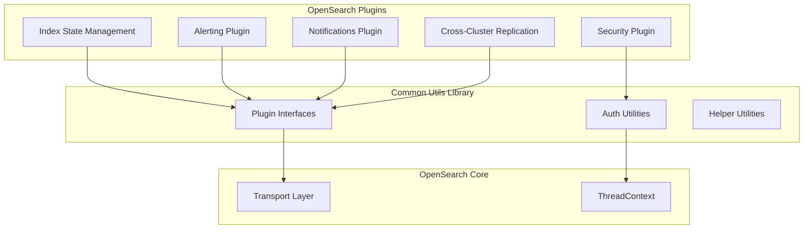
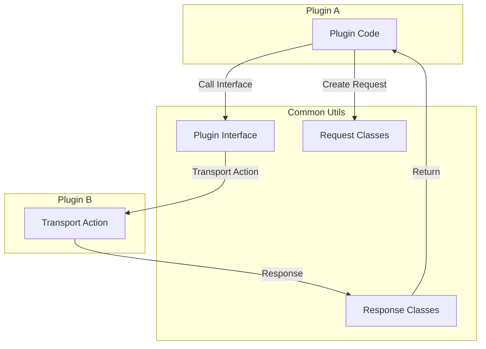

---
tags:
  - domain/core
  - component/server
  - indexing
  - ml
  - security
---
# Common Utils

## Summary

Common Utils is a shared library that provides utilities for building Java-based OpenSearch plugins. It offers common interfaces, request/response classes, and helper utilities that enable communication between different OpenSearch plugins without tight coupling. The library facilitates plugin interoperability by providing shared transport action interfaces for plugins like Alerting, Notifications, and Cross-Cluster Replication.

## Details

### Architecture



### Components

| Component | Description |
|-----------|-------------|
| `AlertingPluginInterface` | Transport action interface for Alerting plugin operations |
| `NotificationsPluginInterface` | Transport action interface for Notifications plugin operations |
| `ReplicationPluginInterface` | Transport action interface for CCR plugin operations |
| `InjectSecurity` | Utility for injecting security context into ThreadContext |
| `User` | Model class representing authenticated user information |
| `Utils` | Helper utilities for string manipulation (escape/unescape) |
| `SecureClientWrapper` | Wrapper for Client with security context handling |

### Plugin Interfaces

The library provides standardized interfaces for inter-plugin communication:



### Security Context Handling

User information is stored in ThreadContext using a pipe-delimited format:
```
username|backendRole1,backendRole2|role1,role2|tenant
```

**Escape Handling:**
- Pipe characters in values are escaped as `\|`
- Parsing uses negative lookbehind regex to split on unescaped pipes

### Configuration

Common Utils is a library dependency and does not have runtime configuration. Plugins include it as a Gradle dependency:

```groovy
dependencies {
    implementation "org.opensearch:common-utils:${version}"
}
```

### Usage Examples

**Injecting User Security Context:**
```java
try (InjectSecurity helper = new InjectSecurity("plugin-name", settings, threadContext)) {
    User user = new User("username", backendRoles, roles, attributes, "tenant");
    helper.injectUserInfo(user);
    // Execute operations with injected security context
}
// Security context automatically cleaned up
```

**Parsing User from ThreadContext:**
```java
String userString = threadContext.getTransient(OPENSEARCH_SECURITY_USER_INFO_THREAD_CONTEXT);
User user = User.parse(userString);
String username = user.getName();
List<String> roles = user.getRoles();
```

**Calling Replication Plugin:**
```kotlin
val request = StopIndexReplicationRequest("follower-index")
ReplicationPluginInterface.stopReplication(client, request, listener)
```

## Limitations

- Plugin interfaces require the target plugin to be installed
- User info format uses pipe delimiter, requiring escape handling for pipe characters in values
- Library changes require coordinated updates across dependent plugins

## Change History

- **v3.3.0** (2025-10-16): Updated user attributes XContent parsing to use `key=value` format in `custom_attribute_names`, updated delete_backport_branch workflow to include release-chores branches
- **v3.3.0** (2025-10-16): Added release notes for version 2.13.0.0 (backported to main branch)
- **v3.2.0** (2025-07-17): Security fix for CVE-2025-48734, reverted batch findings API, upgraded to Gradle 8.14 and JDK 24
- **v3.0.0** (2025-03-19): Added replication plugin interface, fixed transport package imports, added pipe character escaping in user info


## References

### Documentation
- [Common Utils Repository](https://github.com/opensearch-project/common-utils)
- [CVE-2025-48734 Advisory](https://advisories.opensearch.org/advisories/CVE-2025-48734): Security advisory for commons-beanutils

### Pull Requests
| Version | PR | Description | Related Issue |
|---------|-----|-------------|---------------|
| v3.3.0 | [#878](https://github.com/opensearch-project/common-utils/pull/878) | Update user attributes XContent parsing logic | [#1829](https://github.com/opensearch-project/alerting/issues/1829) |
| v3.3.0 | [#860](https://github.com/opensearch-project/common-utils/pull/860) | Update delete_backport_branch workflow to include release-chores branches |   |
| v3.3.0 | [#869](https://github.com/opensearch-project/common-utils/pull/869) | Backport release notes for 2.13 to main branch |   |
| v3.2.0 | [#850](https://github.com/opensearch-project/common-utils/pull/850) | Pinned commons-beanutils dependency to fix CVE-2025-48734 |   |
| v3.2.0 | [#847](https://github.com/opensearch-project/common-utils/pull/847) | Revert PublishFindingsRequest to use a list of findings |   |
| v3.2.0 | [#848](https://github.com/opensearch-project/common-utils/pull/848) | Switch gradle to 8.14 and JDK to 24 |   |
| v3.0.0 | [#667](https://github.com/opensearch-project/common-utils/pull/667) | Adding replication (CCR) plugin interface | [#726](https://github.com/opensearch-project/index-management/issues/726) |
| v3.0.0 | [#790](https://github.com/opensearch-project/common-utils/pull/790) | Fix imports for split transport package |   |
| v3.0.0 | [#801](https://github.com/opensearch-project/common-utils/pull/801) | Escape/Unescape pipe in UserInfo | [#2756](https://github.com/opensearch-project/security/issues/2756) |

### Issues (Design / RFC)
- [Issue #2756](https://github.com/opensearch-project/security/issues/2756): Username pipe character issue
- [Issue #726](https://github.com/opensearch-project/index-management/issues/726): Manage CCR follower indices
- [Issue #1829](https://github.com/opensearch-project/alerting/issues/1829): Custom attributes for Alerting
