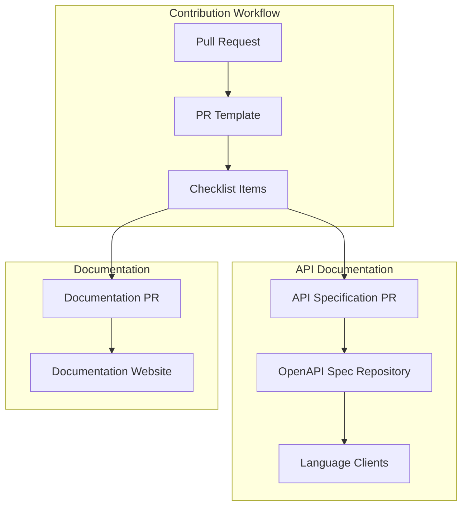
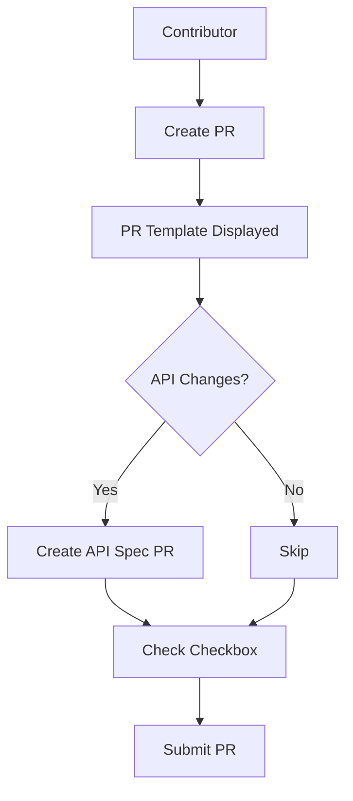

---
tags:
  - common
---
# PR Template API Specification Checkbox

## Summary

The OpenSearch project maintains standardized pull request templates across all repositories to ensure consistent contribution workflows. A key enhancement was the addition of an API specification checkbox that reminds contributors to document API changes in the central OpenAPI specification repository, ensuring language client libraries remain synchronized with API changes.

## Details

### Architecture



### Data Flow



### Components

| Component | Description |
|-----------|-------------|
| PULL_REQUEST_TEMPLATE.md | GitHub template displayed when creating PRs |
| API Spec Checkbox | Checklist item for API documentation |
| DCO Signoff | Developer Certificate of Origin requirement |
| Documentation Checkbox | Reminder for public documentation |

### Configuration

The PR template is located at `.github/PULL_REQUEST_TEMPLATE.md` in each repository.

| Setting | Description | Default |
|---------|-------------|---------|
| Template Location | Path to PR template | `.github/PULL_REQUEST_TEMPLATE.md` |
| API Spec Link | Link to developer guide | opensearch-api-specification DEVELOPER_GUIDE.md |
| Docs Link | Link to create documentation issue | documentation-website issues |

### Usage Example

```markdown
### Description
[Describe what this change achieves]

### Related Issues
Resolves #[Issue number to be closed when this PR is merged]

### Check List
- [x] New functionality includes testing.
- [x] New functionality has been documented.
- [x] API changes companion pull request [created](https://github.com/opensearch-project/opensearch-api-specification/blob/main/DEVELOPER_GUIDE.md).
- [x] Commits are signed per the DCO using `--signoff`.
- [x] Public documentation issue/PR [created](https://github.com/opensearch-project/documentation-website/issues/new/choose).

By submitting this pull request, I confirm that my contribution is made under the terms of the Apache 2.0 license.
```

## Limitations

- No automated enforcement of the API spec checkbox
- Relies on contributor and reviewer diligence
- Each repository maintains its own template copy

## Change History

- **v2.17.0** (2024-09-17): Added API specification checkbox to PR template
- **v2.16.0** (2024-08-06): Added PR template with API spec checkbox to anomaly-detection repository

## References

### Documentation
- [OpenSearch API Specification](https://github.com/opensearch-project/opensearch-api-specification): Central API specification repository
- [Developer Guide](https://github.com/opensearch-project/opensearch-api-specification/blob/main/DEVELOPER_GUIDE.md): Guide for contributing API specs

### Pull Requests
| Version | PR | Description | Related Issue |
|---------|-----|-------------|---------------|
| v2.17.0 | [#696](https://github.com/opensearch-project/common-utils/pull/696) | Add API spec checkbox to common-utils | [#387](https://github.com/opensearch-project/opensearch-api-specification/issues/387) |
| v2.16.0 | [#1262](https://github.com/opensearch-project/anomaly-detection/pull/1262) | Add PR template with API spec checkbox to anomaly-detection | [#387](https://github.com/opensearch-project/opensearch-api-specification/issues/387) |

### Issues (Design / RFC)
- [Issue #387](https://github.com/opensearch-project/opensearch-api-specification/issues/387): Original proposal for API spec checkbox
