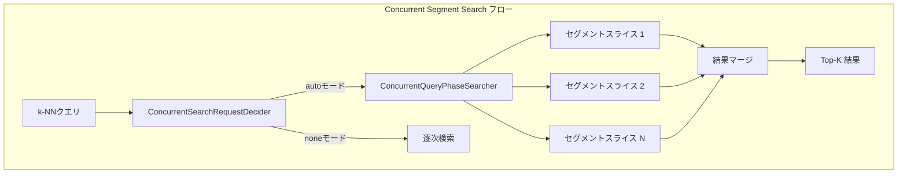

# k-NN向けConcurrent Segment Searchのデフォルト有効化

## 概要

OpenSearch v3.0.0では、k-NNクエリに対してConcurrent Segment Search（並行セグメント検索）がデフォルトで有効になり、最大2.5倍のクエリパフォーマンス向上を実現します。k-NNプラグインはConcurrentSearchRequestDeciderインターフェースと統合され、クラスターが`auto`モードの場合、ベクトル検索クエリは自動的に並列セグメント処理を活用します。

主なメリット：
- **最大2.5倍高速なクエリ**: 並列セグメント処理によりクエリレイテンシを大幅に削減
- **p90レイテンシで約60%改善**: ブログのベンチマークでテールレイテンシの大幅な改善を確認
- **テールレイテンシで20%改善**: フロアセグメントサイズの最適化により最悪ケースのパフォーマンスも向上
- **設定不要**: `auto`モード（デフォルト）で自動的に動作

## 詳細

### アーキテクチャ



### スライス数の計算

最大スライス数は利用可能なCPUリソースに基づいて動的に計算されます：

```
maxSliceCount = Math.max(1, Math.min(Runtime.getRuntime().availableProcessors() / 2, 4))
```

これにより、システムリソースを圧迫することなく効率的な並列処理を実現します。

### 設定オプション

| 設定 | 値 | デフォルト | 説明 |
|------|-----|----------|------|
| `search.concurrent_segment_search.mode` | `auto`, `all`, `none` | `auto` | クラスターレベルの並行検索モード |
| `index.search.concurrent_segment_search.mode` | `auto`, `all`, `none` | (継承) | インデックスレベルのオーバーライド |
| `search.concurrent.max_slice_count` | 0または正の整数 | 0 | 最大並列スライス数（0 = Luceneデフォルト） |

### パフォーマンスベンチマーク

PR #2111の本番クエリを使用したテスト結果：

| メトリクス | ベースライン | Concurrent (auto) | 改善率 |
|-----------|------------|-------------------|--------|
| p50レイテンシ | 58.86 ms | 45.05 ms | 約23%高速化 |
| p90レイテンシ | 85.32 ms | 48.15 ms | 約44%高速化 |
| p99レイテンシ | 95.11 ms | 50.42 ms | 約47%高速化 |

ブログのベンチマークでは、ベクトル検索のp90サービスタイムで約60%の改善が示されており、CPU使用率は25-35%増加します。

### スライシングメカニズム

OpenSearchは2つのスライシングアプローチをサポートしています：

1. **Luceneデフォルト (max_slice_count = 0)**: セグメントサイズに基づくLuceneの内部アルゴリズムを使用
2. **カスタムスライス数**: 正の整数を設定して最大並列度を制御

### 制限事項

- Concurrent Searchにより、CPU使用率が25-35%増加する可能性があります
- すべてのクエリタイプが並列化の恩恵を等しく受けるわけではありません
- スライス数に応じてメモリオーバーヘッドが増加します
- 一部のアグリゲーションは並行実行をサポートしていません

## 使用例

### 現在のモードを確認

```json
GET _cluster/settings?include_defaults=true&filter_path=*.search.concurrent_segment_search.mode
```

### 特定のインデックスで有効化

```json
PUT /my-knn-index/_settings
{
  "index.search.concurrent_segment_search.mode": "all"
}
```

### Concurrent Searchを無効化

```json
PUT _cluster/settings
{
  "persistent": {
    "search.concurrent_segment_search.mode": "none"
  }
}
```

### k-NN検索クエリ（変更不要）

```json
GET /my-knn-index/_search
{
  "size": 10,
  "query": {
    "knn": {
      "my_vector_field": {
        "vector": [0.1, 0.2, 0.3, ...],
        "k": 10
      }
    }
  }
}
```

## 関連PR

| バージョン | PR | 説明 |
|-----------|-----|------|
| v3.0.0 | [#17978](https://github.com/opensearch-project/OpenSearch/pull/17978) | Concurrent Segment Search autoモードをデフォルトで有効化 |

## 参考資料

- [Concurrent Segment Search ドキュメント](https://docs.opensearch.org/3.0/search-plugins/concurrent-segment-search/)
- [Boost Vector Search with CSS ブログ](https://opensearch.org/blog/boost-vector-search-with-css/)
- [k-NN ConcurrentSearchRequestDecider統合 PR #2111](https://github.com/opensearch-project/k-NN/pull/2111)
- [OpenSearch Issue #15259](https://github.com/opensearch-project/OpenSearch/issues/15259)

## 変更履歴

- **v3.0.0**: Concurrent Segment Searchがk-NNクエリでデフォルト有効化
