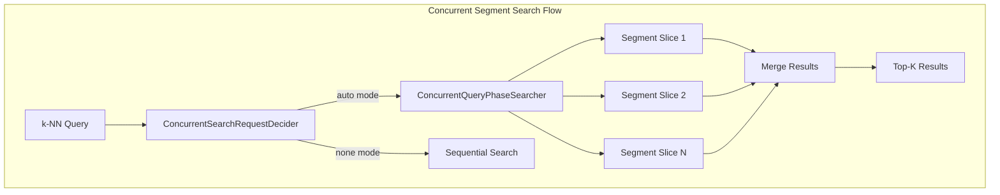

# Concurrent Segment Search Default for k-NN

## Summary

Concurrent segment search is now enabled by default for k-NN queries in OpenSearch v3.0.0, delivering up to 2.5x faster query performance. The k-NN plugin integrates with the ConcurrentSearchRequestDecider interface, allowing vector search queries to automatically leverage parallel segment processing when the cluster is in `auto` mode.

Key benefits:
- **Up to 2.5x faster queries**: Parallel segment processing significantly reduces query latency
- **~60% improvement in p90 latency**: Blog benchmarks show substantial tail latency improvements
- **20% better tail latencies**: Floor segment size optimizations further improve worst-case performance
- **Zero configuration required**: Works automatically in `auto` mode (the default)

## Details

### Architecture



### Slice Count Calculation

The maximum slice count is calculated dynamically based on available CPU resources:

```
maxSliceCount = Math.max(1, Math.min(Runtime.getRuntime().availableProcessors() / 2, 4))
```

This ensures efficient parallelism without overwhelming system resources.

### Configuration Settings

| Setting | Values | Default | Description |
|---------|--------|---------|-------------|
| `search.concurrent_segment_search.mode` | `auto`, `all`, `none` | `auto` | Cluster-level concurrent search mode |
| `index.search.concurrent_segment_search.mode` | `auto`, `all`, `none` | (inherits) | Index-level override |
| `search.concurrent.max_slice_count` | 0 or positive integer | 0 | Max parallel slices (0 = Lucene default) |

### Performance Benchmarks

From PR #2111 testing with production queries:

| Metric | Baseline | Concurrent (auto) | Improvement |
|--------|----------|-------------------|-------------|
| p50 latency | 58.86 ms | 45.05 ms | ~23% faster |
| p90 latency | 85.32 ms | 48.15 ms | ~44% faster |
| p99 latency | 95.11 ms | 50.42 ms | ~47% faster |

Blog benchmarks show ~60% improvement in p90 service time for vector search with 25-35% more CPU utilization.

### Slicing Mechanisms

OpenSearch supports two slicing approaches:

1. **Lucene Default (max_slice_count = 0)**: Uses Lucene's internal algorithm based on segment sizes
2. **Custom Slice Count**: Set a positive integer to control maximum parallelism

### Limitations

- Concurrent search may increase CPU utilization by 25-35%
- Not all query types benefit equally from parallelization
- Memory overhead increases with slice count
- Some aggregations may not support concurrent execution

## Usage Examples

### Check Current Mode

```json
GET _cluster/settings?include_defaults=true&filter_path=*.search.concurrent_segment_search.mode
```

### Enable for Specific Index

```json
PUT /my-knn-index/_settings
{
  "index.search.concurrent_segment_search.mode": "all"
}
```

### Disable Concurrent Search

```json
PUT _cluster/settings
{
  "persistent": {
    "search.concurrent_segment_search.mode": "none"
  }
}
```

### k-NN Search Query (No Changes Required)

```json
GET /my-knn-index/_search
{
  "size": 10,
  "query": {
    "knn": {
      "my_vector_field": {
        "vector": [0.1, 0.2, 0.3, ...],
        "k": 10
      }
    }
  }
}
```

## Resources

- [Concurrent Segment Search Documentation](https://docs.opensearch.org/3.0/search-plugins/concurrent-segment-search/)
- [Boost Vector Search with CSS Blog](https://opensearch.org/blog/boost-vector-search-with-css/)
- [k-NN ConcurrentSearchRequestDecider Integration PR #2111](https://github.com/opensearch-project/k-NN/pull/2111)
- [OpenSearch Issue #15259](https://github.com/opensearch-project/OpenSearch/issues/15259)
