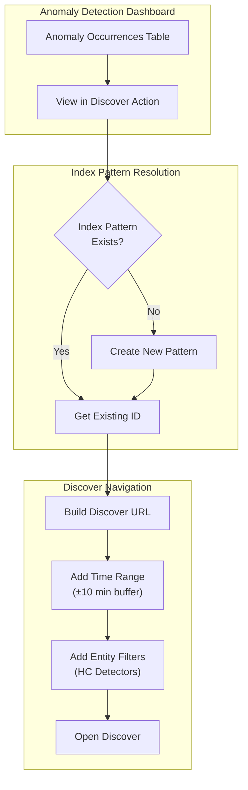
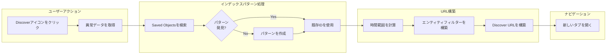

# 異常検知のコンテキスト起動

## 概要

異常検知のコンテキスト起動は、異常発生箇所からDiscoverビューへ直接遷移し、関連ログを自動的に表示することで、オブザーバビリティ体験を向上させます。異常を調査する際、「View in Discover」アクションをクリックすると、検出器のソースインデックスに一致するインデックスパターンを作成または再利用し、適切な時間範囲とエンティティフィルターが事前に適用された状態でDiscoverを開きます。

主なメリット:
- **調査の効率化**: 異常から関連ログへワンクリックでナビゲーション
- **インデックスパターンの自動管理**: 存在しない場合はオンデマンドで作成
- **コンテキストの保持**: 時間範囲とエンティティフィルターが自動適用
- **高カーディナリティ対応**: カテゴリフィールドのエンティティ値がフィルターとして含まれる

## 詳細

### アーキテクチャ



### データフロー



### コンポーネント

| コンポーネント | 説明 |
|---------------|------|
| AnomalyResultsTable | 新しいActionsカラムを含む異常発生テーブルコンポーネント |
| handleOpenDiscover | インデックスパターンの解決とDiscover URL構築を管理する関数 |
| SavedObjectsClient | 既存のインデックスパターンの検索または新規作成に使用 |
| Actions Column | 「View in Discover」アイコンボタンを含む新しいテーブルカラム |

### 設定

| 設定 | 説明 | デフォルト |
|------|------|-----------|
| Time Buffer | 異常の時間範囲の前後に追加されるバッファ | 10分 |
| Index Pattern Title | 検出器インデックスのカンマ区切りリスト | 検出器のインデックス |
| Time Field | 時間ベースのフィルタリングに使用されるフィールド | 検出器の時間フィールド |

### 機能の動作

| シナリオ | 動作 |
|----------|------|
| 単一エンティティ検出器 | 時間範囲フィルターのみでDiscoverを開く |
| 高カーディナリティ検出器 | 時間範囲とエンティティ値フィルターでDiscoverを開く |
| 既存のインデックスパターン | 既存のパターンIDを再利用 |
| インデックスパターンなし | 検出器のインデックスと時間フィールドで新規パターンを作成 |
| マルチデータソース有効時 | Actionsカラムは非表示（機能未対応） |

### 使用例

1. 異常検出器の結果ページに移動
2. 「Anomaly occurrences」テーブルで対象の異常を特定
3. 「Actions」カラムのリンクアイコンをクリック
4. 新しいブラウザタブでDiscoverが開き、以下が表示される:
   - 検出器のソースインデックスに一致するインデックスパターン
   - 異常の開始/終了時刻±10分に設定された時間範囲
   - HC検出器の場合: 特定のエンティティ値のフィルター

### コード変更

実装では異常結果テーブルにActionsカラムを追加:

```typescript
// tableUtils.tsxの新しいActionsカラム
{
  field: 'actions',
  name: 'Actions',
  actions: [
    {
      type: 'icon',
      name: 'View in Discover',
      description: 'View in Discover',
      icon: 'editorLink',
      onClick: () => {},
      'data-test-subj': 'discoverIcon',
    },
  ],
}
```

クリックハンドラーがインデックスパターンの解決とURL構築を管理:

```typescript
// インデックスパターンの検索/作成
const indexPatternResponse = await savedObjectsClient.find({
  type: 'index-pattern',
  fields: ['title'],
  search: `"${indexPatternTitle}"`,
  searchFields: ['title'],
});

if (indexPatternResponse.savedObjects.length > 0) {
  indexPatternId = indexPatternResponse.savedObjects[0].id;
} else {
  const newIndexPattern = await savedObjectsClient.create('index-pattern', {
    title: indexPatternTitle,
    timeFieldName: props.detectorTimeField,
  });
  indexPatternId = newIndexPattern.id;
}
```

## 制限事項

- **マルチデータソース未対応**: MDS有効時はActionsカラムが非表示
- **クロスクラスターインデックス**: 動作するが適切な権限が必要
- **インデックスパターン作成**: 新規パターン作成には`savedObjects:write`権限が必要

## 関連PR

| バージョン | PR | 説明 |
|-----------|-----|------|
| v3.0.0 | [#1005](https://github.com/opensearch-project/anomaly-detection-dashboards-plugin/pull/1005) | コンテキスト起動の実装 |

## 参考資料

- [異常検知ドキュメント](https://docs.opensearch.org/3.0/observing-your-data/ad/index/)
- [異常検知の可視化とダッシュボード](https://docs.opensearch.org/3.0/observing-your-data/ad/dashboards-anomaly-detection/)

## 変更履歴

- **v3.0.0** (2026): 異常検知のコンテキスト起動機能の初回リリース
