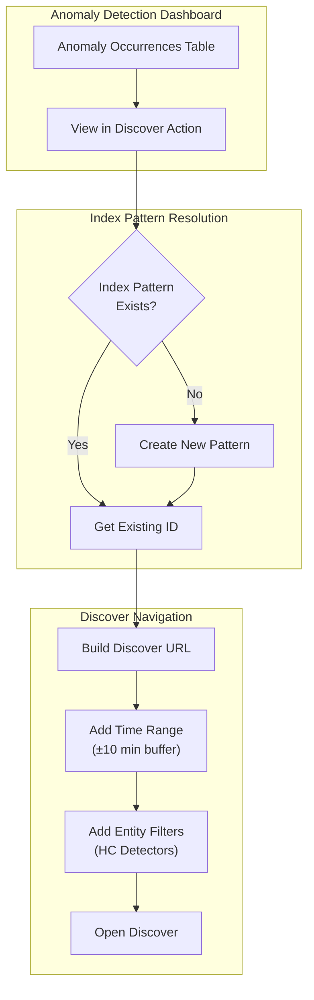
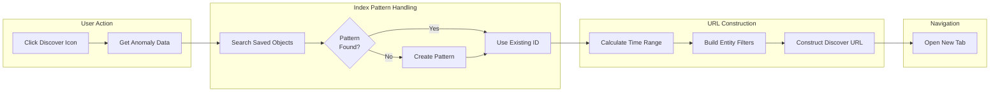

# Contextual Launch for Anomaly Detection

## Summary

Contextual launch for anomaly detection enhances the observability experience by allowing users to launch directly from anomaly occurrences to the Discover view with relevant logs automatically populated. When investigating an anomaly, clicking the "View in Discover" action creates or reuses an index pattern matching the detector's source indices and opens Discover with the appropriate time range and entity filters pre-applied.

Key benefits:
- **Streamlined investigation**: One-click navigation from anomaly to related logs
- **Automatic index pattern management**: Creates index patterns on-demand if they don't exist
- **Context preservation**: Time range and entity filters are automatically applied
- **High-cardinality support**: Entity values from categorical fields are included as filters

## Details

### Architecture



### Data Flow



### Components

| Component | Description |
|-----------|-------------|
| AnomalyResultsTable | Table component displaying anomaly occurrences with the new Actions column |
| handleOpenDiscover | Function that manages index pattern resolution and Discover URL construction |
| SavedObjectsClient | Used to find existing or create new index patterns |
| Actions Column | New table column containing the "View in Discover" icon button |

### Configuration

| Setting | Description | Default |
|---------|-------------|---------|
| Time Buffer | Buffer added before/after anomaly time range | 10 minutes |
| Index Pattern Title | Comma-separated list of detector indices | Detector indices |
| Time Field | Field used for time-based filtering | Detector time field |

### Feature Behavior

| Scenario | Behavior |
|----------|----------|
| Single-entity detector | Opens Discover with time range filter only |
| High-cardinality detector | Opens Discover with time range and entity value filters |
| Existing index pattern | Reuses the existing pattern ID |
| No index pattern | Creates new pattern with detector indices and time field |
| Multi-data-source enabled | Actions column is hidden (feature not supported) |

### Usage Example

1. Navigate to an anomaly detector's results page
2. In the "Anomaly occurrences" table, locate an anomaly of interest
3. Click the link icon in the "Actions" column
4. A new browser tab opens with Discover showing:
   - Index pattern matching the detector's source indices
   - Time range set to anomaly start/end time ±10 minutes
   - For HC detectors: filters for the specific entity values

### Code Changes

The implementation adds an Actions column to the anomaly results table:

```typescript
// New Actions column in tableUtils.tsx
{
  field: 'actions',
  name: 'Actions',
  actions: [
    {
      type: 'icon',
      name: 'View in Discover',
      description: 'View in Discover',
      icon: 'editorLink',
      onClick: () => {},
      'data-test-subj': 'discoverIcon',
    },
  ],
}
```

The click handler manages index pattern resolution and URL construction:

```typescript
// Index pattern lookup/creation
const indexPatternResponse = await savedObjectsClient.find({
  type: 'index-pattern',
  fields: ['title'],
  search: `"${indexPatternTitle}"`,
  searchFields: ['title'],
});

if (indexPatternResponse.savedObjects.length > 0) {
  indexPatternId = indexPatternResponse.savedObjects[0].id;
} else {
  const newIndexPattern = await savedObjectsClient.create('index-pattern', {
    title: indexPatternTitle,
    timeFieldName: props.detectorTimeField,
  });
  indexPatternId = newIndexPattern.id;
}
```

## Limitations

- **Multi-data-source not supported**: The Actions column is hidden when MDS is enabled
- **Cross-cluster indices**: Works with cross-cluster indices but requires appropriate permissions
- **Index pattern creation**: Requires `savedObjects:write` permission to create new patterns

## Related PRs

| Version | PR | Description |
|---------|-----|-------------|
| v3.0.0 | [#1005](https://github.com/opensearch-project/anomaly-detection-dashboards-plugin/pull/1005) | Implementation of contextual launch |

## References

- [Anomaly detection documentation](https://docs.opensearch.org/3.0/observing-your-data/ad/index/)
- [Anomaly detection visualizations and dashboards](https://docs.opensearch.org/3.0/observing-your-data/ad/dashboards-anomaly-detection/)

## Change History

- **v3.0.0** (2026): Initial release of contextual launch feature for anomaly detection
