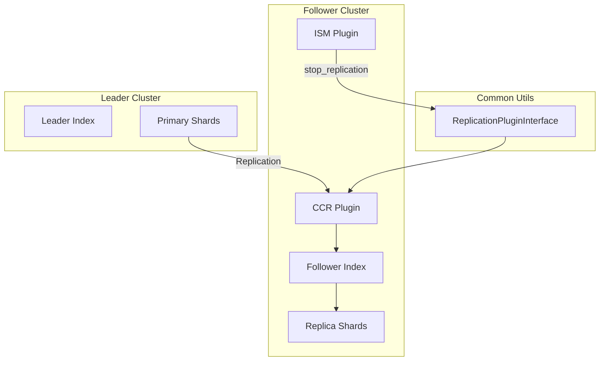
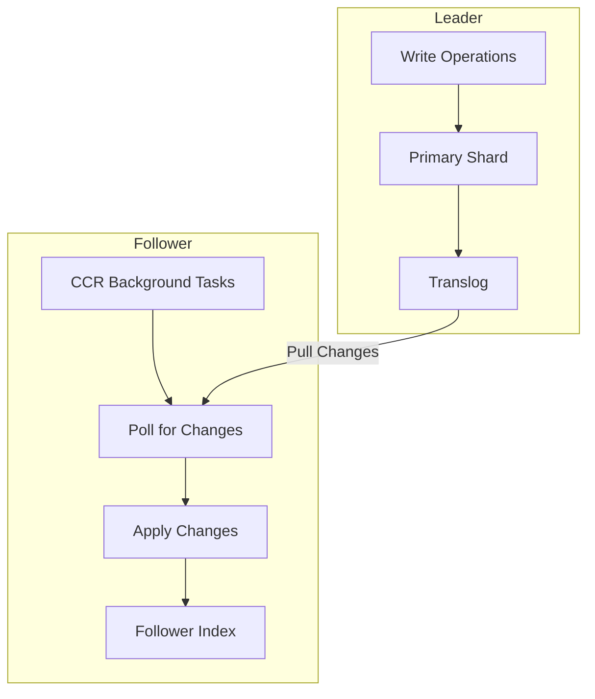

---
tags:
  - cross-cluster-replication
---
# Cross-Cluster Replication (CCR)

## Summary

Cross-Cluster Replication (CCR) is an OpenSearch plugin that enables replication of indexes, mappings, and metadata from one OpenSearch cluster to another. It follows an active-passive model where follower indices pull data from leader (remote) indices, providing disaster recovery, geographic distribution, and centralized reporting capabilities.

## Details

### Architecture



### Data Flow



### Components

| Component | Description |
|-----------|-------------|
| ReplicationPlugin | Main CCR plugin class |
| TransportStopIndexReplicationAction | Transport action to stop replication |
| ReplicationPluginInterface | Cross-plugin interface in common-utils |
| StopIndexReplicationRequest | Request object for stop replication |
| StopReplicationAction (ISM) | ISM action to invoke stop replication |
| AttemptStopReplicationStep | ISM step executing stop replication |

### Configuration

| Setting | Description | Default |
|---------|-------------|---------|
| `plugins.replication.follower.metadata_sync_interval` | Interval for metadata sync | 60s |
| `plugins.replication.follower.index.recovery.chunk_size` | Chunk size for recovery | 10MB |
| `plugins.replication.follower.index.recovery.max_concurrent_file_chunks` | Max concurrent file chunks | 4 |
| `plugins.replication.follower.index.ops_batch_size` | Cluster-level batch size for operations | 50000 |
| `index.plugins.replication.follower.ops_batch_size` | Index-level batch size for operations (v3.3.0+) | 50000 |
| `plugins.replication.autofollow.fetch_poll_interval` | Auto-follow poll interval | 30s |

### Usage Example

#### Starting Replication

```bash
PUT _plugins/_replication/follower-index/_start
{
  "leader_alias": "leader-cluster",
  "leader_index": "leader-index"
}
```

#### Stopping Replication

```bash
POST _plugins/_replication/follower-index/_stop
```

#### ISM Policy with stop_replication

```json
{
  "policy": {
    "description": "Manage CCR follower indices",
    "default_state": "replicating",
    "states": [
      {
        "name": "replicating",
        "actions": [],
        "transitions": [
          {
            "state_name": "unfollow",
            "conditions": {
              "min_index_age": "7d"
            }
          }
        ]
      },
      {
        "name": "unfollow",
        "actions": [
          {
            "stop_replication": {}
          }
        ],
        "transitions": [
          {
            "state_name": "delete"
          }
        ]
      },
      {
        "name": "delete",
        "actions": [
          {
            "delete": {}
          }
        ]
      }
    ]
  }
}
```

## Limitations

- Follower indices are read-only during active replication
- Cross-cluster replication does not currently use segment replication
- The `stop_replication` ISM action only works on actively replicated indices
- Requires proper security configuration for cross-cluster communication
- Dynamic batch size reduction (for 2GB limit handling) is per-node and not persisted across restarts
- Minimum batch size is 16 operations, which may still exceed 2GB for extremely large documents

## Change History

- **v3.4.0** (2026-01-14): Made pause replication API request body optional, defaulting to "User initiated" reason
- **v3.3.0** (2025-11-18): Fixed 2GB limit breach for large document replication with dynamic batch size adjustment and new index-level batch size setting
- **v3.2.0** (2025-08-06): Build fix - added missing `getLowPriorityRemoteDownloadThrottleTimeInNanos()` method to RemoteClusterRepository
- **v3.0.0** (2025-05-06): ISM-CCR integration with `stop_replication` action, Gradle 8.10.2 and JDK23 support
- **v2.17.0** (2024-09-17): Fixed integration tests to use correct cluster setting names after Remote Store Migration GA
- **v1.1.0** (2021-10-05): Initial cross-cluster replication implementation


## References

### Documentation
- [Cross-cluster replication documentation](https://docs.opensearch.org/3.0/tuning-your-cluster/replication-plugin/index/)
- [Replication settings](https://docs.opensearch.org/3.0/tuning-your-cluster/replication-plugin/settings/)
- [Replication API](https://docs.opensearch.org/3.0/tuning-your-cluster/replication-plugin/api/)
- [Replication security](https://docs.opensearch.org/3.0/tuning-your-cluster/replication-plugin/permissions/)
- [Auto-follow](https://docs.opensearch.org/3.0/tuning-your-cluster/replication-plugin/auto-follow/)

### Blog Posts
- [Introduction to Cross-Cluster Replication blog](https://opensearch.org/blog/cross-cluster-replication-intro/)

### Pull Requests
| Version | PR | Repository | Description | Related Issue |
|---------|-----|------------|-------------|---------------|
| v3.4.0 | [#1603](https://github.com/opensearch-project/cross-cluster-replication/pull/1603) | cross-cluster-replication | Fix the requirement of empty request body in pause replication | [#1468](https://github.com/opensearch-project/cross-cluster-replication/issues/1468) |
| v3.3.0 | [#1580](https://github.com/opensearch-project/cross-cluster-replication/pull/1580) | cross-cluster-replication | Fix: Replication of large documents breaches the size limit (2GB) of ReleasableBytesStreamOutput | [#1568](https://github.com/opensearch-project/cross-cluster-replication/issues/1568) |
| v3.2.0 | [#1564](https://github.com/opensearch-project/cross-cluster-replication/pull/1564) | cross-cluster-replication | Add missing method for RemoteClusterRepository class |   |
| v3.0.0 | [#667](https://github.com/opensearch-project/common-utils/pull/667) | common-utils | Adding replication plugin interface |   |
| v3.0.0 | [#1198](https://github.com/opensearch-project/index-management/pull/1198) | index-management | Adding unfollow action in ISM |   |
| v3.0.0 | [#1496](https://github.com/opensearch-project/cross-cluster-replication/pull/1496) | cross-cluster-replication | Gradle 8.10.2 and JDK23 support |   |
| v2.17.0 | [#1412](https://github.com/opensearch-project/cross-cluster-replication/pull/1412) | cross-cluster-replication | Update remote-migration IT with correct setting names |   |
| v1.1.0 | - | cross-cluster-replication | Initial CCR implementation |   |

### Issues (Design / RFC)
- [Issue #726](https://github.com/opensearch-project/index-management/issues/726): Feature request for managing CCR follower indices
- [Issue #1468](https://github.com/opensearch-project/cross-cluster-replication/issues/1468): Bug report for required empty request body in pause API
- [Issue #1557](https://github.com/opensearch-project/cross-cluster-replication/issues/1557): Distribution Build Failed for cross-cluster-replication-3.2.0
- [Issue #1568](https://github.com/opensearch-project/cross-cluster-replication/issues/1568): Bug report for 2GB limit breach during large document replication
