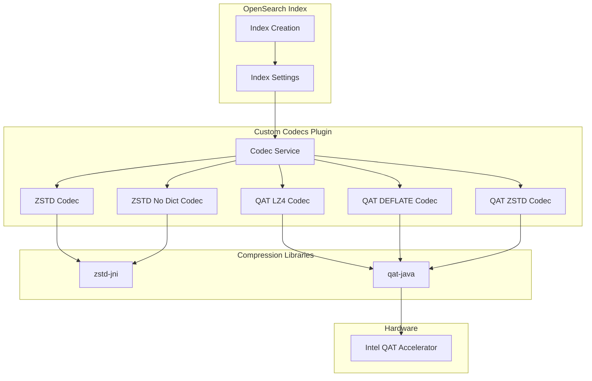

# Custom Codecs

## Summary

The Custom Codecs plugin provides custom Lucene codecs for OpenSearch, enabling users to customize the on-disk representation of indexes. It supports advanced compression algorithms including ZSTD (Zstandard) and hardware-accelerated compression via Intel QAT (Quick Assist Technology). These codecs offer better compression ratios and improved performance compared to the default LZ4 codec.

## Details

### Architecture



### Data Flow


### Components

| Component | Description |
|-----------|-------------|
| `Lucene101CustomCodec` | Base codec for ZSTD compression (Lucene 10.1.0) |
| `Zstd101Codec` | ZSTD compression with dictionary support |
| `ZstdNoDict101Codec` | ZSTD compression without dictionary (faster) |
| `Lucene101QatCodec` | Base codec for QAT hardware acceleration (Lucene 10.1.0) |
| `QatLz4101Codec` | Hardware-accelerated LZ4 compression |
| `QatDeflate101Codec` | Hardware-accelerated DEFLATE compression |
| `QatZstd101Codec` | Hardware-accelerated ZSTD compression |

#### Backward Compatibility Components

| Component | Location | Purpose |
|-----------|----------|---------|
| `Lucene912CustomCodec` | `backward_codecs/lucene912/` | Read existing Lucene 9.12 ZSTD indexes |
| `Lucene912QatCodec` | `backward_codecs/lucene912/` | Read existing Lucene 9.12 QAT indexes |
| `Lucene99CustomCodec` | `backward_codecs/lucene99/` | Read existing Lucene 9.9 indexes |

### Supported Codecs

| Codec | Algorithm | Dictionary | Hardware Accel | Introduced |
|-------|-----------|------------|----------------|------------|
| `zstd` | Zstandard | Yes | No | 2.9.0 |
| `zstd_no_dict` | Zstandard | No | No | 2.9.0 |
| `qat_lz4` | LZ4 | N/A | Yes (Intel QAT) | 2.15.0 |
| `qat_deflate` | DEFLATE | N/A | Yes (Intel QAT) | 2.15.0 |
| `qat_zstd` | Zstandard | N/A | Yes (Intel QAT) | 3.1.0 |

### Configuration

| Setting | Description | Default |
|---------|-------------|---------|
| `index.codec` | Compression codec to use | `default` (LZ4) |
| `index.codec.compression_level` | Compression level (1-6) | 3 |
| `index.codec.qatmode` | QAT mode: `auto` or `hardware` | `auto` |

### Usage Example

#### ZSTD Codec

```json
PUT /my-index
{
  "settings": {
    "index": {
      "codec": "zstd",
      "codec.compression_level": 3
    }
  }
}
```

#### ZSTD No Dictionary Codec

```json
PUT /my-index
{
  "settings": {
    "index": {
      "codec": "zstd_no_dict",
      "codec.compression_level": 4
    }
  }
}
```

#### QAT Hardware-Accelerated Codec

```json
PUT /my-index
{
  "settings": {
    "index": {
      "codec": "qat_lz4",
      "codec.compression_level": 1,
      "codec.qatmode": "auto"
    }
  }
}
```

#### QAT ZSTD Codec

```json
PUT /my-index
{
  "settings": {
    "index": {
      "codec": "qat_zstd",
      "codec.compression_level": 3,
      "codec.qatmode": "auto"
    }
  }
}
```

### Performance Comparison

Benchmark results comparing codecs against the default LZ4 codec (using `nyc_taxi` dataset):

| Metric | `best_compression` | `zstd` | `zstd_no_dict` |
|--------|-------------------|--------|----------------|
| Write Median Latency | 0% | 0% | -1% |
| Write p90 Latency | +3% | +2% | -5% |
| Write Throughput | -2% | +7% | +14% |
| Read Median Latency | 0% | +1% | 0% |
| Read p90 Latency | +1% | +1% | -2% |
| Compression Ratio | -34% | -35% | -30% |

*Negative percentages indicate improvement (smaller size or lower latency)*

### Dependencies

| Library | Version | Purpose |
|---------|---------|---------|
| `com.github.luben:zstd-jni` | 1.5.6-1 | ZSTD compression via JNI |
| `com.intel.qat:qat-java` | 2.3.2 | Intel QAT hardware acceleration |

## Limitations

- ZSTD codecs (`zstd` and `zstd_no_dict`) cannot be used for k-NN or Security Analytics indexes
- Compression levels are limited to range [1, 6] for ZSTD codecs
- QAT hardware acceleration requires Intel 4th/5th Gen Xeon processors with Linux kernel 3.10+
- Changing codec on an existing index requires closing the index or reindexing
- QAT `hardware` mode requires hardware availability; use `auto` for fallback to software

## Related PRs

| Version | PR | Description |
|---------|-----|-------------|
| v3.2.0 | [#263](https://github.com/opensearch-project/custom-codecs/pull/263) | Adding support for composite index |
| v3.1.0 | [#238](https://github.com/opensearch-project/custom-codecs/pull/238) | Add QAT-Accelerated Zstandard Compression Support |
| v3.1.0 | [#255](https://github.com/opensearch-project/custom-codecs/pull/255) | Fix version on BWC test dependency |
| v3.0.0 | [#228](https://github.com/opensearch-project/custom-codecs/pull/228) | Upgrade to Lucene 10.1.0 and introduce new Codec implementation |
| v3.0.0 | [#232](https://github.com/opensearch-project/custom-codecs/pull/232) | Bump ZSTD lib version to 1.5.6-1 |
| v3.0.0 | [#235](https://github.com/opensearch-project/custom-codecs/pull/235) | Fix build due to phasing off SecurityManager in favor of Java Agent |
| v3.0.0 | [#237](https://github.com/opensearch-project/custom-codecs/pull/237) | Add java agent plugin |

## References

- [Custom Codecs Repository](https://github.com/opensearch-project/custom-codecs): Source code
- [Index Codecs Documentation](https://docs.opensearch.org/3.0/im-plugin/index-codecs/): Official documentation
- [ZSTD GitHub](https://github.com/facebook/zstd): Zstandard compression algorithm
- [zstd-jni](https://github.com/luben/zstd-jni): JNI bindings for ZSTD
- [Intel QAT Overview](https://www.intel.com/content/www/us/en/developer/topic-technology/open/quick-assist-technology/overview.html): Hardware acceleration
- [OpenSearch 2.9.0 Blog](https://opensearch.org/blog/introducing-opensearch-2-9-0/): ZSTD codec introduction

## Change History

- **v3.2.0** (2026-01-14): Added composite index (star-tree) support - codecs now delegate to `CompositeCodec` when index has composite fields
- **v3.1.0** (2025-09-16): Added QAT-accelerated ZSTD codec (`qat_zstd`), upgraded qat-java to 2.3.2
- **v3.1.0** (2025-09-16): Fixed BWC test dependency version and added java-agent plugin to BWC tests
- **v3.0.0** (2025-05-06): Upgraded to Lucene 10.1.0 with new codec implementations (Lucene101*), bumped zstd-jni to 1.5.6-1, migrated to Java Agent from SecurityManager
- **v2.15.0** (2024-06-25): Added QAT hardware-accelerated codecs (`qat_lz4`, `qat_deflate`)
- **v2.9.0** (2023-07-24): Initial implementation of ZSTD codecs (`zstd`, `zstd_no_dict`)
