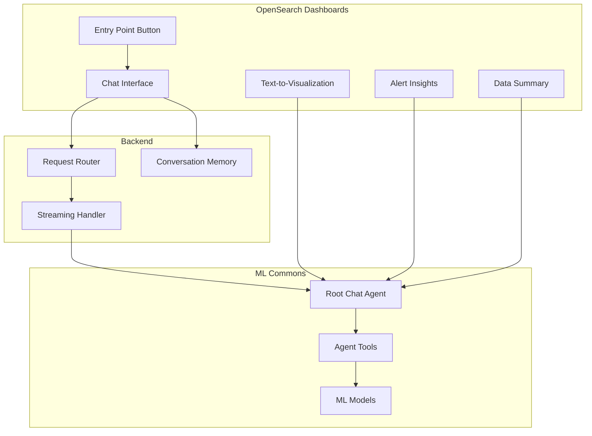
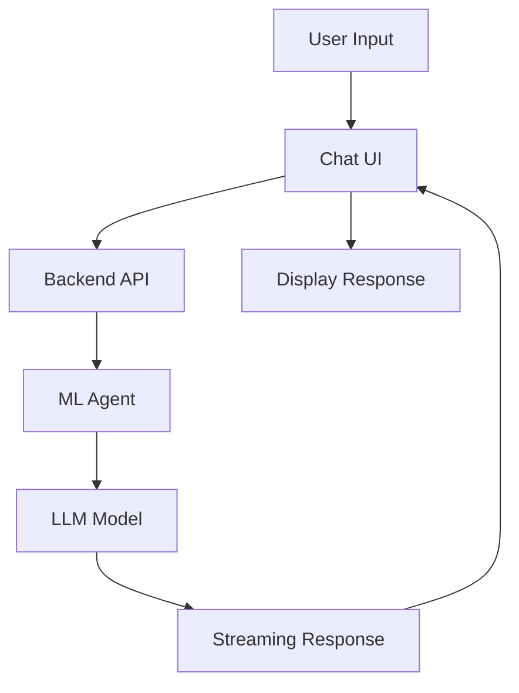

---
tags:
  - dashboards-assistant
---
# AI Assistant / Chatbot

## Summary

The OpenSearch AI Assistant (Chatbot) is an AI-powered conversational interface integrated into OpenSearch Dashboards. It enables users to interact with their data through natural language, generate visualizations from text descriptions, receive alert insights, and get data summaries without requiring specialized query skills. The assistant leverages ML Commons agents and tools to provide intelligent responses.

## Details

### Architecture



### Data Flow



### Components

| Component | Description |
|-----------|-------------|
| Chat Interface | Main conversational UI with message history and input |
| Entry Point Button | Single button in header for accessing the chatbot |
| Streaming Handler | Processes real-time response chunks with special character buffering |
| Conversation Memory | Stores and retrieves conversation history |
| Text-to-Visualization | Generates visualizations from natural language with time range support |
| Alert Insights | Provides AI-generated insights for alerts with format instructions |
| Data Summary | Generates summaries of data patterns |
| Auto Aggregation | Suggests appropriate aggregations for visualizations |
| Flyout State Manager | Persists chatbot visibility state to local storage |

### Configuration

| Setting | Description | Default |
|---------|-------------|--------|
| `assistant.chat.enabled` | Enable/disable the chatbot feature | `false` |
| `assistant.next.enabled` | Enable experimental features (text-to-viz) | `false` |
| `assistant.chatEnabled` | Admin UI control for chatbot | `false` |
| `assistant.enabled` | Admin UI control for alert summary/anomaly detection | `false` |

### Usage Example

1. Enable the assistant in `opensearch_dashboards.yml`:

```yaml
assistant.chat.enabled: true
assistant.next.enabled: true
```

2. Configure the root agent via API:

```json
PUT .plugins-ml-config/_doc/os_chat
{
    "type": "os_chat_root_agent",
    "configuration": {
        "agent_id": "your_root_agent_id"
    }
}
```

3. Access the chatbot via the button in the OpenSearch Dashboards header.

### Key Features

- **Natural Language Interaction**: Ask questions in plain English
- **Streaming Responses**: Real-time response display with special character buffering
- **Conversation History**: Resume previous conversations
- **Text-to-Visualization**: Generate charts from text descriptions with time range support
- **Alert Insights**: AI-powered alert analysis with consistent formatting
- **Data Summaries**: Automatic data pattern summaries
- **Notebook Integration**: Save conversations to Notebooks
- **Persistent Flyout State**: Chatbot stays open across page navigation
- **Admin UI Controls**: Centralized feature management through admin settings

## Limitations

- Requires ML Commons plugin with configured agents and models
- Streaming output requires compatible backend support
- Text-to-visualization requires PPL queries with valid results and aggregations
- Response quality depends on the underlying LLM model
- Admin UI settings require OpenSearch Dashboards 3.1.0+

## Change History

- **v3.1.0** (2026-01-10): T2viz enhancements (single metric styling, time range support, error prevention), streaming buffer for special characters, persistent flyout state, admin UI settings for centralized feature control, alert summary format instructions
- **v3.0.0** (2025-05-06): Major UI redesign, streaming output support, single button entry point, text-to-visualization enhancements with auto-aggregation, conversation auto-loading
- **v2.18.0** (2024-11-05): Added assistant capabilities for conditional UI rendering, new API to check agent config existence, renamed agentName to agentConfigName for clarity
- **v2.13** (2024): Initial introduction of OpenSearch Assistant for OpenSearch Dashboards


## References

### Documentation
- [OpenSearch Assistant Documentation](https://docs.opensearch.org/3.1/dashboards/dashboards-assistant/index/)
- [Build Your Own Chatbot Tutorial](https://docs.opensearch.org/3.1/tutorials/gen-ai/chatbots/build-chatbot/)
- [OpenSearch Assistant Toolkit](https://docs.opensearch.org/3.1/ml-commons-plugin/opensearch-assistant/)
- [Alert Insights](https://docs.opensearch.org/3.1/dashboards/dashboards-assistant/alert-insight/)
- [Data Summary](https://docs.opensearch.org/3.1/dashboards/dashboards-assistant/data-summary/)
- [Text to Visualization](https://docs.opensearch.org/3.1/dashboards/dashboards-assistant/text-to-visualization/)
- [dashboards-assistant Repository](https://github.com/opensearch-project/dashboards-assistant)

### Pull Requests
| Version | PR | Description | Related Issue |
|---------|-----|-------------|---------------|
| v3.1.0 | [#539](https://github.com/opensearch-project/dashboards-assistant/pull/539) | Style single metric in text2vis |   |
| v3.1.0 | [#545](https://github.com/opensearch-project/dashboards-assistant/pull/545) | Improve chatbot UX by scrolling user input message to top |   |
| v3.1.0 | [#546](https://github.com/opensearch-project/dashboards-assistant/pull/546) | Prevent t2viz navigation on PPL errors |   |
| v3.1.0 | [#549](https://github.com/opensearch-project/dashboards-assistant/pull/549) | Buffer for special characters when streaming |   |
| v3.1.0 | [#553](https://github.com/opensearch-project/dashboards-assistant/pull/553) | Save chatbot flyout state to local storage |   |
| v3.1.0 | [#557](https://github.com/opensearch-project/dashboards-assistant/pull/557) | T2viz time range support from context |   |
| v3.1.0 | [#568](https://github.com/opensearch-project/dashboards-assistant/pull/568) | Add format instruction for alert summary |   |
| v3.1.0 | [#578](https://github.com/opensearch-project/dashboards-assistant/pull/578) | Admin UI setting for dashboard assistant features |   |
| v3.0.0 | [#398](https://github.com/opensearch-project/dashboards-assistant/pull/398) | Expose chatEnabled flag to capabilities |   |
| v3.0.0 | [#435](https://github.com/opensearch-project/dashboards-assistant/pull/435) | Update chatbot UI to align with new look |   |
| v3.0.0 | [#493](https://github.com/opensearch-project/dashboards-assistant/pull/493) | Support streaming output |   |
| v3.0.0 | [#505](https://github.com/opensearch-project/dashboards-assistant/pull/505) | Generate visualization on t2v page mount |   |
| v3.0.0 | [#514](https://github.com/opensearch-project/dashboards-assistant/pull/514) | Add auto aggregation suggest for t2v |   |
| v3.0.0 | [#540](https://github.com/opensearch-project/dashboards-assistant/pull/540) | Change chatbot entry point to single button |   |
| v2.18.0 | [#267](https://github.com/opensearch-project/dashboards-assistant/pull/267) | Add assistant capabilities to control rendering components |   |
| v2.18.0 | [#307](https://github.com/opensearch-project/dashboards-assistant/pull/307) | Expose API to check if agent config name has agent ID configured |   |
