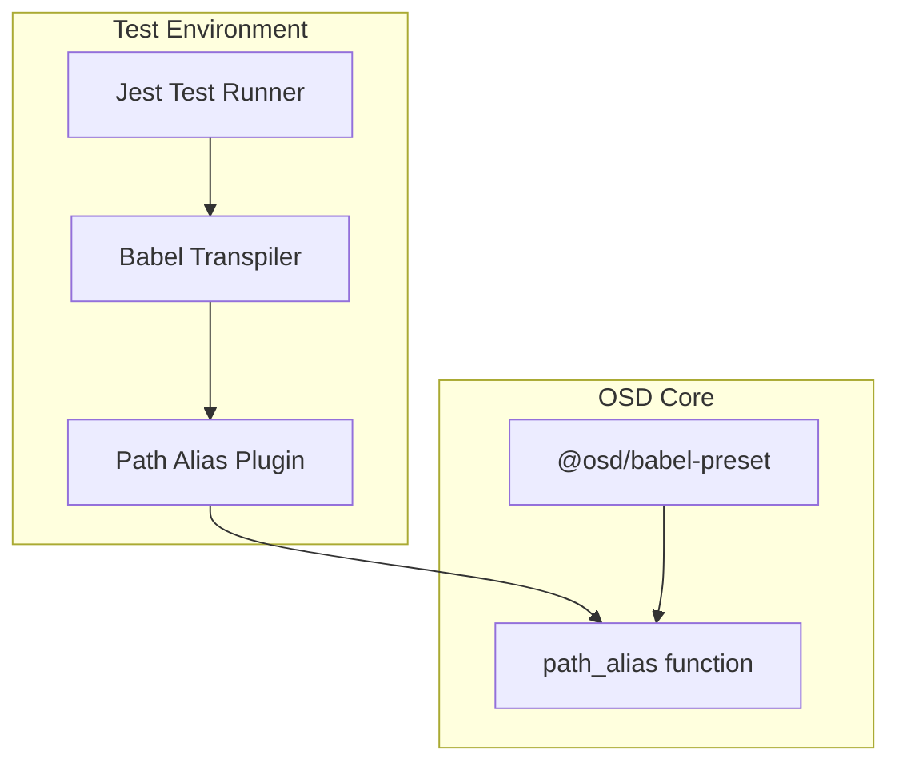

---
tags:
  - dashboards-assistant
---
# Dashboard Assistant CI Configuration

## Summary

The dashboards-assistant plugin uses a babel configuration for Jest testing that aligns with OpenSearch Dashboards core. This configuration ensures proper module resolution during test execution, particularly for path aliases used across the codebase.

## Details

### Architecture



### Configuration

The `babel.config.js` file configures babel for the test environment:

| Setting | Description | Value |
|---------|-------------|-------|
| `@babel/preset-env` | JavaScript transpilation | Node current |
| `@babel/preset-react` | React JSX support | Default |
| `@babel/preset-typescript` | TypeScript support | Default |
| `pathAliasPlugin` | Module path resolution | From `@osd/babel-preset` |

### Usage Example

```javascript
// babel.config.js
const pathAliasPlugin = require('@osd/babel-preset/path_alias');

module.exports = function (api) {
  if (api.env('test')) {
    return {
      presets: [
        require('@babel/preset-env', {
          useBuiltIns: false,
          targets: {
            node: 'current',
          },
        }),
        require('@babel/preset-react'),
        require('@babel/preset-typescript'),
      ],
      plugins: [pathAliasPlugin({})],
    };
  }
  return {};
};
```

## Limitations

- Configuration only applies to test environment (`api.env('test')`)
- Requires `@osd/babel-preset` package from OpenSearch Dashboards core

## Change History

- **v3.1.0** (2025-06-03): Added path alias plugin to babel configuration for CI compatibility


## References

### Documentation
- [PR #580](https://github.com/opensearch-project/dashboards-assistant/pull/580): CI fix implementation
- [PR #9831](https://github.com/opensearch-project/OpenSearch-Dashboards/pull/9831): Path alias extraction in OSD core

### Pull Requests
| Version | PR | Description | Related Issue |
|---------|-----|-------------|---------------|
| v3.1.0 | [#580](https://github.com/opensearch-project/dashboards-assistant/pull/580) | Fix failed CI due to path alias |   |
