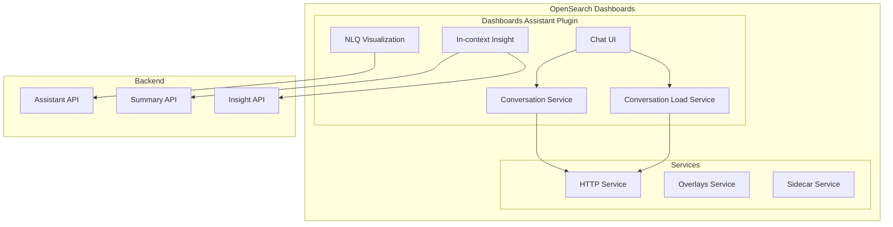

---
tags:
  - domain/ml
  - component/dashboards
  - dashboards
  - search
---
# Dashboards Assistant

## Summary

The OpenSearch Dashboards Assistant is a plugin that enables users to interact with an AI assistant through chat or various OpenSearch Dashboards pages. It provides natural language query capabilities, in-context insights, and visualization generation features.

## Details

### Architecture

### Components

| Component | Description |
|-----------|-------------|
| Chat UI | Main chat interface for interacting with the AI assistant |
| In-context Insight | Provides AI-generated insights and summaries for alerts and other data |
| NLQ Visualization | Natural language query visualization embeddable |
| Conversation Service | Manages conversation history and pagination |
| Conversation Load Service | Handles loading individual conversations and latest conversation ID |

### Key Features

#### Chat Interface
- Sidecar-based chat panel
- Conversation history management
- Real-time message streaming
- Conversation persistence

#### In-context Insights
- AI-generated summaries for alerts
- RAG-based insights with context
- Lazy loading of insights (triggered on user action)

#### NLQ Visualization
- Natural language to visualization conversion
- Embeddable visualization component
- Integration with dashboards

### Configuration

| Setting | Description | Default |
|---------|-------------|---------|
| `assistant.chat.enabled` | Enable/disable chat functionality | `true` |
| `assistant.incontextInsight.enabled` | Enable/disable in-context insights | `true` |

## Limitations

- NLQ Visualization is not available from the "Create new" dropdown menu (by design)
- Insights API calls are deferred until user explicitly requests them

## Change History

- **v3.1.0** (2026-01-10): Bug fixes for UI behavior, error logging, insights request timing, and conversation loading state

## References

### Documentation
- [dashboards-assistant repository](https://github.com/opensearch-project/dashboards-assistant)
- Text to Visualization
- AI Assistant Chatbot

### Pull Requests
| Version | PR | Description | Related Issue |
|---------|-----|-------------|---------------|
| v3.1.0 | [#579](https://github.com/opensearch-project/dashboards-assistant/pull/579) | Fix unnecessary embeddable in create new dropdown |   |
| v3.1.0 | [#548](https://github.com/opensearch-project/dashboards-assistant/pull/548) | Log error body or message instead of the entire error object |   |
| v3.1.0 | [#520](https://github.com/opensearch-project/dashboards-assistant/pull/520) | Fix http request for insights to be triggered only after view insights button is clicked |   |
| v3.1.0 | [#569](https://github.com/opensearch-project/dashboards-assistant/pull/569) | Fix chat page conversation loading state |   |
