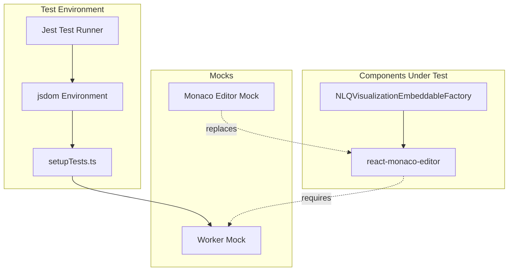

# Dashboards Core Bugfixes

## Summary

This document tracks bugfixes and maintenance changes to the OpenSearch Dashboards Assistant plugin's core testing infrastructure. These fixes ensure reliable unit test execution in Jest environments.

## Details

### Architecture



### Components

| Component | Description |
|-----------|-------------|
| `test/setupTests.ts` | Global test setup file that configures the Jest environment |
| `Worker` mock | No-op implementation of Web Worker API for jsdom |
| Monaco editor mock | Jest mock that replaces react-monaco-editor with null component |

### Configuration

| Setting | Description | Default |
|---------|-------------|---------|
| `window.Worker` | Global Worker constructor mock | Empty function |

### Usage Example

```typescript
// In test files that use Monaco editor
jest.mock('react-monaco-editor', () => () => null);

describe('ComponentUsingMonaco', () => {
  it('should work without Worker errors', () => {
    // Test code here
  });
});
```

## Limitations

- Worker mock does not provide actual Web Worker functionality
- Monaco editor mock returns null, so tests cannot verify Monaco-specific behavior
- Tests requiring real Worker behavior need additional setup

## Related PRs

| Version | PR | Description |
|---------|-----|-------------|
| v3.2.0 | [#593](https://github.com/opensearch-project/dashboards-assistant/pull/593) | Fix failed unit tests due to missing Worker |

## References

- [PR #593](https://github.com/opensearch-project/dashboards-assistant/pull/593): Initial fix implementation
- [OpenSearch Dashboards Assistant](https://github.com/opensearch-project/dashboards-assistant): Repository
- [Jest jsdom Environment](https://jestjs.io/docs/configuration#testenvironment-string): Jest documentation

## Change History

- **v3.2.0**: Added Worker mock and Monaco editor mock to fix unit test failures
