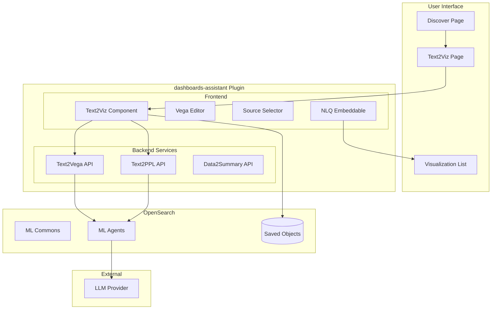
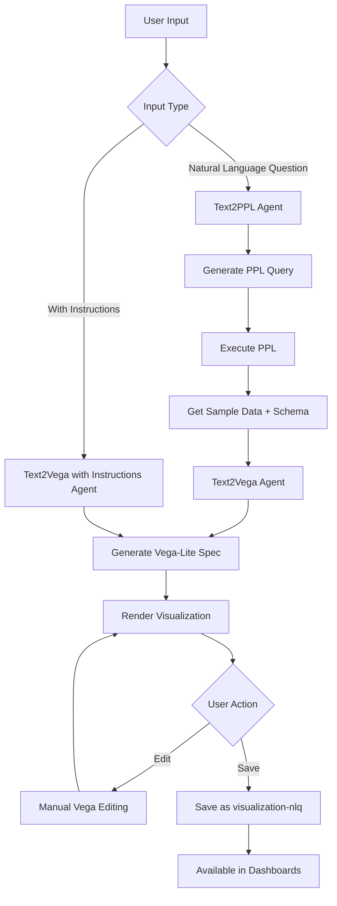

# Text to Visualization (t2viz)

## Summary

Text to Visualization (t2viz) is an AI-powered feature in OpenSearch Dashboards that enables users to create data visualizations using natural language queries. By leveraging Large Language Models (LLMs) through ML Commons agents, users can describe their visualization needs in plain English, and the system automatically generates appropriate Vega-Lite specifications to render the visualization.

This feature bridges the gap between data exploration and visualization creation, making it accessible to users who may not be familiar with visualization configuration or query languages.

## Details

### Architecture



### Data Flow



### Components

| Component | Description |
|-----------|-------------|
| `Text2Viz` | Main page component for creating NLQ visualizations |
| `Text2Vega` | Service class that coordinates the text-to-visualization pipeline |
| `EditorPanel` | Monaco-based code editor for manual Vega spec editing |
| `SourceSelector` | Index pattern selection dropdown |
| `NLQVisualizationEmbeddable` | Embeddable for rendering saved NLQ visualizations |
| `NLQVisualizationEmbeddableFactory` | Factory for creating embeddables from saved objects |
| `VisNLQSavedObject` | Saved object type for persisting NLQ visualizations |

### Configuration

| Setting | Description | Default |
|---------|-------------|---------|
| `assistant.text2viz.enabled` | Enable text to visualization feature | `false` |
| `assistant.chat.enabled` | Enable chat assistant (related feature) | `false` |
| `assistant.alertInsight.enabled` | Enable alert insights | `false` |
| `assistant.smartAnomalyDetector.enabled` | Enable smart anomaly detector | `false` |

### API Reference

#### Text to Vega API

```
POST /api/assistant/text2vega
```

Request body:
```json
{
  "input_question": "Show sales by category",
  "input_instruction": "Use a bar chart with blue colors",
  "ppl": "source=sales | stats sum(amount) by category",
  "dataSchema": "[{\"name\":\"category\",\"type\":\"string\"}]",
  "sampleData": "[{\"category\":\"Electronics\",\"sum(amount)\":1000}]"
}
```

#### Text to PPL API

```
POST /api/assistant/text2ppl
```

Request body:
```json
{
  "index": "sales",
  "question": "Show total sales by category"
}
```

#### Data to Summary API

```
POST /api/assistant/data2summary
```

Request body:
```json
{
  "sample_data": "[{...}]",
  "sample_count": 10,
  "total_count": 1000,
  "question": "Summarize this data",
  "ppl": "source=index | stats count()"
}
```

### Usage Example

```typescript
// Programmatic usage of Text2Vega service
const text2vega = new Text2Vega(http, searchClient, savedObjects);

text2vega.invoke({
  index: 'opensearch_dashboards_sample_data_ecommerce',
  prompt: 'Show average order value by day',
  dataSourceId: 'default'
});

// Subscribe to results
text2vega.getResult$().subscribe((vegaSpec) => {
  if (vegaSpec) {
    // Render the visualization
    console.log(JSON.stringify(vegaSpec, null, 2));
  }
});
```

### Saved Object Schema

The `visualization-nlq` saved object type stores:

```typescript
interface VisNLQSavedObject {
  id?: string;
  title: string;
  description?: string;
  visualizationState: string;  // JSON string containing Vega spec
  uiState: string;             // JSON string containing user input
  searchSourceFields?: {
    index?: IndexPattern;
  };
  version?: number;
}
```

## Limitations

- **Experimental Status**: This feature is experimental and not recommended for production environments
- **LLM Dependency**: Requires external LLM provider (e.g., Amazon Bedrock with Claude) to be configured
- **Input Size Limit**: Questions and instructions are limited to 400 characters each
- **Visualization Types**: Currently only generates Vega-Lite specifications
- **Agent Configuration**: Requires ML Commons agents to be properly configured
- **Data Source Support**: Works with index patterns; other data source types have limited support

## Related PRs

| Version | PR | Description |
|---------|-----|-------------|
| v2.18.0 | [#264](https://github.com/opensearch-project/dashboards-assistant/pull/264) | Initial implementation of text to visualization |
| v2.18.0 | [#295](https://github.com/opensearch-project/dashboards-assistant/pull/295) | Add discovery summary API |
| v2.18.0 | [#349](https://github.com/opensearch-project/dashboards-assistant/pull/349) | Integration with Discover page |
| v3.0.0 | [#510](https://github.com/opensearch-project/dashboards-assistant/pull/510) | Add metrics collection for t2viz |
| v3.1.0 | [#546](https://github.com/opensearch-project/dashboards-assistant/pull/546) | Prevent navigation when PPL returns no results |

## References

- [Issue #294](https://github.com/opensearch-project/dashboards-assistant/issues/294): Feature request for data summary API
- [Documentation](https://docs.opensearch.org/2.18/dashboards/dashboards-assistant/text-to-visualization/): Official text to visualization documentation
- [ML Commons Agents](https://docs.opensearch.org/2.18/ml-commons-plugin/agents-tools/index/): Agent and tools documentation
- [Flow Framework](https://docs.opensearch.org/2.18/automating-configurations/): Workflow automation for agent setup

## Change History

- **v3.1.0**: Added error handling for PPL queries with no results
- **v3.0.0**: Added metrics collection for t2viz usage
- **v2.18.0**: Initial implementation with Text2Vega, Text2PPL, and Data2Summary APIs
