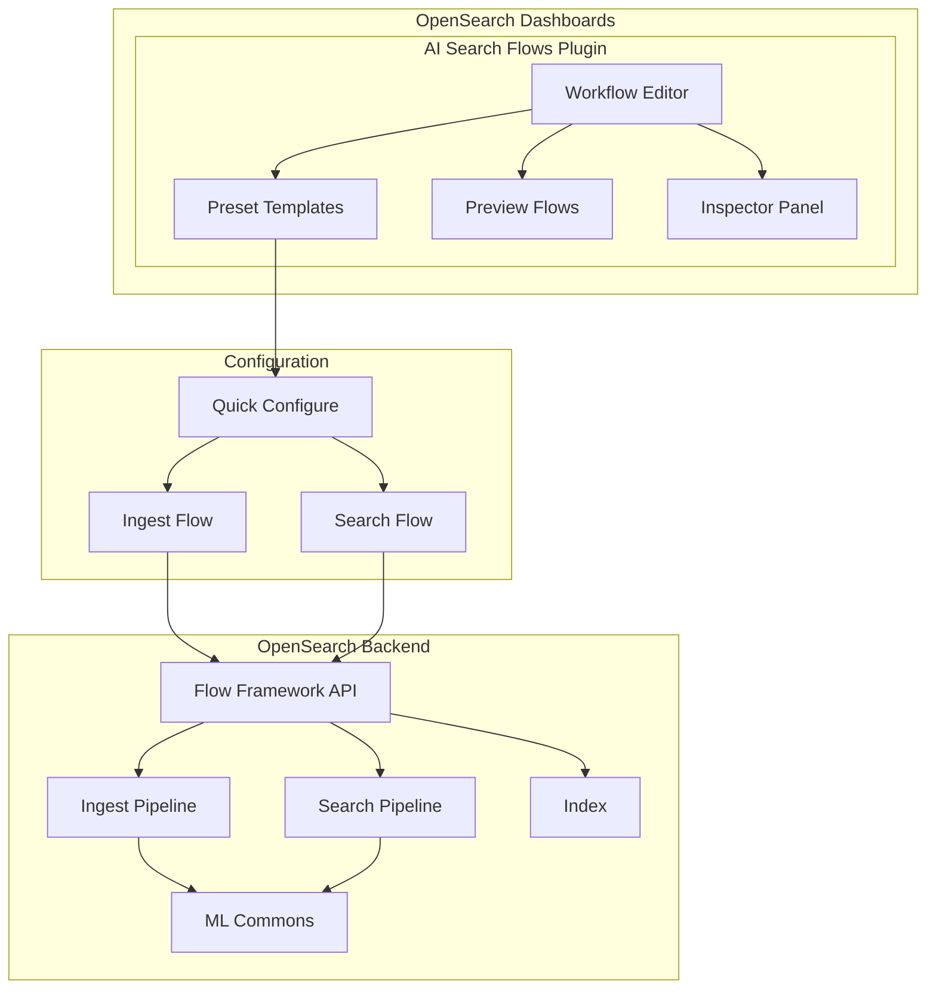

# AI Search Flows

## Summary

AI Search Flows (formerly "OpenSearch Flow") is a visual UI designer in OpenSearch Dashboards for building AI-powered search workflows. It enables users to iteratively build and test ingest and search pipelines with ML inference processors, supporting use cases like semantic search, hybrid search, RAG (Retrieval-Augmented Generation), and multimodal search. The plugin simplifies the creation of AI/ML workflows by providing preset templates, visual flow editors, and exportable workflow templates.

## Details

### Architecture



### Data Flow

```mermaid
flowchart TB
    subgraph "Ingest Flow"
        D[Documents] --> IP[Ingest Pipeline]
        IP --> MLP1[ML Inference Processor]
        MLP1 --> EMB[Generate Embeddings]
        EMB --> IDX[Index]
    end
    
    subgraph "Search Flow"
        Q[Query] --> SRP[Search Request Processor]
        SRP --> MLP2[ML Inference Processor]
        MLP2 --> QR[Query Rewrite]
        QR --> SEARCH[Execute Search]
        SEARCH --> RESP[Search Response Processor]
        RESP --> MLP3[ML Inference Processor]
        MLP3 --> RAG[RAG/Summarization]
        RAG --> RES[Results]
    end
```



### Components

| Component | Description |
|-----------|-------------|
| Workflow Editor | Multi-step form for configuring ingest and search flows |
| Preset Templates | Pre-configured templates for common AI search use cases |
| Preview Flows | Read-only visualization of data flow through pipelines |
| Inspector Panel | Test flows, view responses, errors, and created resources |
| Quick Configure | Modal for rapid setup with model selection and field mapping |
| ML Inference Processor | Processor for integrating ML models in pipelines |

### Preset Templates

| Preset | Description | Use Case |
|--------|-------------|----------|
| Semantic Search | Vector search with text embeddings | Finding semantically similar documents |
| Semantic Search (Sparse Encoders) | Neural sparse search with sparse encoders | Semantic search using sparse vectors (v3.1.0+) |
| Hybrid Search | Combined keyword + vector search | Balanced relevance with BM25 and semantic |
| RAG + Vector Search | Vector retrieval with LLM summarization | Question answering with context |
| RAG + Hybrid Search | Hybrid retrieval with LLM summarization | Enhanced RAG with keyword matching |
| Multimodal Search | Text and image embedding search | Cross-modal retrieval |
| Custom | Blank configuration for advanced use cases | Specialized workflows |

### Configuration

| Setting | Description | Default |
|---------|-------------|---------|
| Workflow Name | Unique identifier for the workflow | Required |
| Embedding Model | Model for generating vector embeddings | User-selected |
| LLM Model | Large language model for RAG | User-selected (RAG presets) |
| Text Field | Source field for text content | `text` |
| Vector Field | Field for storing embeddings | `embedding` |
| Index Settings | k-NN enabled index configuration | `index.knn: true` |

### Usage Example

#### Creating a Semantic Search Workflow

1. Access AI Search Flows from OpenSearch Dashboards
2. Select "Semantic Search" preset
3. Configure embedding model in Quick Configure modal
4. Import sample data (JSON array format)
5. Configure ML Inference Processor input/output mappings
6. Build and run ingestion
7. Configure search pipeline with query rewrite
8. Test and export workflow template

```yaml
# Exported Workflow Template
name: semantic-search-workflow
description: Semantic search with text embeddings
workflows:
  provision:
    nodes:
      - id: create_ingest_pipeline
        type: create_ingest_pipeline
        user_inputs:
          pipeline_id: semantic-ingest
          configurations:
            processors:
              - ml_inference:
                  model_id: ${embedding_model_id}
                  input_map:
                    - text: $.text_field
                  output_map:
                    - embedding: $.embedding
      - id: create_index
        type: create_index
        user_inputs:
          index_name: semantic-index
          settings:
            index.knn: true
          mappings:
            properties:
              text_field:
                type: text
              embedding:
                type: knn_vector
                dimension: 768
```

### Advanced Data Transformations

| Transform Type | Direction | Description |
|----------------|-----------|-------------|
| Data Field | Input | Maps document field to model input |
| JSONPath Expression | Input/Output | Extracts data using JSONPath syntax |
| Prompt Template | Input | Constant value with dynamic variables |
| Custom String | Input | Static string value |
| No Transformation | Output | Preserves model output as-is |

### Agent Configuration (v3.4.0+)

The plugin now includes enhanced agent configuration capabilities:

#### Agent Summary Visualization

A "View agent summary" button displays agent execution steps in a modal, showing:
- Available tools
- Tool execution sequence
- Validation results

#### Memory Integration

Support for conversational search with memory persistence:

| Feature | Description |
|---------|-------------|
| Continue conversation | Injects `memory_id` from previous response |
| Remove conversation | Clears `memory_id` for fresh context |
| Auto-clear | Memory cleared when switching to flow agents |

#### Simplified Agent Configuration

| Change | Description |
|--------|-------------|
| Unified model field | Single "model" field replaces separate LLM configuration |
| Auto-inferred LLM interface | Automatically detects interface from connector URL |
| Hidden advanced settings | LLM interface moved under "Advanced settings" |

#### Automatic Response Filters

For flow agents, response filters are auto-configured for supported providers:
- OpenAI: Auto-configured
- Bedrock Claude: Auto-configured
- Unknown/Custom: Manual configuration required

## Limitations

- Models must have defined interfaces for simplified ML processor forms
- Datasource version required for simulate API calls
- Plugin URL unchanged from original "flow-framework" for compatibility
- Complex nested data may require JSONPath expressions
- Memory integration only works with conversational agents, not flow agents
- Automatic LLM interface inference may not work for custom connectors
- Response filter auto-configuration limited to OpenAI and Bedrock Claude providers

## Related PRs

| Version | PR | Description |
|---------|-----|-------------|
| v3.4.0 | [#626](https://github.com/opensearch-project/dashboards-assistant/pull/626) | Disable dashboards assistant chatbot if investigation feature flag enabled |
| v3.4.0 | [#801](https://github.com/opensearch-project/dashboards-flow-framework/pull/801) | Add agent summary |
| v3.4.0 | [#796](https://github.com/opensearch-project/dashboards-flow-framework/pull/796) | Clean up / hide complex fields on agent configuration |
| v3.4.0 | [#803](https://github.com/opensearch-project/dashboards-flow-framework/pull/803) | Clean up agent summary formatting |
| v3.4.0 | [#809](https://github.com/opensearch-project/dashboards-flow-framework/pull/809) | Integrate with memory |
| v3.4.0 | [#817](https://github.com/opensearch-project/dashboards-flow-framework/pull/817) | Automatically add response filters to flow agents when possible |
| v3.4.0 | [#820](https://github.com/opensearch-project/dashboards-flow-framework/pull/820) | Remove default empty tool field values; fix EuiSelect values in Firefox |
| v3.1.0 | [#722](https://github.com/opensearch-project/dashboards-flow-framework/pull/722) | Integrate preview panel into inspector panel |
| v3.1.0 | [#737](https://github.com/opensearch-project/dashboards-flow-framework/pull/737) | Refactor form navigation to left panel |
| v3.1.0 | [#742](https://github.com/opensearch-project/dashboards-flow-framework/pull/742) | Added Semantic Search using Sparse Encoders template |
| v3.1.0 | [#743](https://github.com/opensearch-project/dashboards-flow-framework/pull/743) | Misc UI improvements IV |
| v3.1.0 | [#1139](https://github.com/opensearch-project/flow-framework/pull/1139) | Make thread pool sizes configurable (backend) |
| v3.0.0 | [#662](https://github.com/opensearch-project/dashboards-flow-framework/pull/662) | Rename to "AI Search Flows" |
| v3.0.0 | [#665](https://github.com/opensearch-project/dashboards-flow-framework/pull/665) | Add RAG + hybrid search preset |
| v3.0.0 | [#676](https://github.com/opensearch-project/dashboards-flow-framework/pull/676) | Simplify ML processor forms |
| v3.0.0 | [#610](https://github.com/opensearch-project/dashboards-flow-framework/pull/610) | Simplify RAG presets |
| v3.0.0 | [#604](https://github.com/opensearch-project/dashboards-flow-framework/pull/604) | Refactor quick configure components; improve processor error handling |
| v3.0.0 | [#605](https://github.com/opensearch-project/dashboards-flow-framework/pull/605) | Hide search query section when version is less than 2.19 |
| v3.0.0 | [#602](https://github.com/opensearch-project/dashboards-flow-framework/pull/602) | Legacy preset integration |
| v3.0.0 | [#701](https://github.com/opensearch-project/dashboards-flow-framework/pull/701) | Optional model inputs support |

## References

- [AI Search Flows Documentation](https://docs.opensearch.org/3.0/vector-search/ai-search/workflow-builder/)
- [Creating AI Search Workflows Tutorial](https://docs.opensearch.org/3.0/tutorials/gen-ai/ai-search-flows/building-flows/)
- [Flow Framework Plugin](https://docs.opensearch.org/3.0/automating-configurations/workflow-templates/)
- [ML Commons Integration](https://docs.opensearch.org/3.0/ml-commons-plugin/integrating-ml-models/)
- [dashboards-flow-framework Repository](https://github.com/opensearch-project/dashboards-flow-framework)
- [flow-framework Repository](https://github.com/opensearch-project/flow-framework)
- [Model Configuration Examples](https://github.com/opensearch-project/dashboards-flow-framework/blob/main/documentation/models.md)

## Change History

- **v3.4.0** (2026-01-14): Added agent summary visualization, memory integration for conversational search, simplified agent configuration with auto-inferred LLM interface, automatic response filters for flow agents, Firefox EuiSelect fixes
- **v3.1.0** (2025-06-10): Major UI refactor with left panel navigation, integrated preview into inspector panel, added Semantic Search using Sparse Encoders template, configurable thread pool sizes
- **v3.0.0** (2025-05-13): Renamed to "AI Search Flows", added RAG + hybrid search preset, simplified ML processor forms, improved state persistence, added processor reordering, refactored quick configure components with Formik integration, improved processor error handling with dynamic error display, added version compatibility check to hide search query section for versions < 2.19.0
