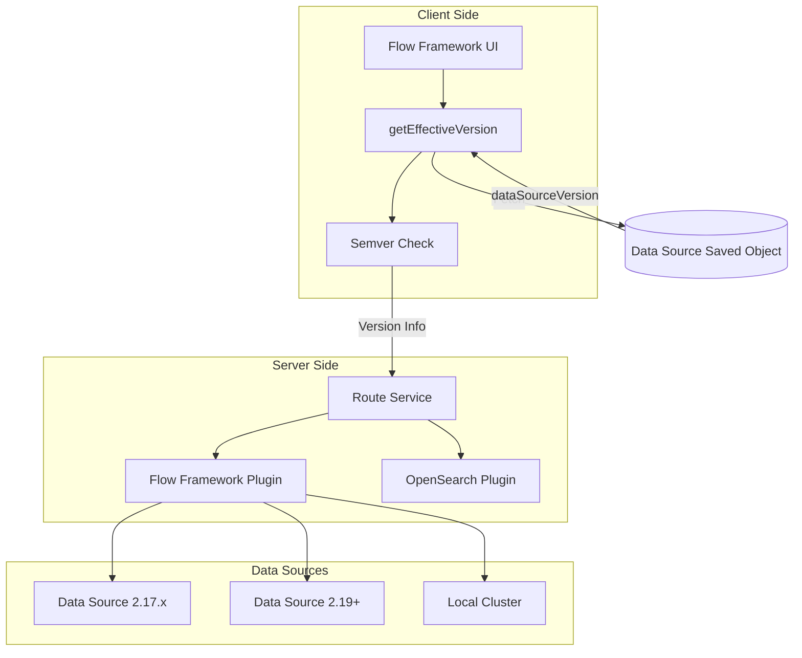
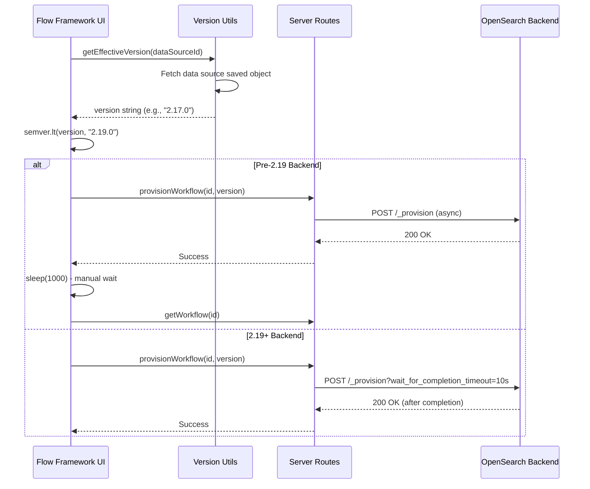

# Backward Compatibility

## Summary

The Dashboards Flow Framework plugin provides backward compatibility (BWC) support for connecting to older OpenSearch backends. This feature enables users to use the Flow Framework UI with data sources running different OpenSearch versions, automatically adapting API calls based on the detected backend version.

## Details

### Architecture



### Data Flow



### Components

| Component | Description |
|-----------|-------------|
| `getEffectiveVersion()` | Utility function to fetch version from data source saved object |
| `MINIMUM_FULL_SUPPORTED_VERSION` | Constant defining minimum version for full feature support (2.19.0) |
| `provisionWorkflowAsync` | Async provisioning API for pre-2.19 backends |
| `updateAndReprovisionWorkflowAsync` | Async update and reprovision API for pre-2.19 backends |

### Configuration

| Setting | Description | Default |
|---------|-------------|---------|
| `MIN_SUPPORTED_VERSION` | Minimum supported OpenSearch version | 2.17.0 |
| `MINIMUM_FULL_SUPPORTED_VERSION` | Version with full feature support | 2.19.0 |
| `PROVISION_TIMEOUT` | Timeout for synchronous provisioning | 10s |

### Version-Specific Behavior

| Feature | Pre-2.19 | 2.19+ |
|---------|----------|-------|
| Provisioning | Asynchronous with manual polling | Synchronous with timeout |
| Reprovisioning | Asynchronous | Synchronous |
| Verbose Pipeline Search | Not available | Available |
| Transform Query UI | Hidden | Visible |
| All Workflow Templates | Limited selection | Full selection |

### Usage Example

```typescript
import { getEffectiveVersion } from '../utils';
import semver from 'semver';
import { MINIMUM_FULL_SUPPORTED_VERSION } from '../../common';

// Get version from data source
const version = await getEffectiveVersion(dataSourceId);

// Check if pre-2.19
const isPreV219 = semver.lt(version, MINIMUM_FULL_SUPPORTED_VERSION);

// Conditional feature rendering
if (isPreV219) {
  // Hide features not supported in older versions
  setShowTransformQuery(false);
}

// Conditional API calls
if (isPreV219) {
  await callWithRequest('flowFramework.provisionWorkflowAsync', { workflow_id });
  await sleep(1000); // Wait for async completion
} else {
  await callWithRequest('flowFramework.provisionWorkflow', { workflow_id });
}
```

## Limitations

- Pre-2.19 backends do not support synchronous provisioning, resulting in potential UI state delays
- Verbose pipeline errors are not available for pre-2.19 backends
- Some workflow templates are filtered out for pre-2.19 data sources
- Manual polling with `sleep()` is used as a workaround for async operations

## Related PRs

| Version | PR | Description |
|---------|-----|-------------|
| v3.0.0 | [#612](https://github.com/opensearch-project/dashboards-flow-framework/pull/612) | Support 2.17 BWC with latest backend integrations |
| v3.0.0 | [#591](https://github.com/opensearch-project/dashboards-flow-framework/pull/591) | Integrate with synchronous provisioning feature |
| v3.0.0 | [#598](https://github.com/opensearch-project/dashboards-flow-framework/pull/598) | Add fine-grained error handling with verbose pipeline |

## References

- [PR #612](https://github.com/opensearch-project/dashboards-flow-framework/pull/612): Main BWC implementation
- [Dashboards Flow Framework](https://github.com/opensearch-project/dashboards-flow-framework): Plugin repository
- [Flow Framework](https://github.com/opensearch-project/flow-framework): Backend plugin

## Change History

- **v3.0.0** (2025-05-06): Added BWC support for 2.17 data sources with conditional API execution
