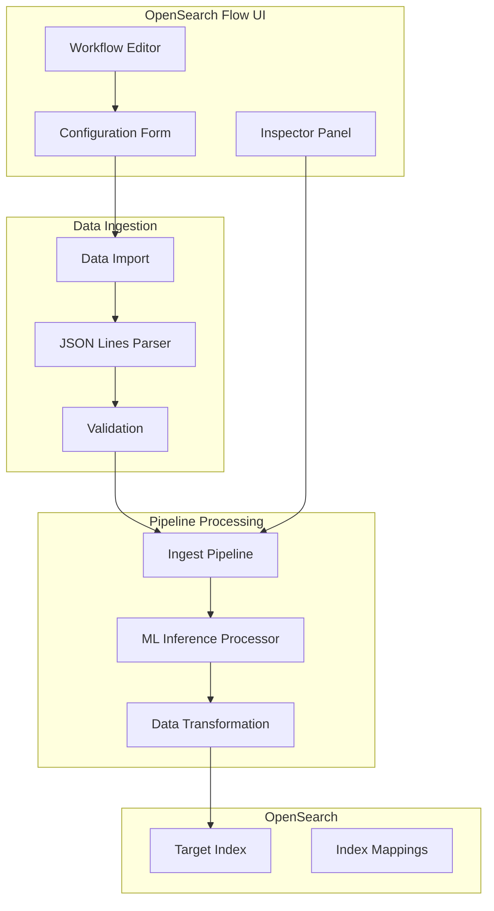
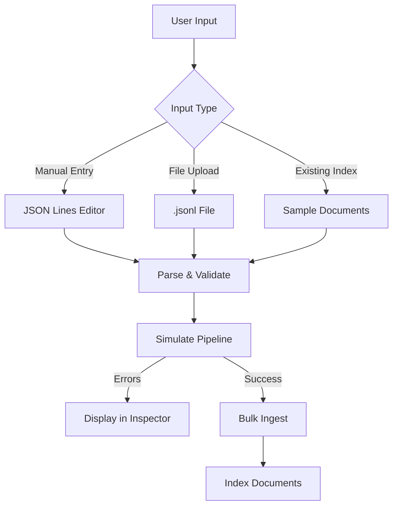

---
tags:
  - domain/ml
  - component/dashboards
  - dashboards
  - indexing
  - k-nn
  - ml
  - search
---
# Data Ingestion in OpenSearch Flow

## Summary

OpenSearch Flow (dashboards-flow-framework plugin) provides a visual interface for building AI search workflows, including data ingestion pipelines. The data ingestion feature allows users to import data into OpenSearch indexes through ingest pipelines with ML inference processors, enabling vector search and RAG use cases.

## Details

### Architecture



### Data Flow



### Components

| Component | Description |
|-----------|-------------|
| JsonLinesField | Input component for JSON Lines format with validation and error handling |
| Data Import Modal | Interface for importing data via manual entry, file upload, or existing index |
| Inspector Panel | Displays ingest responses, errors, and resource information |
| Error Tab | Shows processor-level errors with details about failures |

### Configuration

| Setting | Description | Default |
|---------|-------------|---------|
| Input Format | Data format for ingestion | JSON Lines |
| File Extension | Accepted file type for upload | `.jsonl` |
| Verbose Mode | Enable detailed error reporting | `true` |

### Usage Example

#### JSON Lines Input Format

```jsonl
{"title": "Document 1", "content": "First document content", "category": "tech"}
{"title": "Document 2", "content": "Second document content", "category": "science"}
{"title": "Document 3", "content": "Third document content", "category": "tech"}
```

#### Workflow Configuration

1. Access OpenSearch Flow via **OpenSearch Plugins** > **OpenSearch Flow**
2. Select a preset template (e.g., "Semantic Search" or "RAG with Vector Retrieval")
3. Configure the embedding model for vector generation
4. Import sample data using JSON Lines format
5. Configure the ML Inference Processor with input/output mappings
6. Update the workflow to create the ingest pipeline and index
7. Test the ingestion in the Inspector panel

### Error Handling

The data ingestion feature provides fine-grained error handling:

1. **Pre-ingestion validation**: Uses the simulate pipeline API with `verbose=true` to detect errors before actual ingestion
2. **Processor-level errors**: Displays which specific processor failed and why
3. **Error display locations**:
   - Errors tab in Inspector with detailed information
   - Error icons next to failed processors in the form

## Limitations

- JSON Lines format requires one JSON object per line (no multi-line JSON objects)
- File uploads limited to `.jsonl` extension
- Error handling quality depends on model interface definitions
- Local cluster version detection required for proper preset rendering

## Change History

- **v3.0.0** (2025): Added fine-grained error handling, JSON Lines format support, local cluster version detection fixes, and various UX improvements


## References

### Documentation
- [Documentation: Building AI search workflows](https://docs.opensearch.org/3.0/vector-search/ai-search/workflow-builder/): Official OpenSearch Flow documentation
- [Ingest Pipelines](https://docs.opensearch.org/3.0/ingest-pipelines/): OpenSearch ingest pipeline documentation
- [JSON Lines specification](https://jsonlines.org/): JSON Lines format specification

### Pull Requests
| Version | PR | Description | Related Issue |
|---------|-----|-------------|---------------|
| v3.0.0 | [#598](https://github.com/opensearch-project/dashboards-flow-framework/pull/598) | Add fine-grained error handling | [#571](https://github.com/opensearch-project/dashboards-flow-framework/issues/571) |
| v3.0.0 | [#639](https://github.com/opensearch-project/dashboards-flow-framework/pull/639) | Change ingestion input to JSON Lines format |   |
| v3.0.0 | [#606](https://github.com/opensearch-project/dashboards-flow-framework/pull/606) | Fix local cluster version detection |   |
| v3.0.0 | [#613](https://github.com/opensearch-project/dashboards-flow-framework/pull/613) | UX improvements XI |   |
| v3.0.0 | [#618](https://github.com/opensearch-project/dashboards-flow-framework/pull/618) | UX improvements XII |   |
| v3.0.0 | [#630](https://github.com/opensearch-project/dashboards-flow-framework/pull/630) | Bug fixes XIII |   |
| v3.0.0 | [#644](https://github.com/opensearch-project/dashboards-flow-framework/pull/644) | Various bug fixes & improvements | [#627](https://github.com/opensearch-project/dashboards-flow-framework/issues/627) |
| v3.0.0 | [#654](https://github.com/opensearch-project/dashboards-flow-framework/pull/654) | Search Index Local Cluster fix | [#653](https://github.com/opensearch-project/dashboards-flow-framework/issues/653) |
| v3.0.0 | [#672](https://github.com/opensearch-project/dashboards-flow-framework/pull/672) | JSON Lines autofilling fixes |   |

### Issues (Design / RFC)
- [Issue #571](https://github.com/opensearch-project/dashboards-flow-framework/issues/571): Fine-grained error handling feature request
- [Issue #627](https://github.com/opensearch-project/dashboards-flow-framework/issues/627): Various bug fixes request
- [Issue #653](https://github.com/opensearch-project/dashboards-flow-framework/issues/653): Search Index Local Cluster bug
