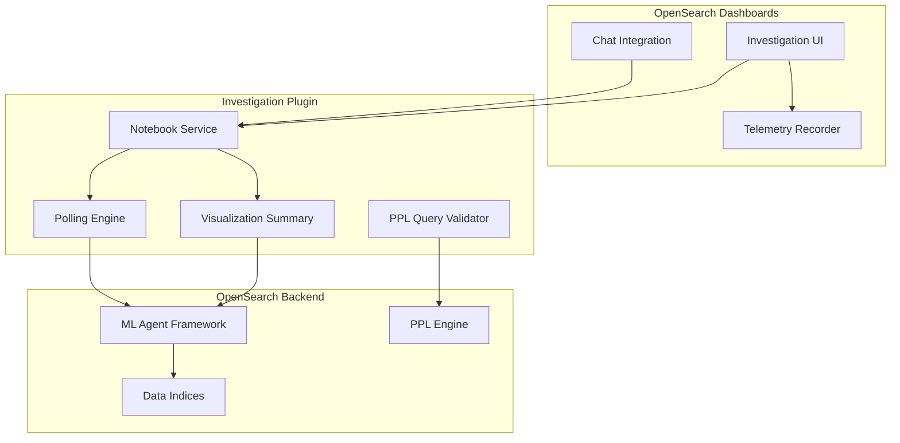

---
tags:
  - dashboards-investigation
---
# Automated Investigation (Dashboards)

## Summary

The Automated Investigation plugin for OpenSearch Dashboards provides an AI-powered investigation workflow that automatically analyzes observability data (logs, traces, metrics) to generate hypotheses and findings about system issues. Users can trigger investigations from the Dashboards UI, review generated hypotheses, confirm or reject findings, and reinvestigate with feedback. The plugin integrates with OpenSearch's ML agent framework and the Dashboards chat interface.

## Details

### Architecture

### Key Concepts

| Concept | Description |
|---------|-------------|
| Investigation | An automated analysis session that examines observability data to identify root causes |
| Hypothesis | A proposed explanation for an observed issue, generated by the ML agent |
| Finding | A specific piece of evidence discovered during investigation that supports or contradicts a hypothesis |
| Reinvestigation | Re-running an investigation with user feedback or updated time range |
| Notebook | The container object that stores investigation state, steps, and results |

### Hypothesis Workflow

Users can interact with hypotheses through several actions:
- **Accept**: Mark a hypothesis as the accepted root cause
- **Rule out**: Dismiss a hypothesis as not applicable
- **Rule in**: Reactivate a previously ruled-out hypothesis
- **Replace primary**: Promote an alternative hypothesis to primary

### Finding Workflow

Findings support user feedback:
- **Confirm/Reject**: Validate or invalidate a finding
- **Thumb up/down**: Mark a finding as important or irrelevant
- **Undo**: Remove previous feedback or marking

### Telemetry

The plugin tracks user interactions via the core `PluginTelemetryRecorder`, covering investigation lifecycle events, hypothesis actions, finding actions, feedback, and duration metrics.

### Configuration

| Setting | Description | Default |
|---------|-------------|---------|
| Summary agent timeout | Timeout for visualization summary ML agent calls | 60 seconds |
| Max retries (summary) | Retry count for summary agent | 0 |
| Visualization image max length | Maximum size for visualization summary images | Enforced (limit added in v3.6.0) |

### PPL Query Validation

PPL queries are validated using the `/_plugins/_ppl/_explain` API for lightweight syntax checking without executing the actual query. Error messages are extracted via a centralized `extractErrorMessage` utility that handles OpenSearch PPL/SQL errors, HTTP client errors, and standard errors.

## Limitations

- Telemetry events are client-side only; no built-in server-side aggregation dashboard
- Summary agent timeout (60s) is not user-configurable
- Investigation quality depends on the underlying ML agent model capabilities

## Change History

- **v3.6.0** (2026-03-25): Added accept hypothesis feature, duration tracking at investigation/step/sub-step levels, comprehensive telemetry metrics, visualization summary image size limits, log analysis rerun during reinvestigation. Enhanced tool result styling, absolute time display in reinvestigation, investigation detail card wording, summary agent timeout (60s), polling retry counts, PPL query validation via `_explain` API. Fixed hypothesis detail button placement, duplicate confirm/reject buttons, wrong datasource ID from chat, chat integration type conflict.

## References

### Pull Requests
| Version | PR | Description |
|---------|-----|-------------|
| v3.6.0 | `https://github.com/opensearch-project/dashboards-investigation/pull/321` | Add accept hypothesis feature |
| v3.6.0 | `https://github.com/opensearch-project/dashboards-investigation/pull/320` | Add duration tracking |
| v3.6.0 | `https://github.com/opensearch-project/dashboards-investigation/pull/342` | Add comprehensive telemetry metrics |
| v3.6.0 | `https://github.com/opensearch-project/dashboards-investigation/pull/326` | Add max length limit for visualization summary |
| v3.6.0 | `https://github.com/opensearch-project/dashboards-investigation/pull/322` | Allow log analysis rerun during reinvestigation |
| v3.6.0 | `https://github.com/opensearch-project/dashboards-investigation/pull/319` | Update tool result style to align with chat |
| v3.6.0 | `https://github.com/opensearch-project/dashboards-investigation/pull/318` | Show absolute time in reinvestigation time picker |
| v3.6.0 | `https://github.com/opensearch-project/dashboards-investigation/pull/338` | Update investigation detail card wording |
| v3.6.0 | `https://github.com/opensearch-project/dashboards-investigation/pull/334` | Increase summary agent timeout to 60s |
| v3.6.0 | `https://github.com/opensearch-project/dashboards-investigation/pull/327` | Increase polling retry count |
| v3.6.0 | `https://github.com/opensearch-project/dashboards-investigation/pull/335` | Improve PPL error handling and fix steps style |
| v3.6.0 | `https://github.com/opensearch-project/dashboards-investigation/pull/339` | Fix hypothesis detail buttons placement |
| v3.6.0 | `https://github.com/opensearch-project/dashboards-investigation/pull/325` | Remove duplicate confirm/reject buttons |
| v3.6.0 | `https://github.com/opensearch-project/dashboards-investigation/pull/337` | Fix wrong datasource ID from chat |
| v3.6.0 | `https://github.com/opensearch-project/dashboards-investigation/pull/329` | Fix chat integration type conflict |
