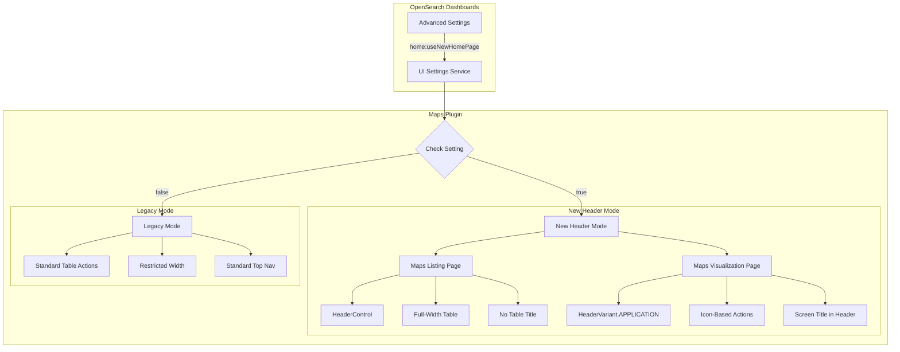
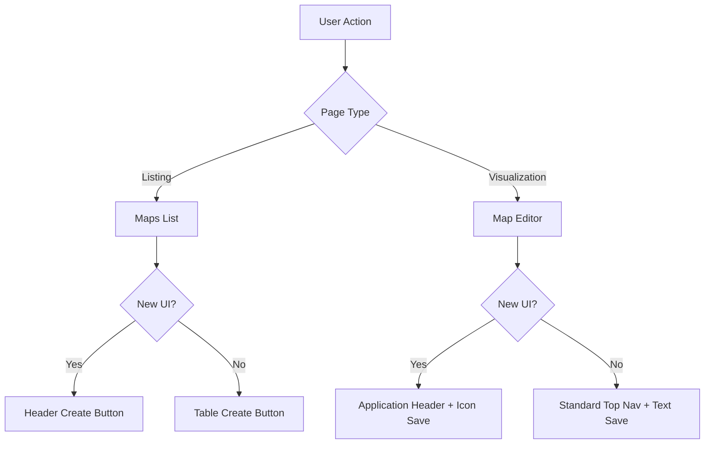

---
tags:
  - domain/geo
  - component/dashboards
  - dashboards
---
# Maps Plugin UI Updates

## Summary

The Maps Plugin UI Updates feature enables the OpenSearch Dashboards Maps plugin to conditionally use the new header design system (TriNeo project). This provides a more consistent and modern user experience when the new home page UI is enabled, including updated Page Header and Application Header variants, as well as full-width table layouts.

## Details

### Architecture



### Data Flow



### Components

| Component | Description |
|-----------|-------------|
| `HeaderControl` | OSD navigation component for placing controls in the application header |
| `HeaderVariant.APPLICATION` | Chrome header variant for application-style pages with grouped actions |
| `TopNavMenuIconData` | Configuration type for icon-based top navigation menu items |
| `TopNavMenuItemRenderType.IN_PORTAL` | Render type for search bar in portal mode |
| `TableListView` | Enhanced table component with `restrictWidth` prop support |

### Configuration

| Setting | Description | Default |
|---------|-------------|---------|
| `home:useNewHomePage` | Enables the new home page UI including header changes across all plugins | `false` |

### Usage Example

#### Enabling the New UI

```yaml
# In OpenSearch Dashboards Advanced Settings
home:useNewHomePage: true
```

#### Maps Listing Page Implementation

```typescript
// Check if new UI is enabled
const newHomePageEnabled = uiSettings.get('home:useNewHomePage');

// Conditionally render HeaderControl
{newHomePageEnabled &&
  <HeaderControl
    setMountPoint={application.setAppRightControls}
    controls={[
      {
        id: 'Create map',
        label: 'Create map',
        iconType: 'plus',
        fill: true,
        href: `${MAPS_APP_ID}${APP_PATH.CREATE_MAP}`,
        testId: 'createButton',
        controlType: 'button',
      },
    ]}
  />
}

// TableListView with conditional width
<TableListView
  createItem={newHomePageEnabled ? undefined : navigateToCreateMapPage}
  tableListTitle={newHomePageEnabled ? '' : 'Maps'}
  restrictWidth={newHomePageEnabled ? false : true}
  // ... other props
/>
```

#### Maps Visualization Page Implementation

```typescript
// Set header variant when new UI is enabled
useEffect(() => {
  if (showActionsInGroup) {
    chrome.setHeaderVariant?.(HeaderVariant.APPLICATION);
  }
  return () => {
    chrome.setHeaderVariant?.();
  };
}, [chrome.setHeaderVariant, showActionsInGroup]);

// Icon-based top nav configuration
if (showActionsInGroup) {
  const topNavConfig: TopNavMenuIconData[] = [
    {
      tooltip: 'Save',
      ariaLabel: 'Save your map',
      testId: 'mapSaveButton',
      run: onSaveButtonClick,
      iconType: 'save',
      controlType: 'icon',
    },
  ];
  return topNavConfig;
}

// TopNavMenu with grouped actions
<TopNavMenu
  config={config}
  showSearchBar={TopNavMenuItemRenderType.IN_PORTAL}
  groupActions={showActionsInGroup}
  screenTitle={title}
  // ... other props
/>
```

## Limitations

- Requires OpenSearch Dashboards core support for `HeaderControl` and `HeaderVariant` APIs
- The new UI is opt-in and disabled by default
- Integration tests for the new header UI are implemented separately

## Change History

- **v2.18.0** (2024-10-22): Fix flyout overlay issue with new application header by adjusting pushMinBreakpoint to 1576px
- **v2.17.0** (2024-09-17): Initial implementation of conditional new header UI support


## References

### Documentation
- [Maps Documentation](https://docs.opensearch.org/2.17/dashboards/visualize/maps/): Official Maps plugin documentation
- [OpenSearch Dashboards PR #7691](https://github.com/opensearch-project/OpenSearch-Dashboards/pull/7691): Full width table support in OSD core

### Blog Posts
- [Getting started with multilayer maps](https://opensearch.org/blog/multilayer-maps/): Maps plugin blog post

### Pull Requests
| Version | PR | Description | Related Issue |
|---------|-----|-------------|---------------|
| v2.18.0 | [#680](https://github.com/opensearch-project/dashboards-maps/pull/680) | Fix flyout overlay issue with new application header |   |
| v2.17.0 | [#653](https://github.com/opensearch-project/dashboards-maps/pull/653) | Conditionally use the new Page Header variant on the Maps listing page | [#649](https://github.com/opensearch-project/dashboards-maps/issues/649) |
| v2.17.0 | [#654](https://github.com/opensearch-project/dashboards-maps/pull/654) | Conditionally use the new Application Header variant on the Maps visualization page | [#649](https://github.com/opensearch-project/dashboards-maps/issues/649) |
| v2.17.0 | [#655](https://github.com/opensearch-project/dashboards-maps/pull/655) | Conditionally use full width for Maps listing page table | [#649](https://github.com/opensearch-project/dashboards-maps/issues/649) |

### Issues (Design / RFC)
- [Issue #649](https://github.com/opensearch-project/dashboards-maps/issues/649): Support Trineo new headers change in maps
