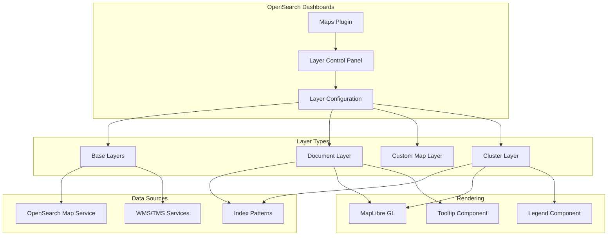
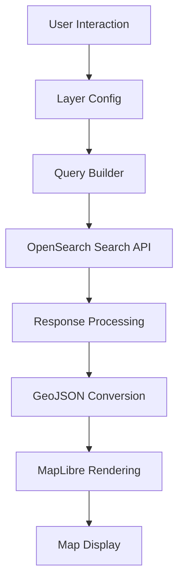

# Maps & Geospatial

## Summary

OpenSearch Dashboards Maps is a visualization plugin that enables users to create interactive map visualizations with multiple layers. It supports various layer types including base maps, document layers, custom maps, and cluster layers. The plugin integrates with OpenSearch's geospatial capabilities to visualize geo_point and geo_shape data on maps powered by MapLibre GL.

## Details

### Architecture



### Data Flow



### Components

| Component | Description |
|-----------|-------------|
| `MapContainer` | Main container component managing map state and layers |
| `LayerControlPanel` | UI panel for managing map layers |
| `AddLayerPanel` | Dialog for adding new layers |
| `LayerConfigPanel` | Configuration panel for layer settings |
| `DocumentLayerFunctions` | Rendering logic for document layers |
| `ClusterLayerFunctions` | Rendering logic for cluster layers |
| `OSMLayerFunctions` | Rendering logic for OpenSearch Map base layers |
| `CustomLayerFunctions` | Rendering logic for custom WMS/TMS layers |
| `MapsLegend` | Legend component for cluster layer gradients |

### Layer Types

#### Base Layers
- **OpenSearch Map**: Default vector tile basemap
- **Custom Map**: WMS or TMS custom map sources

#### Data Layers
- **Documents**: Visualize individual geo_point/geo_shape documents
- **Cluster**: Aggregate documents using geospatial bucket aggregations

### Cluster Layer Configuration

| Setting | Description | Default |
|---------|-------------|---------|
| `source.indexPatternId` | Index pattern for data source | Required |
| `source.cluster.agg` | Aggregation type (geohash_grid, geotile_grid, geohex_grid) | `geohash_grid` |
| `source.cluster.field` | Geospatial field name | Required |
| `source.cluster.precision` | Aggregation precision | `2` |
| `source.cluster.changePrecision` | Auto-adjust precision on zoom | `false` |
| `source.cluster.useCentroid` | Use geocentroid for placement | `false` |
| `source.metric.agg` | Metric aggregation (count, avg, sum, max, min) | `count` |
| `source.metric.field` | Field for metric aggregation | - |
| `source.filters` | Layer-level filters | `[]` |
| `source.useGeoBoundingBoxFilter` | Filter by map extent | `false` |
| `source.applyGlobalFilters` | Apply dashboard global filters | `true` |
| `style.fillType` | Fill type (solid, gradient) | `gradient` |
| `style.fillColor` | Solid fill color | `#ff0000` |
| `style.palette` | Gradient color palette | `blue` |
| `style.borderColor` | Border color | `#000000` |
| `style.borderThickness` | Border thickness (0-100px) | `1` |

### Supported Aggregations

#### Cluster Aggregations
| Type | Field Types | Precision Range |
|------|-------------|-----------------|
| Geohash Grid | geo_point, geo_shape | 1-12 |
| Geotile Grid | geo_point, geo_shape | 0-29 |
| Geohex Grid | geo_point only | 0-15 |

#### Metric Aggregations
| Type | Field Types |
|------|-------------|
| Count | Any |
| Average | number |
| Sum | number |
| Max | number, date |
| Min | number, date |

### Usage Example

```yaml
# Adding a cluster layer to visualize flight destinations
1. Navigate to Maps visualization
2. Click "Add layer" > "Data layer" > "Cluster"
3. Configure Data tab:
   - Index pattern: opensearch_dashboards_sample_data_flights
   - Geoaggregation type: Geohash
   - Geospatial field: DestLocation
   - Metric: Count
4. Configure Style tab:
   - Fill color: Gradient
   - Palette: Blue
5. Click "Update"
```

## Limitations

- Geohex grid aggregation only supports `geo_point` fields
- Geocentroid option unavailable for `geo_shape` fields
- Maximum 10,000 documents per document layer
- Border thickness limited to 0-100px

## Related PRs

| Version | PR | Description |
|---------|-----|-------------|
| v3.0.0 | [#703](https://github.com/opensearch-project/dashboards-maps/pull/703) | Introduce cluster layer |
| v3.0.0 | [#704](https://github.com/opensearch-project/dashboards-maps/pull/704) | Fix layer config panel background |
| v3.0.0 | [#718](https://github.com/opensearch-project/dashboards-maps/pull/718) | Fix data label overlap |

## References

- [Issue #250](https://github.com/opensearch-project/dashboards-maps/issues/250): Cluster layer feature request
- [Using Maps](https://docs.opensearch.org/3.0/dashboards/visualize/maps/): Official documentation
- [Geohash Grid](https://docs.opensearch.org/3.0/aggregations/bucket/geohash-grid/): Geohash aggregation docs
- [Geotile Grid](https://docs.opensearch.org/3.0/aggregations/bucket/geotile-grid/): Geotile aggregation docs
- [Geohex Grid](https://docs.opensearch.org/3.0/aggregations/bucket/geohex-grid/): Geohex aggregation docs
- [Getting started with multilayer maps](https://opensearch.org/blog/multilayer-maps/): Blog post

## Change History

- **v3.0.0** (2025-05-06): Added Cluster Layer with geohash/geotile/geohex aggregations, legend support, and multi-data source support. Fixed layer config panel styling and data label overlap issues.
