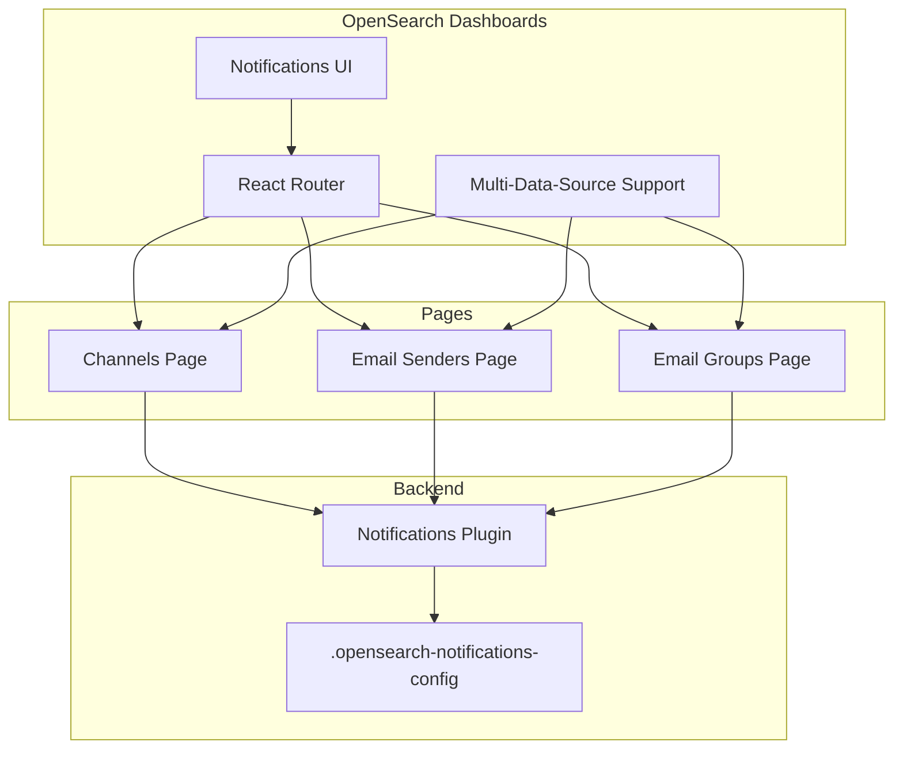

# OpenSearch Dashboards Notifications

## Summary

OpenSearch Dashboards Notifications is a plugin that provides a user interface for managing notification channels and sending test messages. It integrates with the OpenSearch Notifications backend plugin to enable users to configure various notification destinations including Email, Slack, Amazon SNS, Amazon Chime, Microsoft Teams, and custom webhooks.

The plugin supports Multi-Data-Source (MDS) functionality, allowing users to manage notifications across multiple OpenSearch clusters from a single Dashboards instance.

## Details

### Architecture

### Components

| Component | Description |
|-----------|-------------|
| Channels | Manage notification channels (Slack, Email, SNS, etc.) |
| Email Senders | Configure SMTP and SES email senders |
| Email Recipient Groups | Manage groups of email recipients |
| MDSEnabledComponent | Base component for multi-data-source support |
| DataSourceMenuContext | React context for data source selection |

### Supported Channel Types

| Channel Type | Description |
|--------------|-------------|
| Slack | Send notifications to Slack channels |
| Email | Send email notifications via SMTP or SES |
| Amazon SNS | Publish to SNS topics |
| Amazon Chime | Send to Chime webhooks |
| Microsoft Teams | Send to Teams webhooks |
| Custom Webhook | Send to custom HTTP endpoints |

### Multi-Data-Source Support

The plugin supports OpenSearch Dashboards' Multi-Data-Source (MDS) feature, allowing users to:

- Select a data source from the data source picker
- Persist the selected data source across page navigation
- View and manage notifications for different OpenSearch clusters

### Configuration

The plugin uses the following URL parameters for state management:

| Parameter | Description | Default |
|-----------|-------------|---------|
| `dataSourceId` | ID of the selected data source | Local cluster ("") |

## Limitations

- Requires the Notifications backend plugin to be installed on the OpenSearch cluster
- Email functionality requires proper SMTP or SES configuration
- Some channel types may require additional AWS permissions

## Related PRs

| Version | PR | Description |
|---------|-----|-------------|
| v3.4.0 | [#393](https://github.com/opensearch-project/dashboards-notifications/pull/393) | Fix channel name edit refetching on every keystroke |
| v2.18.0 | [#256](https://github.com/opensearch-project/dashboards-notifications/pull/256) | Fit & Finish - semantic headers, text sizes, context menus |
| v2.18.0 | [#263](https://github.com/opensearch-project/dashboards-notifications/pull/263) | Fit & Finish UX Fixes - spacing, full-width content |
| v2.18.0 | [#270](https://github.com/opensearch-project/dashboards-notifications/pull/270) | Fit & Finish UX Fixes Pt 2 - filter separation, default pill |
| v2.18.0 | [#287](https://github.com/opensearch-project/dashboards-notifications/pull/287) | Fix typo in recipient |
| v2.18.0 | [#290](https://github.com/opensearch-project/dashboards-notifications/pull/290) | Bug fix to switch to default datasource instead of local cluster |
| v2.18.0 | [#271](https://github.com/opensearch-project/dashboards-notifications/pull/271) | Fix CI workflow for windows |
| v2.18.0 | [#280](https://github.com/opensearch-project/dashboards-notifications/pull/280) | Fix cache cypress hashfile path |
| v2.17.0 | [#234](https://github.com/opensearch-project/dashboards-notifications/pull/234) | Change parent item name for new navigation |
| v2.17.0 | [#242](https://github.com/opensearch-project/dashboards-notifications/pull/242) | Fix link checker |
| v2.17.0 | [#244](https://github.com/opensearch-project/dashboards-notifications/pull/244) | Persist dataSourceId across applications |
| v2.14.0 | [#186](https://github.com/opensearch-project/dashboards-notifications/pull/186) | Added MDS Support |
| v2.15.0 | [#205](https://github.com/opensearch-project/dashboards-notifications/pull/205) | Bug fixes for MDS in getServerFeatures API |

## References

- [OpenSearch Notifications Documentation](https://docs.opensearch.org/latest/observing-your-data/notifications/index/)
- [dashboards-notifications Repository](https://github.com/opensearch-project/dashboards-notifications)
- [notifications Repository](https://github.com/opensearch-project/notifications)

## Change History

- **v3.4.0** (2026-01-14): Fixed channel name edit UX regression - prevented unnecessary API refetching on every keystroke when editing channel names
- **v2.18.0** (2024-11-05): Fit & Finish UX improvements - standardized semantic headers (H1/H2/H3), consistent text sizes, smaller context menus, 16px content-to-header spacing, full-width content sections, separated table filters, added default pill to encryption method dropdown. Also fixed default data source selection and typo in recipient groups UI.
- **v2.17.0** (2024-09-17): Changed navigation parent item name to "Notification channels", added description for left navigation, fixed link checker CI, added dataSourceId persistence for new navigation
- **v2.15.0**: Bug fixes for MDS support in getServerFeatures API
- **v2.14.0**: Added Multi-Data-Source (MDS) support
