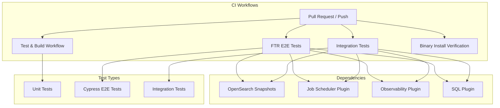

---
tags:
  - dashboards-observability
---
# Dashboards Observability CI/Tests

## Summary

The dashboards-observability plugin maintains a comprehensive CI/CD pipeline for testing and building the plugin. This includes unit tests, integration tests, end-to-end functional tests, and binary installation verification workflows.

## Details

### Architecture



### Components

| Component | Description |
|-----------|-------------|
| `dashboards-observability-test-and-build-workflow.yml` | Main test and build workflow for unit tests |
| `integration-tests-workflow.yml` | Integration tests with OpenSearch backend |
| `ftr-e2e-dashboards-observability-test.yml` | Functional Test Runner (FTR) end-to-end tests using Cypress |
| `verify-binary-install.yml` | Verifies plugin installation via binary distribution |

### Configuration

| Setting | Description | Default |
|---------|-------------|---------|
| `OPENSEARCH_VERSION` | Target OpenSearch version | `3.4.0` |
| `OPENSEARCH_PLUGIN_VERSION` | Plugin version for snapshots | `3.4.0.0-SNAPSHOT` |
| `OPENSEARCH_DASHBOARDS_VERSION` | Dashboards branch to test against | `main` |

### Plugin Dependencies

The integration and E2E tests require these OpenSearch plugins:

| Plugin | Purpose |
|--------|---------|
| opensearch-job-scheduler | Job scheduling functionality |
| opensearch-observability | Backend observability features |
| opensearch-sql-plugin | SQL query support |

### Snapshot Repository

Plugin snapshots are fetched from the OpenSearch CI repository:

```
https://ci.opensearch.org/ci/dbc/snapshots/maven/org/opensearch/plugin/{plugin}/{version}/
```

Version resolution uses maven-metadata.xml to get the latest snapshot build.

### Usage Example

```yaml
# Example: Fetching latest plugin snapshot
- name: Get latest snapshot version
  run: |
    METADATA_URL="https://ci.opensearch.org/ci/dbc/snapshots/maven/org/opensearch/plugin/opensearch-observability/3.4.0.0-SNAPSHOT/maven-metadata.xml"
    SNAPSHOT_VERSION=$(curl -s $METADATA_URL | grep '<value>' | head -1 | sed 's/.*<value>\(.*\)<\/value>.*/\1/')
    echo "version=$SNAPSHOT_VERSION"
```

## Limitations

- CI workflows are specific to GitHub Actions
- Integration tests require Java 21 (Corretto distribution)
- E2E tests have a 1200-second timeout for Dashboards startup

## Change History

- **v3.4.0** (2026-01-11): Migrated to OpenSearch CI snapshot repository, updated to 3.4.0, added dynamic snapshot version resolution, improved error handling


## References

### Documentation
- [GitHub Actions Documentation](https://docs.github.com/en/actions)
- [dashboards-observability repository](https://github.com/opensearch-project/dashboards-observability)
- [OpenSearch CI Snapshots](https://ci.opensearch.org/ci/dbc/snapshots/maven/)

### Pull Requests
| Version | PR | Description | Related Issue |
|---------|-----|-------------|---------------|
| v3.4.0 | [#2501](https://github.com/opensearch-project/dashboards-observability/pull/2501) | Fix typo in checkout step name |   |
| v3.4.0 | [#2526](https://github.com/opensearch-project/dashboards-observability/pull/2526) | Update snapshots and unit tests |   |
| v3.4.0 | [#2528](https://github.com/opensearch-project/dashboards-observability/pull/2528) | Update CI workflows for Integ tests |   |
